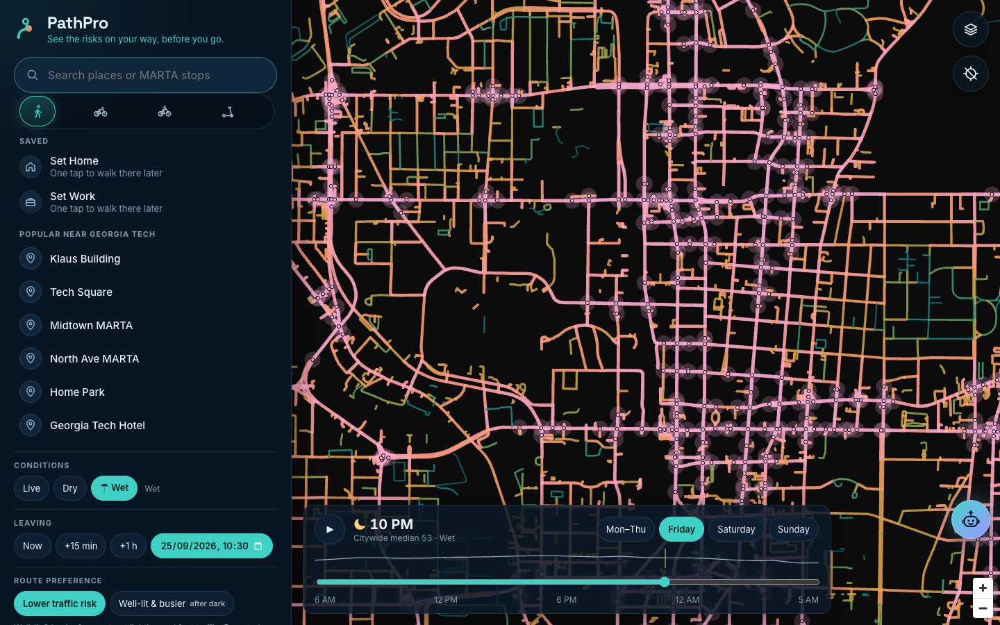
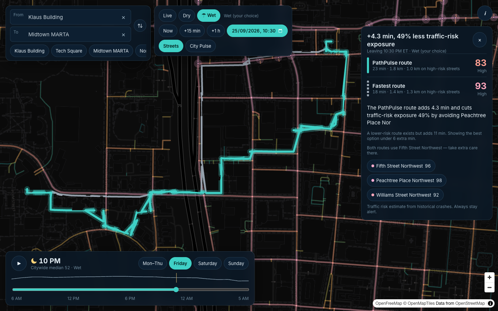
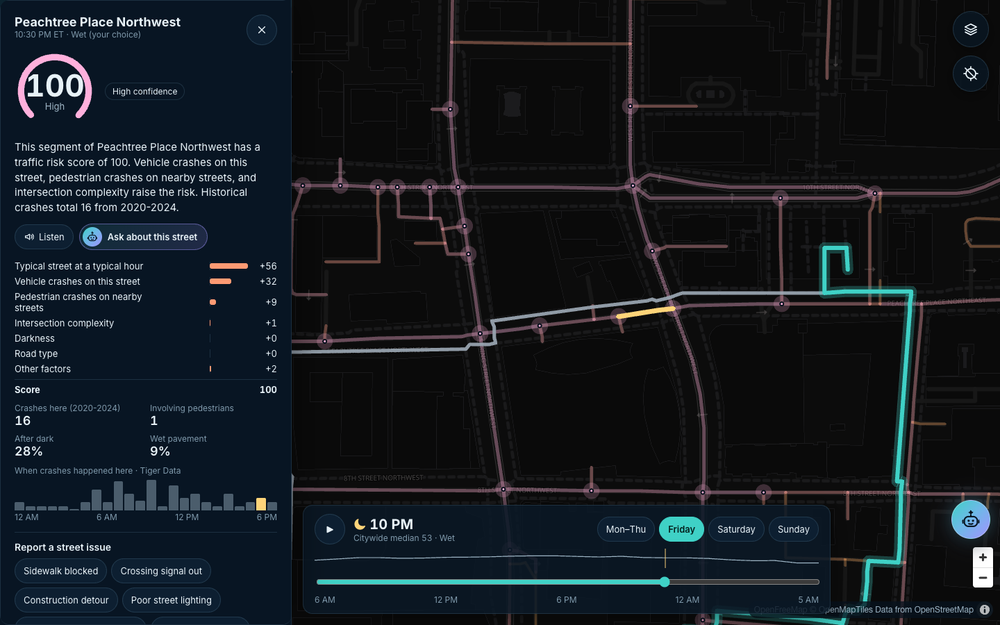
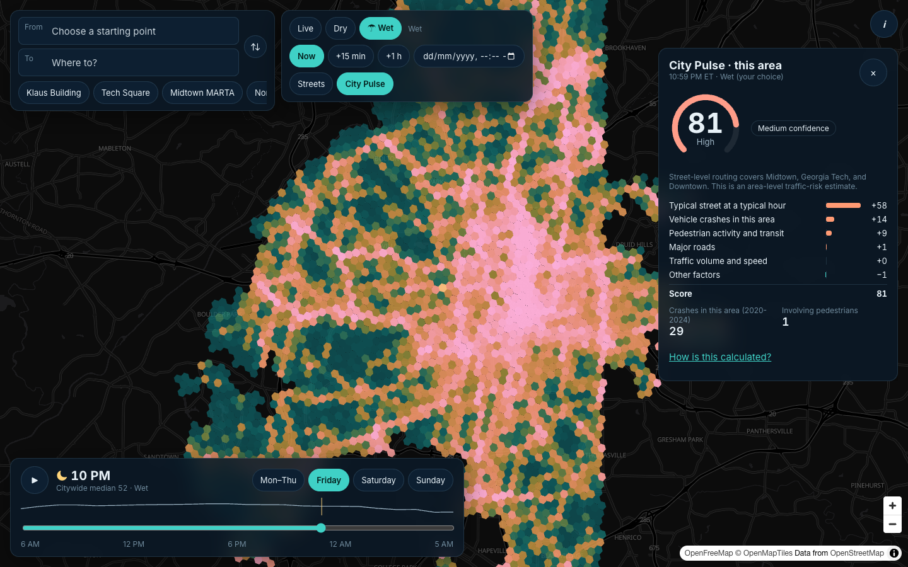
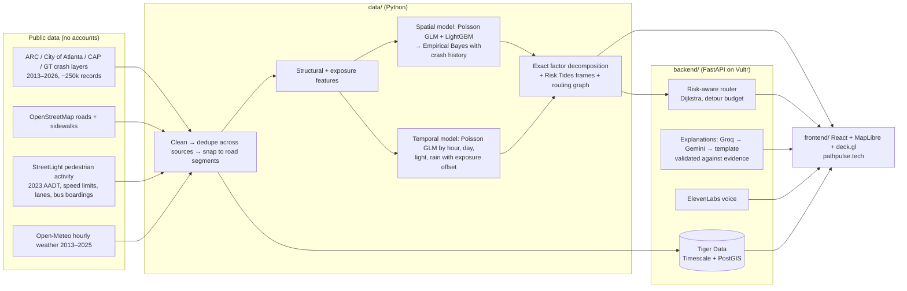

# PathPulse

**See traffic risk before you walk into it.**

**Try it:** [Live demo (GitHub Pages)](https://shaiknagurshareef.github.io/HackGT13/). This is the scripted Klaus → Midtown MARTA scenario and works offline.
The full live app (any route, City Pulse, live weather) runs from `deploy/run_live.sh` behind a Cloudflare tunnel. See the Devpost page for the current URL.

PathPulse is a pedestrian traffic-risk forecaster for Atlanta. It learns from public crash records where and when people on foot get hit by vehicles. It turns that into a map that changes by hour and weather (**Risk Tides**). It also offers a walking route that trades a few minutes for much less exposure to high-risk streets.

Every score is explainable: a trained model produces it, the score is split exactly into the factors that drive it, and an LLM turns that evidence into one plain-English sentence. The LLM never produces a number.

> Built at **HackGT 13** (Sep 25–27, 2026) for the **Oracle of the Deep** (ML/AI + visualization) track and the **Aramco "A Marina's Mission"** social-good track.
> Scope: **traffic** risk to pedestrians only. PathPulse does not model crime or personal safety.

| Risk Tides (Friday 10 PM, wet) | Fastest vs PathPulse route |
| --- | --- |
|  |  |
| **Why is this street risky?** | **City Pulse: all of Atlanta** |
|  |  |

## What it does

- **Risk Tides.** Scrub or play 24 hours and switch Dry/Wet or the day of the week. About 50,000 street segments across the whole City of Atlanta re-color on one fixed 0–100 citywide scale. The top 5% of intersections glow.
- **Fastest vs PathPulse route.** *Klaus → Midtown MARTA, Friday 10:30 PM, rain:* **+4.2 min, 54% less traffic-risk exposure**, avoiding Peachtree Place and Williams St. If the fastest route is already the lower-risk one, PathPulse says so plainly.
- **"Why?" on every street.** A score dial, a confidence badge, and factor bars that add up exactly to the score. The sheet also shows the street's crash history and when crashes happened by hour (from Tiger Data).
- **City Pulse.** Area-level traffic-risk scores for 3,537 hexes covering the whole City of Atlanta. Any address in the city gets a score, even outside street-level routing coverage.
- **Grounded AI explanations.** The chain is Groq, then Gemini, then a deterministic template. A validator rejects any sentence containing a number that isn't in the evidence, or the words "safe" or "crime".
- **Honest by design.**
  - An About page and model card state the limitations.
  - "Traffic risk estimate from historical crashes. Always stay alert." appears on every route.
  - 911 and Georgia Tech Police are one tap away.
- **Demo mode.** `?demo=1` replays the scripted scenario from recorded responses, with the network off.

## How well it works

The data runs 2020–2024 across the whole City of Atlanta (2,228 pedestrian crashes snapped to streets). The model was trained on 2020–2023 and **tested on 543 pedestrian crashes from 2024**, ranking streets by predicted risk.

| Method | Crashes in the top 10% of street length | At the City HIN's own 10% of length | ROC-AUC |
| --- | --- | --- | --- |
| **PathPulse** | **74.3%** (95% CI 70–78%) | **73.9%** | **0.89** |
| Ranking by past pedestrian crashes | 49.8% | 49.8% | 0.72 |
| City of Atlanta High Injury Network (2025) | 53.8% | 53.7% | 0.69 |
| ARC structural risk flags | 51.2% | 50.1% | 0.79 |
| Random | 11.9% | 11.6% | 0.49 |

- **Second holdout (train 2020–22, test 2023):** 68.1% vs 45.5% for past-crash ranking and 54.2% for the HIN.
- **City Pulse (2024, 3,537 hexes):** the top 10% of hexes held **74.5%** of pedestrian crashes, vs 66.1% for past-crash ranking and 13% at random. ROC-AUC is 0.92.
- **What these numbers do and do not show:**
  - The confidence interval resamples 47 spatial blocks, so nearby streets are not treated as independent.
  - The gain over past-crash ranking in 2024 is +24.5 points (95% CI +20.4 to +28.8), and it repeats on 2023 (+22.6).
  - Citywide ranking includes many quiet residential streets, which makes it easier than ranking within dense Downtown alone.
  - We report ranking, not calibrated counts, because 2024 recorded more pedestrian crashes than earlier years.
  - Full details are in the [model card](docs/model_card.md).

## How it's built



- **Data:** about 250k crash records from 8 public ArcGIS layers are cleaned into one schema. Personal fields in the source data are dropped.
  - The same crash reported by several sources is merged (by collision id, or within 20 m and 30 min).
  - Each crash is snapped to a road segment, with intersection crashes split across their approaches. 95% of pedestrian crashes snap.
- **Model:**
  - An exposure-aware safety performance function uses traffic volume, speed limit, lanes, intersection complexity, pedestrian activity, transit, sidewalks, and vehicle-crash density. It is a log-space ensemble of a Poisson GLM and a monotone LightGBM, cross-validated on spatial blocks.
  - It is blended with each street's own history using Empirical Bayes, the Highway Safety Manual method.
  - A multi-task Poisson GLM adds hour, day, light, and rain effects.
  - No demographic, income, or crime features are used anywhere.
- **Explanations:** every score splits exactly into factors by telescoping through the percentile curve. The LLM only sees server-built JSON evidence.
- **Routing:** Dijkstra runs on an 85k-node citywide walk graph, searched in a padded box around each trip, with a density-weighted cost ladder, inside a detour budget of min(1.25× the fastest time, +6 min). Every edge is re-scored at the time you'd actually walk it. p95 latency is about 120 ms.

## Run it locally

Prerequisites: Python 3.12 with [uv](https://docs.astral.sh/uv/), and Node 22.

```bash
uv sync --all-packages
# Rebuild data + model (≈5 min; pulls public layers)
uv run --package pathpulse-data python -m pathpulse_data.fetch.snapshot
uv run --package pathpulse-data python -m pathpulse_data.fetch.weather
uv run --package pathpulse-data python -m pathpulse_data.network.graph
uv run --package pathpulse-data python -m pathpulse_data.ingest.run
uv run --package pathpulse-data python -m pathpulse_data.network.features
uv run --package pathpulse-data python -m pathpulse_data.export.bundle   # evaluates, fits, exports

# API (optional keys in backend/.env — see .env.example; works without any)
cd backend && uv run uvicorn app.main:create_app --factory --port 8000
# Web
cd frontend && npm install && npm run dev   # http://localhost:5173  (?demo=1 for the scripted demo)
```

Tests:

```bash
uv run --package pathpulse-data pytest data/tests --cov
uv run --package pathpulse-backend pytest backend/tests --cov
cd frontend && npm test -- --coverage && npx playwright test
```

## Sponsor technology, and the job each one does

These integrations are implemented and tested. Each one switches on when its key is present in `backend/.env`, which `deploy/go.sh` verifies. Without keys, PathPulse falls back gracefully: template explanations, the device voice, and in-memory history.

- **Groq** (`openai/gpt-oss-120b`, fallback `gpt-oss-20b`): fast, grounded one-to-three-sentence explanations.
- **Gemini API:** second provider in the explanation chain.
- **ElevenLabs:** reads explanations and walk alerts aloud, with browser speech as the fallback.
- **Tiger Data:** system of record.
  - The crash hypertable and hourly continuous aggregate power "when crashes happened here".
  - PostGIS stores street geometry, and a versioned risk grid stores the scores.
- **Vultr:** hosts the API and the site (Caddy + systemd).
- **.tech:** [pathpulse.tech](https://pathpulse.tech).

## Built with AI tools, and credits

- **AI tools, disclosed per HackGT rules:**
  - Code was written with **Claude Code** following the [ECC](https://github.com/affaan-m/ecc) workflow: plan, test first, implement, independent ML and security review agents, verify.
  - Product decisions, scope, and review were done by the team during the event.
- **Data:**
  - Atlanta Regional Commission, City of Atlanta Department of Transportation, Central Atlanta Progress, and Georgia Tech crash and road layers
  - StreetLight Data pedestrian activity (via City of Atlanta)
  - © OpenStreetMap contributors
  - Open-Meteo (CC-BY 4.0)
  - OpenFreeMap basemap
- **Libraries:** FastAPI, LightGBM, scikit-learn, statsmodels, OSMnx, GeoPandas, H3, MapLibre GL, deck.gl, React, Vite.

PathPulse is not an emergency service. In an emergency call **911**. Georgia Tech Police: **404-894-2500**.
