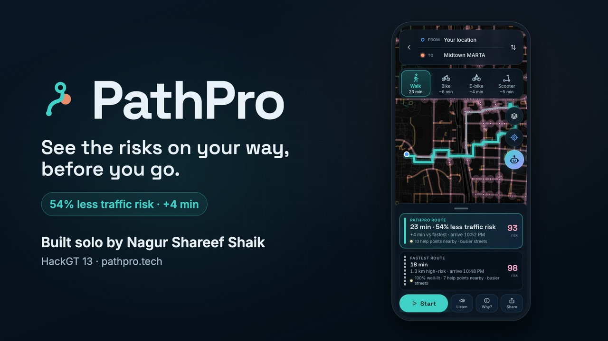
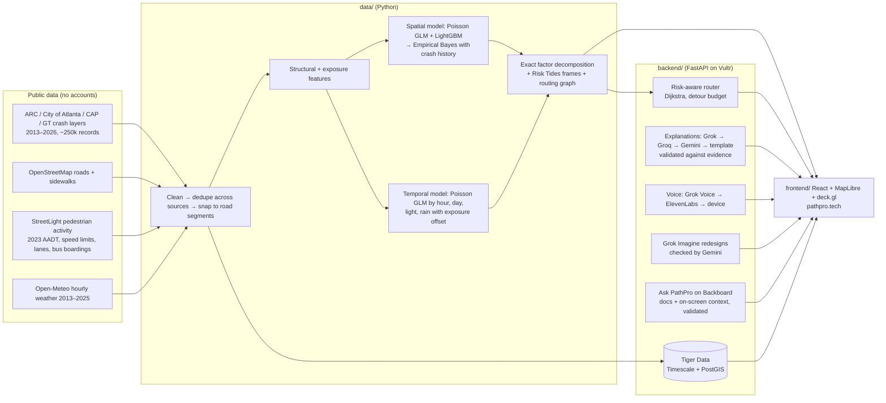

# PathPro

**See the risks on your way, before you go.**

**Live app: [pathpro.tech](https://pathpro.tech)**, hosted on Vultr (Atlanta) behind Caddy with automatic HTTPS.

## Demo videos

[](media/pathpro_demo_v3.mp4)

| Video | Length | Captions |
| --- | --- | --- |
| [**Demo (v3, 3 min)**: the story, the app with the Ask PathPro agent, Grok Voice alerts, Grok Imagine with Gemini's check, and the 2024 holdout result. Narrated with Grok Voice](media/pathpro_demo_v3.mp4) | 3:02 | [SRT](media/pathpro_demo_v3.srt) · [VTT](media/pathpro_demo_v3.vtt) |
| [**Earlier full demo (v2)**: motivation, how PathPro differs, the app on phone and desktop, every risk it shows, who it's for, results and ROI, and one scene per sponsor](media/pathpro_demo_v2.mp4) | 6:30 | [SRT](media/pathpro_demo_v2.srt) · [VTT](media/pathpro_demo_v2.vtt) |
| [**30-second cut**](media/pathpro_30s.mp4) | 0:35 | [SRT](media/pathpro_30s.srt) · [VTT](media/pathpro_30s.vtt) |

All videos have burned-in captions and are stored with Git LFS. v3 is narrated with Grok Voice (AI; the on-screen note says so) and shows the current app. v2 and the 30-second cut use ElevenLabs narration and predate the Grok, Gemini and Ask PathPro features; their opening and closing cards show an outdated four-person team (PathPro is a solo build). Clone with `git lfs install` first, or open a file on GitHub and choose "View raw" to play it. The v3 script, production notes and number sources are in [media/pathpro_v3_script.md](media/pathpro_v3_script.md); earlier cuts are in [media/pathpro_demo_script.md](media/pathpro_demo_script.md).

## Documentation

Start at **[docs/README.md](docs/README.md)**:

- [User guide](docs/guide/user_guide.md) ([PDF](docs/guide/user_guide.pdf))
- [Technical documentation](docs/technical/README.md) ([PDF](docs/technical/pathpro_technical_docs.pdf)): architecture diagrams, data and models, API, deployment, security, testing
- [Decision log](docs/decisions.md)
- [Model card](docs/model_card.md)

- **Modes:** Walk · Bike · E-bike · Scooter (a separate cyclist-risk model on OpenStreetMap's bike network), plus a MARTA hand-off for long walks. No car routing, by design.
- **Offline demo:** add `?demo=1` for the scripted Klaus → Midtown MARTA scenario (walk and ride).
- **Deploy:** `deploy/go.sh pathpro.tech` provisions the Vultr VM, installs Caddy + systemd, ships the app, and smoke-tests it.

PathPro is a pedestrian traffic-risk forecaster for Atlanta. It learns from public crash records where and when people on foot get hit by vehicles. It turns that into a map that changes by hour and weather (**Risk Tides**). It also offers a walking route that trades a few minutes for much less exposure to high-risk streets.

Every score is explainable: a trained model produces it, the score is split exactly into the factors that drive it, and an LLM turns that evidence into one plain-English sentence. The LLM never produces a number.

> A solo build by **Nagur Shareef Shaik** (team name **Coding Claws**, Georgia State University) at **HackGT 13** (Sep 25–27, 2026), entered in the **Oracle of the Deep** (ML/AI + visualization) track and the **Aramco "A Marina's Mission"** and **SpaceXAI "Make it Legendary"** sponsor tracks.
> Scope: **traffic** risk to pedestrians, plus a **personal-safety layer**: street lighting, foot traffic, help points (GT blue-light phones, police, fire, hospitals, MARTA), and an informational layer of reported crimes against persons. Crime is never used to choose routes or in the traffic model. See [model card](docs/model_card.md) and [safety sources](docs/safety_sources.md).

| Risk Tides (Friday 10 PM, wet) | Fastest vs PathPro route |
| --- | --- |
|  |  |
| **Why is this street risky?** | **City Pulse: all of Atlanta** |
|  |  |

## What it does

- **Risk Tides.** Scrub or play 24 hours and switch Dry/Wet or the day of the week. About 50,000 street segments across the whole City of Atlanta re-color on one fixed 0–100 citywide scale. The top 5% of intersections glow.
- **Fastest vs PathPro route.** *Klaus → Midtown MARTA, Friday 10:30 PM, rain:* **+4.2 min, 54% less traffic-risk exposure**, avoiding Peachtree Place and Williams St. If the fastest route is already the lower-risk one, PathPro says so plainly.
- **"Why?" on every street.** A score dial, a confidence badge, and factor bars that add up exactly to the score. The sheet also shows the street's crash history and when crashes happened by hour (from Tiger Data).
- **City Pulse.** Area-level traffic-risk scores for 3,537 hexes covering the whole City of Atlanta. Any address in the city gets a score, even outside street-level routing coverage.
- **Grounded AI explanations.** The chain is Grok, then Groq, then Gemini, then a deterministic template. A validator rejects any sentence containing a number that isn't in the evidence, or the words "safe" or "crime".
- **Spoken alerts.** Navigation callouts and Listen use Grok Voice, with ElevenLabs and then the device's own voice as backups.
- **"Imagine this street redesigned."** For planners: Grok Imagine draws the street with evidence-based fixes (crosswalks, curb extensions, lighting, a road diet). The server builds the prompt from the street's own risk factors, never from user text or street names, and every image is labeled "not a real photo". Gemini checks each image before it is shown: it confirms which planned fixes appear and rejects images with readable text, logos, or faces.
- **Ask PathPro (Backboard).** Ask how PathPro works, or about the street, route, or area on screen. Answers come from PathPro's own docs plus server-built context, and each one is validated (no numbers that aren't in the docs or the evidence, no crime framing), with a fixed fallback. Memory is opt-in and private to one browser: it keeps only stated travel preferences, never places, and "Forget me" deletes it. Each visitor gets 20 questions a day.
- **Honest by design.**
  - An About page and model card state the limitations.
  - "Traffic risk estimate from historical crashes. Always stay alert." appears on every route.
  - 911 and Georgia Tech Police are one tap away.
- **Community street reports.** Walkers flag a traffic-related issue on a street (sidewalk blocked, crossing signal out, construction detour, poor lighting, flooding, fast-moving traffic). Reports show as violet dots on the map, on the street sheet, and on route results for 14 days. They are context only: they never change a score, a route, or what the explanation model sees.
- **Demo mode.** `?demo=1` replays the scripted scenario from recorded responses, with the network off.

## How well it works

The data runs 2020–2024 across the whole City of Atlanta (2,228 pedestrian crashes snapped to streets). The model was trained on 2020–2023 and **tested on 543 pedestrian crashes from 2024**, ranking streets by predicted risk.

| Method | Crashes in the top 10% of street length | At the City HIN's own 10% of length | ROC-AUC |
| --- | --- | --- | --- |
| **PathPro** | **74.3%** (95% CI 70–78%) | **73.9%** | **0.89** |
| Ranking by past pedestrian crashes | 49.8% | 49.8% | 0.72 |
| City of Atlanta High Injury Network (2025) | 53.8% | 53.7% | 0.69 |
| ARC structural risk flags | 51.2% | 50.1% | 0.79 |
| Random | 11.9% | 11.6% | 0.49 |

- **Second holdout (train 2020–22, test 2023):** 68.1% vs 45.5% for past-crash ranking and 54.2% for the HIN.
- **City Pulse (2024, 3,537 hexes):** the top 10% of hexes held **74.5%** of pedestrian crashes, vs 66.1% for past-crash ranking and 13% at random. ROC-AUC is 0.92.
- **What these numbers do and do not show:**
  - The confidence interval comes from 400 resamples of 614 H3 res-8 spatial blocks, so nearby streets are not treated as independent.
  - The gain over past-crash ranking in 2024 is +24.5 points (95% CI +20.4 to +28.8), and it repeats on 2023 (+22.6).
  - Citywide ranking includes many quiet residential streets, which makes it easier than ranking within dense Downtown alone.
  - PathPro claims ranking, not calibrated counts, because 2024 recorded more pedestrian crashes than earlier years.
  - Full details are in the [model card](docs/model_card.md).

## How it's built



- **Data:** about 250k crash records from 8 public ArcGIS layers are cleaned into one schema. Personal fields in the source data are dropped.
  - The same crash reported by several sources is merged (by collision id, or within 20 m and 30 min).
  - Each crash is snapped to a road segment, with intersection crashes split across their approaches. 95% of pedestrian crashes snap.
- **Model:**
  - An exposure-aware safety performance function uses traffic volume, speed limit, lanes, intersection complexity, pedestrian activity, transit, sidewalks, and vehicle-crash density. It is a log-space ensemble of a Poisson GLM and a monotone LightGBM, cross-validated on spatial blocks.
  - It is blended with each street's own history using Empirical Bayes, the Highway Safety Manual method.
  - A multi-task Poisson GLM adds hour, day, light, and rain effects.
  - No demographic, income, or crime features are used anywhere.
- **Explanations:** every score splits exactly into factors by telescoping through the percentile curve. The LLM only sees server-built JSON evidence.
- **Routing:** Dijkstra runs on an 85k-node citywide walk graph, searched in a padded box around each trip, with a density-weighted cost ladder, inside a detour budget of min(1.25× the fastest time, +6 min). Every edge is re-scored at the time you'd actually walk it. p95 latency is about 120 ms.

## Run it locally

Prerequisites: Python 3.12 with [uv](https://docs.astral.sh/uv/), and Node 22.

```bash
uv sync --all-packages
# Rebuild data + model (≈5 min; pulls public layers)
uv run --package pathpulse-data python -m pathpulse_data.fetch.snapshot
uv run --package pathpulse-data python -m pathpulse_data.fetch.weather
uv run --package pathpulse-data python -m pathpulse_data.network.graph
uv run --package pathpulse-data python -m pathpulse_data.ingest.run
uv run --package pathpulse-data python -m pathpulse_data.network.features
uv run --package pathpulse-data python -m pathpulse_data.export.bundle   # evaluates, fits, exports

# API (optional keys in backend/.env — see .env.example; works without any)
cd backend && uv run uvicorn app.main:create_app --factory --port 8000
# Web
cd frontend && npm install && npm run dev   # http://localhost:5173  (?demo=1 for the scripted demo)
```

Tests:

```bash
uv run --package pathpulse-data pytest data/tests --cov
uv run --package pathpulse-backend pytest backend/tests --cov
cd frontend && npm test -- --coverage && npx playwright test
```

## Sponsor technology, and the job each one does

These integrations are implemented and tested. Each one switches on when its key is present in `backend/.env`, which `deploy/go.sh` verifies. Without keys, PathPro falls back gracefully: template explanations, the device voice, and in-memory history. Without `MONGODB_URI`, community reports are hidden and everything else works. Without the xAI key, explanations start at Groq, voice starts at ElevenLabs, and Imagine shows a short "unavailable" message. Without the Backboard keys, Ask PathPro is hidden.

**Live status (Sat Sep 26, night):** Grok, Grok Voice, Grok Imagine, the Gemini image check, and Ask PathPro are built and tested, and Grok, Gemini, and Backboard were verified against the real APIs locally. They are **not yet deployed** to pathpro.tech. Everything else below is live.

- **Grok (xAI):** first provider in the explanation chain; **Grok Voice** for navigation callouts and Listen; **Grok Imagine** for "Imagine this street redesigned".
- **Groq** (`openai/gpt-oss-120b`, fallback `gpt-oss-20b`): fast, grounded one-to-three-sentence explanations when Grok is unavailable.
- **Gemini API:** third provider in the explanation chain, and the multimodal check on every Grok Imagine illustration.
- **Backboard:** Ask PathPro. A Backboard assistant answers from PathPro's curated docs (model card, metrics, safety sources, decision log, data and models, judge Q&A). Public questions use read-only memory; opt-in memory lives in a private per-browser assistant clone that "Forget me" deletes.
- **ElevenLabs:** reads explanations and walk alerts aloud when Grok Voice is unavailable, with the device voice as the last fallback.
- **Tiger Data:** system of record.
  - The crash hypertable and hourly continuous aggregate power "when crashes happened here".
  - PostGIS stores street geometry, and a versioned risk grid stores the scores.
- **MongoDB Atlas:** community street reports (`backend/app/repositories/reports.py`) and **Share my walk** live links (`backend/app/repositories/walks.py`, TTL-expiring after 6 h, optimistic-concurrency position updates), on pymongo's async client.
  - A 2dsphere index answers "reports in this map view" with `$geoWithin`.
  - A TTL index expires each report 14 days after its last confirmation, with no cleanup job.
  - One atomic `find_one_and_update` upsert per report: a repeat report on the same street and category confirms the existing one instead of duplicating it (unique index on segment + category).
  - An aggregation pipeline (`$match` → `$group` → `$sort`) summarises active reports by category.
  - Report locations come from PathPro's street graph, never from the phone, and there is no free-text field. Reports never feed the model or the explanation evidence.
- **Vultr:** hosts the API and the site (Caddy + systemd).
- **.tech:** [pathpro.tech](https://pathpro.tech), read as "path protect": the `.tech` completes the word.

## Built with AI tools, and credits

- **AI tools, disclosed per HackGT rules:**
  - AI coding assistants were used during development (see the Devpost AI-tools disclosure). I followed a test-first workflow: plan, failing test, implementation, independent ML and security review, verification.
  - In the product, Grok models, Grok Imagine, Grok Voice, Gemini, and Backboard are used as described above; none of them produces a risk number.
  - Product decisions, scope, and review were mine, made during the event.
- **Data:**
  - Atlanta Regional Commission, City of Atlanta Department of Transportation, Central Atlanta Progress, and Georgia Tech crash and road layers
  - StreetLight Data pedestrian activity (via City of Atlanta)
  - © OpenStreetMap contributors
  - Open-Meteo (CC-BY 4.0)
  - OpenFreeMap basemap
- **Libraries:** FastAPI, LightGBM, scikit-learn, statsmodels, OSMnx, GeoPandas, H3, MapLibre GL, deck.gl, React, Vite.

PathPro is not an emergency service. In an emergency call **911**. Georgia Tech Police: **404-894-2500**.
