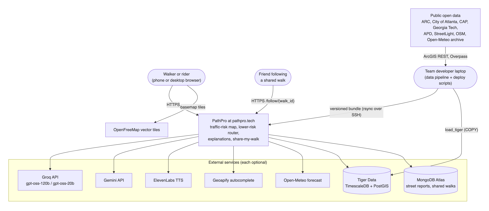

# PathPro — Architecture and build plan

PathPro ([pathpro.tech](https://pathpro.tech)) forecasts pedestrian and cyclist traffic risk for every street in the City of Atlanta by hour and weather, and plans lower-risk walking and riding routes. It is a solo build by Nagur Shareef Shaik (team name Coding Claws, Georgia State University) for HackGT 13. Scope comes from `Requirements (PRD).md`.

This page has two parts: a one-page summary of the architecture as it runs today, and the original Friday-night build plan, kept for the record. The detailed, code-checked description is in [docs/technical/](technical/README.md).

## Architecture today

*System context. Details and the container view: [technical/architecture.md](technical/architecture.md).*

| Part | What it is | Where |
| --- | --- | --- |
| Offline pipeline | Fetches public crash, network, exposure, and weather data; cleans, deduplicates, and snaps crashes to 49,915 road segments; fits the walk model (Poisson GLM + monotone LightGBM + Empirical Bayes, with an hour-and-conditions model), the ride model, City Pulse hexes, and the personal-safety layer; exports a versioned bundle | `data/` (uv package `pathpulse_data`) |
| Model bundle | Immutable files per model version (factors, Risk Tides frames, walk and ride graphs, geometry, metrics), hashed in `manifest.json`; the API loads it at startup and fails fast on a mismatch | `artifacts/<version>/` |
| API | FastAPI on one uvicorn worker behind Caddy on a Vultr VM: routes, segment and area detail, explanations, voice, street redesign illustrations, Ask PathPro, geocoding, live conditions, community reports, Share my walk, safety layers | `backend/app/` |
| SPA | React, MapLibre, deck.gl, zod-validated API client; the `?demo=1` mode answers from recorded fixtures and works offline | `frontend/src/` |
| Systems of record | Tiger Data (crash hypertable, hourly aggregate, score grid; one read on the request path, for the hourly chart), MongoDB Atlas (reports, shared walks) | `data/sql/`, `backend/app/repositories/` |

**Generative AI, always behind server-built evidence and validation**

- **Explanations:** xAI Grok (`grok-4.20-0309-non-reasoning`) → Groq `gpt-oss-120b` → Gemini → Groq `gpt-oss-20b` → deterministic template. Every provider gets the same evidence-only prompt and the same validator (numbers and clock times must come from the evidence; banned framings rejected). Street names are flattened to one short line before any LLM sees them.
- **Voice (`/tts`):** Grok Voice → ElevenLabs → the device's own voice. Only server-written explanation text is ever spoken.
- **"Imagine this street redesigned":** Grok Imagine draws the street with evidence-based fixes from a server-built prompt (the street's risk factors, no street names); Gemini checks each picture before it is cached or shown (which planned fixes appear; no text, logos, or identifiable faces; one retry). Pictures are cached on disk, capped at 40 a day (10 per client), and labeled as an AI illustration, never a photo.
- **Ask PathPro (Backboard):** retrieval over six project documents, with server-built context for the street, route, or City Pulse area on screen (or live conditions). Answers are validated (sourced numbers only, no links, no crime framing, on topic) or replaced by a fixed fallback. Opt-in private memory is a per-browser assistant clone that keeps only stated travel preferences; "Forget me" deletes it. Thread and memory tokens are HMAC-signed.

**Rules that shape everything:** the model bundle, not a database, is the hot path; every external service is optional; no model-generated number reaches the user; no demographic or income features anywhere; crime data is informational only and never used in the traffic model or routing; API keys live only in `backend/.env` on the server.

| Flow | Diagram |
| --- | --- |
| Plan a route | [a3_route_sequence.png](technical/img/a3_route_sequence.png) |
| "Why?" explanations | [a4_explain_sequence.png](technical/img/a4_explain_sequence.png) |
| Street redesign illustration | [a9_imagine_sequence.png](technical/img/a9_imagine_sequence.png) |
| Ask PathPro | [a10_ask_sequence.png](technical/img/a10_ask_sequence.png) |
| Ask PathPro memory | [a11_ask_memory.png](technical/img/a11_ask_memory.png) |
| Deployment | [o1_deploy.png](technical/img/o1_deploy.png) |

---

## Original build plan (Friday 21:00, kept for the record)

What follows is the plan written at the start of the hackathon. Several choices changed while building (see [decisions.md](decisions.md)): the domain became pathpro.tech, the router uses a density-scaled cost ladder, the spatial model became a GLM plus monotone LightGBM, walk and ride models share one bundle, a personal-safety layer was added (crime shown for information only), and Grok, Grok Imagine, Gemini image review, and Ask PathPro on Backboard were added on Saturday evening.

### Context at the start
The plan was to build **PathPro** (planned domain **pathpulse.tech**) from `Requirements (PRD).md`: an Atlanta pedestrian traffic-risk forecaster with:
- hourly **Risk Tides**
- a fastest vs lower-risk walking router
- factor-by-factor explanations
- grounded LLM explanations
- **City Pulse**, citywide area scores

Targets: Oracle of the Deep, Best Overall, the social-good track, and MLH prizes.

**Environment.** 8 GB M1, Python 3.12, uv, Node 22 and npm, **no Docker**. `gh` is logged in; the remote is `ShaikNagurShareef/PathPro`.

**Decisions at the start**
- Builder: Nagur Shareef Shaik, solo (team name Coding Claws).
- LLM: **Groq** first (`openai/gpt-oss-120b`, then `gpt-oss-20b`), then **Gemini** (`gemini-3.8-flash`), then a deterministic template. (Later: xAI Grok placed first.)
- Voice: **ElevenLabs**, with the browser's built-in speech as fallback. (Later: Grok Voice placed first.)
- Database: **Tiger Data**, as system of record. The demo never depends on it.
- Hosting: a **Vultr** VM plus the .tech domain.
- **City Pulse** is P1 and covers **traffic risk only**; crime data stays out of every model. (Later: the personal-safety layer shows reported crimes against persons for information only.)

**How PathPro differs from past work**
- lumos.ai (AGPL, ideas only): crime-based, city-level scores, the model imitates a formula, no route comparison, no per-factor explanation, nothing on the map changes over time.
- **SafeWay (HackGT 11)**: an Atlanta router with fixed hand-set weights.
- PathPro instead has:
  - a *forecasting* model trained on real crash outcomes, with pedestrian exposure
  - an honest held-out test that beats the City's own High Injury Network
  - risk that changes by hour and weather
  - explanations built from the model's own evidence

### Hackathon checklist (from the HackGT 13 research)
**Timeline**
- Hacking ends **Sun 08:00**. Devpost closes at 12:00, but submit by 08:00.
- Expo runs **09:30–11:00 in the Klaus Atrium**. The demo route starts at Klaus, so the demo can start "from this building".
- Closing ceremony: 12:30, Ferst Theatre.
- You must be present at the expo. After Devpost, submit the link at expo.hexlabs.org.

**Categories to enter (no cap on the number)**
- Oracle of the Deep: the ML/AI/visualization track.
- **Aramco "A Marina's Mission"**: the social-good track. Pedestrian deaths are a public-health problem.
- Best Overall.
- MLH prizes:
  - **Tiger Data**: hypertable, continuous aggregates, sparkline
  - **Vultr**: the deployed backend
  - **ElevenLabs**: Listen and walk alerts
  - **.tech**: pathpulse.tech
  - **Gemini API**: confirm at the MLH table; it's on the MLH page but not on Devpost
- Notability "Trust the Process": planning notes and screenshots.
- Create-X interest box.
- Drop SpaceXAI and DigitalOcean. (Later: SpaceXAI entered with Grok, Grok Voice, and Grok Imagine.)

**Judging focus** is creativity, complexity and completeness (unverified; check live.hexlabs.org while logged in). Past winners had a concrete harm, a working live demo, rich visuals and a multi-stage ML pipeline. The plan covers each of these.

**Rules compliance**
- The Devpost write-up discloses the AI tools used and what was built, and credits every framework and dataset.
- Only data and code created this weekend.

**Expo table kit (M9)**
- laptop running `?demo=1` offline, plus a phone showing the live site
- printed QR code for pathpulse.tech
- one-page model card with the headline metric
- 30-second and 2-minute pitch scripts
- a judge Q&A cheat sheet covering exposure bias, why not crime, and data limitations

**Headline claims for judges**
- "PathPro's top 10% of predicted streets captured X% of the *following year's* pedestrian crashes, versus Y% for the City's High Injury Network and 10% by chance."
- "A +3 min walk cuts high-risk exposure by Z%."

### Data (all public ArcGIS REST, no account; page 2,000 at a time with `resultOffset`, `outSR=4326`)
Bases:
- ARC = `services1.arcgis.com/Ug5xGQbHsD8zuZzM/arcgis/rest/services`
- COA = `services2.arcgis.com/zLeajbicrDRLQcny/arcgis/rest/services`

| Purpose | Layer | Notes |
|---|---|---|
| Spatial ped counts | ARC `Crashes2020_2024`, `Crashes2019to2023` | Year only; 817 ped crashes in the bbox 2020–24; citywide pulls for City Pulse |
| **Timed ped crashes (about 4× the first pull)** | ARC `MARTACountyCrashes_2023`, ARC `2022_COA_Pedestrian_and_bicycle_crashes`, CAP `services3.arcgis.com/FWC2S7IFSuSHD4PZ/.../Downtown_Transportation/FeatureServer/9` (2017–21, 470 ped), COA `Fiveyear_Crashdata_Midtown_WFL1` (2019–23, 153 ped), COA `KACrashesSince2013` (249 ped fatal/serious), gtmaps `services2.arcgis.com/I9cUOJUZvdGAJncI/.../Atlanta_Collisions_Involving_Ped_or_Cyclist/FeatureServer/3` (2021–25) | De-duplicate on Collision_ID, else date/time plus 20 m |
| Timed all-mode crashes | ARC `COA_2022AllCrashes`, `MARTACountyCrashes_2023` | ~21k in the bbox; shared temporal signal |
| **Pedestrian exposure by time of day** | COA `Citywide-Pedestrian-Activity--250ftHex--ZA{21,31,41,51}…` (StreetLight 2021) | Daily volume by day part and weekday/weekend; used as a feature and as the exposure offset |
| **Vehicle exposure and design** | COA `SummaryStats_Routes_AADT/17` (2023 AADT), `Centerline_ATLDOT/0` (speed limit, lanes, class), `Speedlimit_COA`, GDOT `RoadSegments_Fulton` (divided, one-way) | Joined to OSM edges within 15 m and 30° heading |
| Context | ARC `Atlanta_Region_Safety_Risk_Factors/1`, COA `Sidewalks_Inventory/2`, `MARTA_Bus_Stops_COA` (boardings), ARC `PedestrianSignals`, OSM crossings and nightlife POIs, `School_Zones_with_Schedules`, Downtown lights (with a missing-data flag) | — |
| Baselines only (never features, to avoid leakage) | COA `HIN_Tiers_2025`, ARC `ARC_High_Injury_Network_Severity` | "Beat the City's HIN" comparison |
| Excluded (NFR-14) | income, Communities of Concern, demographics | Not used as features |

Other sources:
- Walk network: OSMnx 2.1.1.
- Weather: Open-Meteo forecast and archive.
- Basemap: OpenFreeMap tiles.
- Geocoding: Geoapify plus a curated gazetteer of local places.

### Model: tuned for accuracy and still honest
**Unit of analysis:** OSM road edges.
- A crash within 15 m of a node is split 1/degree across that node's edges; otherwise it snaps to the nearest edge within 30 m.
- Sidewalks and crossings inherit risk from the nearest road edge.

**A — spatial model**
- An **exposure-aware** safety performance function. Features:
  - log pedestrian volume (StreetLight)
  - log AADT, speed limit, lanes, divided, one-way, functional class
  - intersection degree, signals, crossings, bus boardings
  - sidewalk condition, nightlife POIs, school zones
  - non-pedestrian crash density from the training window only
- An **ensemble of LightGBM Poisson and a Poisson GLM**, with weights stacked on validation. Hyperparameters tuned with Optuna under a 20-minute budget.
- **Empirical Bayes** blend with each segment's observed counts.
- Validation uses both **temporal holdout** (train ≤2022, validate 2023, test 2024–25) and **spatial block CV** on H3 resolution-7 blocks.

**B — hour and condition model**
- A multi-task Poisson GLM on stacked rows (cell × {all-mode, pedestrian}).
- Terms: hour, day group, dark, wet, road group, plus ridge-penalized pedestrian interactions.
- Offset: log(pedestrian exposure for that day part × hours). Wet and dark are defined identically for crashes and exposure: Open-Meteo precipitation ≥0.1 mm, and `astral` sunrise/sunset.

**Combination:** rate = A × B normalized. Score = citywide percentile, 0–100.

**Factor bars** use telescoping attribution over LightGBM `pred_contrib` values and the GLM terms, so the bars sum exactly to the score.

**Metrics** go to `metrics.json` and the model card, with bootstrap confidence intervals:
- **Headline: top-decile capture** on the 2024–25 holdout.
- ROC-AUC and PR-AUC for "segment has ≥1 ped crash in the holdout".
- Poisson deviance and calibration by decile.
- Compared against: random, count-only, the City HIN, ARC risk-factor count, and A with a flat B.

**Targets:**
- ≥3× random capture, and beating both count-only and the HIN.
- ROC-AUC ≥0.80.
- Calibration within ±25% per decile.
- The pedestrian×dark coefficient must be positive.

**City Pulse:** the same pipeline aggregated to H3 resolution-9 hexes across the City of Atlanta (~3.5k cells). Frames per hex; an area card for any Atlanta address.

**Router:** scipy `csgraph.dijkstra` on a CSR matrix. Cost = t·(1+λ·(s/100)²) over the ladder λ ∈ {0.5…16}, keeping the lowest-risk route within the detour budget. Each edge is re-scored at its traversal hour.

### Repo layout (monorepo)
- `data/pathpulse_data/` (uv package):
  - `fetch/{arcgis,weather}.py`
  - `network/{graph,features,conflate,inherit}.py`
  - `ingest/{clean,dedupe,snap}.py`
  - `timeseries/exposure.py`
  - `model/{spf,ensemble,eb,temporal,evaluate,tune}.py`
  - `citywide/{hexgrid,model}.py`
  - `export/{frames,bundle}.py`
  - `db/load_tiger.py` and `sql/`
- `backend/app/`:
  - `main.py`
  - `api/{envelope,health,meta,routes,segments,areas,explain,conditions,geocode,tts}.py`
  - `domain/{scoring,router,route_metrics,timeutil}.py`
  - `repositories/{artifacts,history}.py`
  - `services/explain/{evidence,prompt,providers,validator,template,cache}.py`
  - `services/{weather,geocode,tts}.py`
- `frontend/src/` (Vite, React, TypeScript, MapLibre, deck.gl `MapLibreOverlay`, zod):
  - `api/`, `state/urlState.ts`, `frames/frameStore.ts`
  - `map/{segments,hotspots,routes,hex}Layer.ts`
  - `components/{Timeline,ConditionsChip,SearchBar,ComparisonCard,SegmentSheet,AreaCard,FactorBars,Legend,About,FirstRun}.tsx`
  - `demo/`, `lib/`, `e2e/`
- `deploy/{Caddyfile,pathpulse.service,deploy.sh}`
- `docs/{architecture,model_card,api,demo_script,devpost,judge_qa}.md`

**API**
- Every response uses the envelope `{success, data, error}` and carries `model_version`.
- `GET /healthz`, `GET /meta`
- Static `frames_{cond}.bin`, `hex_frames_{cond}.bin` and `segments.geojson`, with sha256 values in the manifest.
- `POST /routes`, `GET /segments/{id}`, `GET /areas/{h3}`, `GET /areas/lookup`
- `POST /explain`: the server builds the evidence; Groq gets 1.6 s, then Gemini, then the template; output is validated and cached.
- `GET /conditions/live`, `GET /geocode`, `POST /tts {key}`

### Engineering workflow
- **Setup:** coding rules for Python, TypeScript, React and web, with a map from file globs to review checklists.
- **Plan and build:** a plan for each milestone, then test-first development with a commit at RED and at GREEN.
- **Skills by area:**
  - data and model: `mle-workflow`
  - backend: `fastapi-patterns`
  - frontend: `react-patterns` and `frontend-a11y`
  - LLM: `cost-aware-llm-pipeline`
- **Review after each milestone:** code review, a language review (Python, FastAPI or React), a security review, and an ML review for M2.
- **Verify:** `verification-loop` (ruff, mypy, eslint, tsc, pytest and Vitest with ≥80% coverage, gitleaks), then a checkpoint.
- **Conventions:**
  - conventional commits
  - files of 200–400 lines, functions under 50 lines
  - frozen dataclasses and pydantic at every boundary
  - a repository pattern
  - rate limit of 60/min/IP and CORS locked to the app's origin
- **Pushing:** commits stay local until the first `git push` is approved; Devpost needs the repo link.
- **M0 also amends the PRD:**
  - §8: sponsors and categories above
  - §4: City Pulse requirements (CITY-01…04, P1)
  - §9.3: resolve Q2–Q4

### Milestones (Fri 21:00 → Sun 08:00)
| # | Window | Exit criteria |
|---|---|---|
| M0 | Fri 21–22 | Scaffolding, rule packs, pre-commit, `.env.example`, PRD amended. PostGIS confirmed on Tiger. Keys smoke-tested. |
| M1 | 22–01:30 | Every layer above saved as parquet (committed) with an ingestion and dedupe report. Graph ≥98% connected. Conflation, snapping, exposure, dark/wet flags. Tiger load running in the background. |
| M2 | 01:30–04 | SPF ensemble with tuning, EB, temporal GLM, `metrics.json` against every baseline; frames and manifest; hex frames. |
| — | 04–08:30 | Sleep. The Optuna and bootstrap runs can finish overnight. |
| M3 | Sat 08:30–12 | Backend slice: healthz, meta, static files, `/routes`, `/segments`, template explanations. |
| M4 | 12–16 | Frontend slice: map, frames, timeline, dry/wet, quick picks, comparison card. **Works end to end locally.** |
| M5 | 16–19 | LLM chain, validator and cache; live conditions; geocode; URL state; factor bars. |
| M6 | 19–22 | Vultr with Caddy TLS, pathpulse.tech, systemd. `?demo=1` bundle. About page, model card, trust copy, P0 edge cases. |
| M7 | 22–00:30 | Verification loop, reviewer agents, Playwright, coverage. **P0 gate.** |
| M8 | 00:30–04 | P1 in order: **City Pulse**, Listen (ElevenLabs), Preview walk, avoided hotspots, sparkline (Tiger), day groups. Anything not done by 03:30 is dropped. **Freeze at 04:00.** |
| M9 | Sun 04–08 | 2–3 minute video, Devpost write-up (every category, AI-tool disclosure, data credits), README with architecture diagram, expo kit, submit by 07:30. |

**Freeze criteria:**
- every P0 acceptance check passes on pathpulse.tech
- the offline Playwright demo passes
- coverage ≥80%
- no CRITICAL or HIGH findings
- gitleaks is clean
- the model targets are met, or honestly reported with confidence intervals

### Verification (end to end)
- `uv run pytest --cov` in `data/` and `backend/` shows ≥80%. This includes property tests that:
  - the factor bars sum to the score
  - the detour budget is never violated
  - de-duplication and snapping match golden cases
- `uv run python -m pathpulse_data.model.evaluate` prints capture, AUC, deviance and calibration against random, count-only, HIN and ARC risk factors, with confidence intervals. The targets in the Model section must be met, or reported honestly.
- `npm run test -- --coverage` and `npx playwright test` in `frontend/`: the demo spec runs offline with `context.setOffline(true)`.
- Latency: a `curl` loop against `POST /routes` shows p95 < 1.5 s. `/explain` returns the template when keys are removed.
- Manual checks on pathpulse.tech:
  - Klaus → Midtown MARTA at 10:30 PM wet shows two routes and the stated trade-off, with factor bars that sum to the score.
  - A short campus trip shows a single route.
  - A Decatur destination shows the out-of-coverage message.
  - A West End address shows the City Pulse card.
  - Scrubbing the timeline responds in under 100 ms.
