# PathPro User Guide

**See the risks on your way, before you go.**

PathPro is live at **[pathpro.tech](https://pathpro.tech)**. An offline demo is at **[pathpro.tech/?demo=1](https://pathpro.tech/?demo=1)**.

I built PathPro solo at HackGT 13. I'm **Nagur Shareef Shaik** (team name **Coding Claws**, Georgia State University).

> **In an emergency, call 911.** Georgia Tech Police: **404-894-2500**. PathPro is not an emergency service.

## Contents

1. [What PathPro is](#what-pathpro-is)
2. [Quick start (two taps)](#quick-start-two-taps)
3. [Getting around the screen](#getting-around-the-screen)
4. [Planning a trip](#planning-a-trip)
5. [Choosing how you travel](#choosing-how-you-travel)
6. [Reading the route card](#reading-the-route-card)
7. [Why? explanations and Listen](#why-explanations-and-listen)
8. [Ask PathPro](#ask-pathpro)
9. [Imagine this street redesigned](#imagine-this-street-redesigned)
10. [Walking and riding navigation](#walking-and-riding-navigation)
11. [Learned routines](#learned-routines)
12. [Share my walk and the late check-in](#share-my-walk-and-the-late-check-in)
13. [Personal safety mode](#personal-safety-mode)
14. [Risk Tides and City Pulse](#risk-tides-and-city-pulse)
15. [Community street reports](#community-street-reports)
16. [Map options](#map-options)
17. [Privacy](#privacy)
18. [Accessibility](#accessibility)
19. [Offline demo mode](#offline-demo-mode)
20. [Troubleshooting and FAQ](#troubleshooting-and-faq)
21. [Limits](#limits)
22. [Emergency note](#emergency-note)

## What PathPro is

PathPro is a map and trip planner for people on foot, on a bike, or on a scooter in the City of Atlanta. Other map apps answer "what's fastest?" PathPro also shows what is on the way, then offers a **lower-risk route** that usually costs only a few extra minutes. It works in any phone or desktop browser. There is no app to install and no account.

PathPro shows five kinds of risk:

- **Traffic risk from vehicle crashes.** A model trained on five years of public crash records scores about 50,000 Atlanta streets from 0 to 100. The score changes by hour, by day, and with the weather. This is the score PathPro uses to choose routes.
- **Reported crimes against persons.** An optional map layer shows Atlanta Police reports of homicide, robbery, and assault, grouped by area and time of day. It is for information only and **never** chooses or ranks a route.
- **Lighting and foot traffic.** Where the data exists, PathPro marks well-lit streets and busier streets. After dark you can ask for a route that favors them.
- **Darkness and weather.** Every score is for a specific hour and for dry or wet streets. You can use the live forecast or pick one yourself.
- **Street hazards people report.** Walkers can flag a blocked sidewalk, a crossing signal that is out, a construction detour, poor lighting, flooding, or fast-moving traffic. These reports show for 14 days.

## Quick start (two taps)

1. Open **[pathpro.tech](https://pathpro.tech)** on your phone. When your browser asks to use your location, choose **Allow**. A short welcome card explains what the map shows. Tap **Got it**.
2. Tap **Where to?** and pick a place, for example **Midtown MARTA** under *Popular near Georgia Tech*.

That's it. PathPro starts from **Your location** and shows the lower-risk route next to the fastest one. Tap **Start** to walk it.

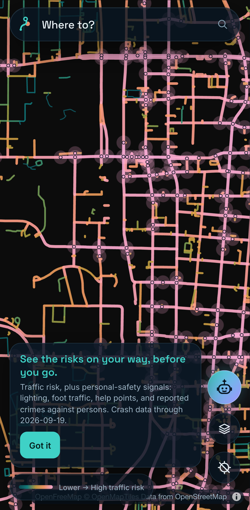

## Getting around the screen

**On a phone**, the map fills the screen:

- **Where to?** at the top opens search.
- The **Ask PathPro agent button** (the round teal-to-violet button with a robot face, bottom right) opens [Ask PathPro](#ask-pathpro), a chat about how PathPro works.
- The **layers button** (stacked squares, just under the agent button) opens **Map options**: conditions, departure time, route preference, map mode, Risk Tides, the legend, privacy, **About PathPro**, and an **Ask PathPro** entry.
- The **locate button** (under the layers button) centers the map on you. It shows a crossed-out icon when location is off.
- The **legend chip** at the bottom reads *Lower → High traffic risk*. Tap it for the full 0–100 scale.
- A **status chip** under the search pill (for example *☂ Wet · 10:30 PM*) appears when you've changed an option.
- Once you pick a destination, the **route sheet** slides up from the bottom. Drag its handle up or tap **Why?** to see more. Drag it down to see more map.

Colors run from teal (lower) through amber to pink (high). Thicker lines mean higher risk.

**On a desktop or laptop** (1024 px wide and up), a sidebar on the left holds everything: search, saved places, the map options, the legend, and, at the bottom, **About PathPro** and **Ask PathPro**. **Risk Tides** sits on the map at the bottom. The **Ask PathPro agent button** sits on the map at the bottom right, just above the zoom buttons. When you plan a trip, the sidebar shows the full route comparison and explanation at once.

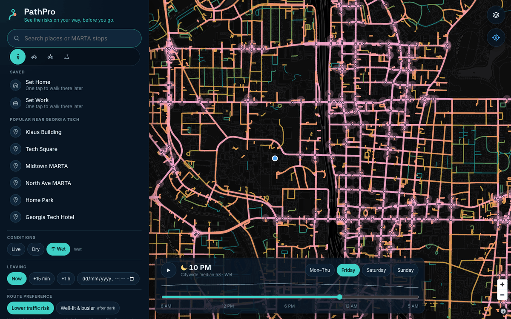

## Planning a trip

### Start from where you are

With location allowed, the start is filled in as **Your location**. You don't need to type anything. If your location is off, PathPro says so and offers **Pick a start** (see [Troubleshooting](#troubleshooting-and-faq)).

To start somewhere else, tap the **From** line in the trip header. The **Choose a start** sheet opens with **Your location** at the top, followed by search and popular places.

### Search

Tap **Where to?** and type at least two letters in **Search places or MARTA stops**. You'll see campus buildings, MARTA stations, and street addresses. Press **Enter** to take the first result. A result marked *Outside routing coverage* still gets an area-level score from City Pulse.

On a desktop, you can also **right-click the map** to drop a pin and use it as the destination.

### Saved Home and Work, recents, popular places

With the search box empty, the **Where to?** sheet lists:

- **Suggested for now**: trips PathPro has learned you usually take at this time (see [Learned routines](#learned-routines)).
- **Saved**: **Home** and **Work**. Tap **Set Home** or **Set Work** the first time. To change one later, tap the pencil, or long-press it on a phone.
- **Recent**: your last few destinations.
- **Popular near Georgia Tech**: Klaus Building, Tech Square, Midtown MARTA, North Ave MARTA, Home Park, and Georgia Tech Hotel.

The small icons under the search box choose how you travel (walk, bike, e-bike, scooter) before you pick a place.

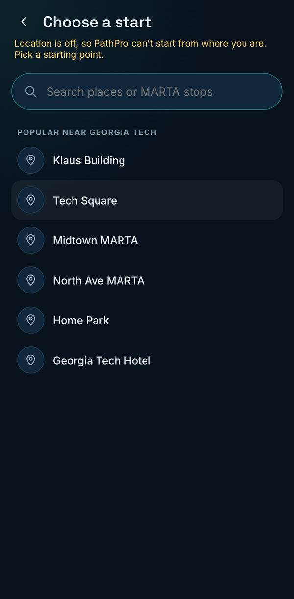

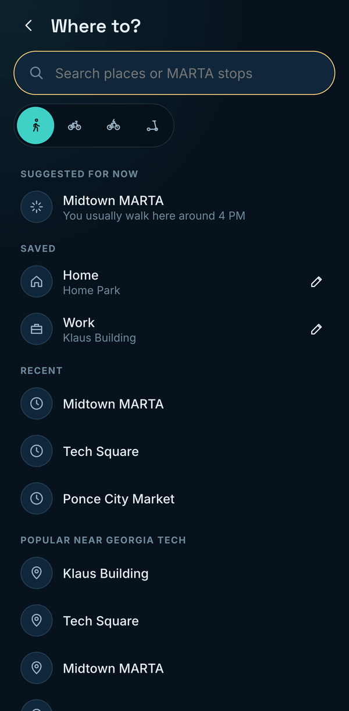

### Swap and go back

- The **⇅** button in the trip header (**Swap start and destination**) reverses the trip. Use it for the walk home.
- The **‹** button (**Back to map**) clears the trip and returns to the map.

## Choosing how you travel

Under the trip header is a row of four large mode buttons: **Walk · Bike · E-bike · Scooter**. Each shows a big icon, its name, and its travel time underneath. The one you've picked is outlined in teal. A **~** means an estimate until that route loads.

- **Walk** routes use sidewalks and footpaths with the pedestrian traffic-risk model.
- **Bike, E-bike, and Scooter** routes use OpenStreetMap's bike network with a separate model trained on cyclist crashes. The first time you pick a ride mode, PathPro downloads the ride risk map (about 11 MB). This takes 15–20 seconds on a typical connection, and the map re-colors when it's ready.
- A mode that isn't available where you are stays visible but grayed out, reads **Soon** instead of a time, and says *Coming soon in this area* when you tap it.

**Long walks get faster options.** When the walk is longer than about 25 minutes, the route card adds:

- a **MARTA hand-off** card, for example *Faster with MARTA: walk 19 min to North Avenue station …then from Midtown station, 21 min walk*. Tap it to plan the walk to that station.
- a **Try Bike** chip (for example *Try Bike: ~14 min*). Tap it to switch to the Bike tab.

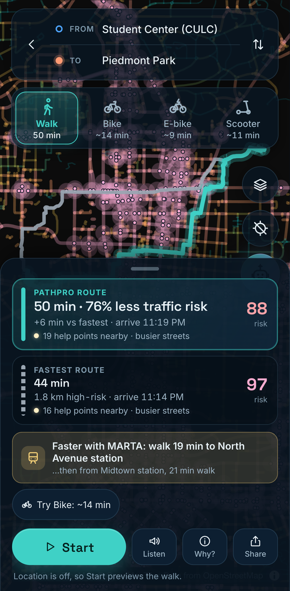

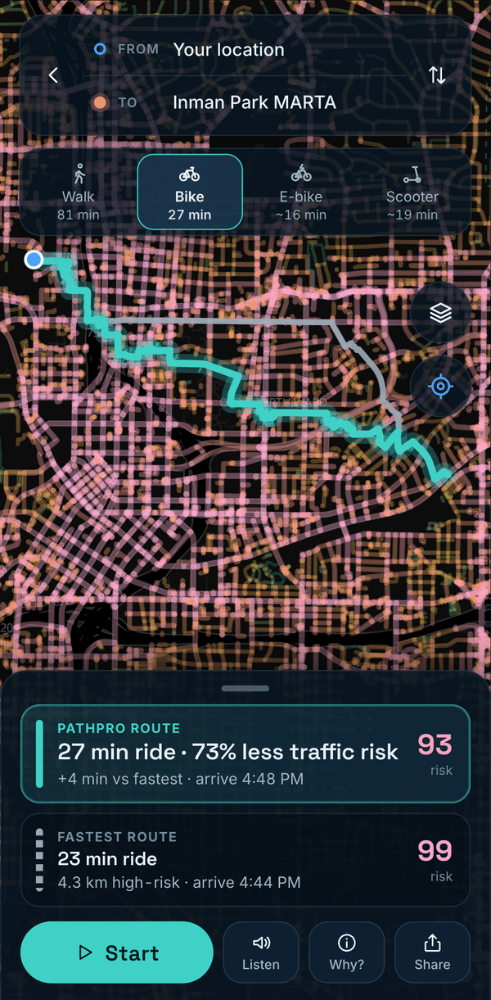

## Reading the route card

The route card compares two routes. The **PathPro route** is teal on the map and the **fastest route** is gray.

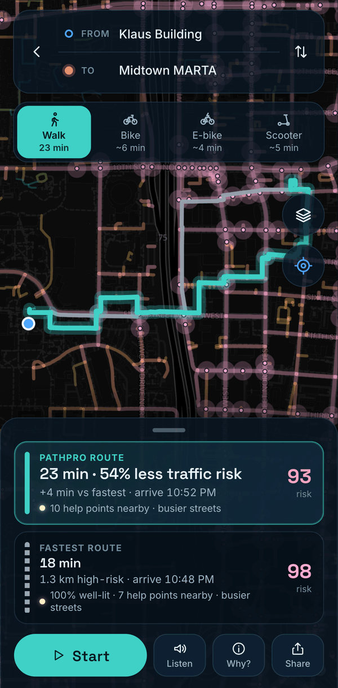

Reading the **PathPro route** row from top to bottom:

| What you see | What it means |
| --- | --- |
| **23 min** (or **27 min ride**) | Travel time at your pace. |
| **54% less traffic risk** | How much less exposure to high-risk street length this route has than the fastest route, at the hour you'll be walking it. |
| **+4 min vs fastest** | The extra time the lower-risk route costs. PathPro never adds more than 6 minutes, or 25% of the trip. |
| **arrive 10:52 PM** | When you'll get there if you leave now (or at the time you set). |
| **10 help points nearby · busier streets** | Help points within 100 m of the route (blue-light phones, police, fire, hospitals, MARTA), plus *well-lit* or *busier streets* when most of the route qualifies. |
| **93 risk** (right edge) | The route's traffic-risk score on the citywide 0–100 scale. 75 and up is the top quarter of the city. |

The **Fastest route** row shows its time, how much of it runs on high-risk streets (for example *1.3 km high-risk*), and its arrival time.

If the fastest route is already the lower-risk one, PathPro shows a single route that reads *already the lower-risk option*. It won't invent a detour.

Below the rows are four buttons: **Start**, **Listen**, **Why?**, and **Share**. **Share** sends the trip plan (start, destination, and options) as a link, so a friend opens the same comparison. A GPS start is labeled *Start point*. It is not a live position. For that, use [Share my walk](#share-my-walk-and-the-late-check-in).

Every route shows the reminder *Traffic risk estimate from historical crashes. Always stay alert.*

## Why? explanations and Listen

### Why this route

Tap **Why?** (or drag the sheet up) to see:

- **Why this route**: a short, plain-English explanation. It is written from the model's evidence, and any sentence with a number that isn't in the evidence is thrown out. Below it, the **Ask about this route** pill (with the agent's robot mark) opens [Ask PathPro](#ask-pathpro) for follow-up questions.
- **Leaving … · conditions**: the departure time and weather the scores use.
- **Avoids 2 high-risk stretches**: chips for the streets the PathPro route skips, with their scores. Tap one to zoom the map to it.
- A **Personal safety** summary, when that data is available: reported crimes against persons near each route, side by side, with **How to read this**. It never ranks the routes.
- Streets **both routes use**, where extra care is worth it.
- The highest-risk stretches on the fastest route. Tap one to open that street.
- **Preview walk** (or **Preview ride**): plays the trip on the map without GPS.

### Why is this street risky?

Tap any street on the map, or any street chip, to open its sheet:

- a **score dial** (0–100) with a band (Lower, Moderate, Elevated, High) and a confidence badge (*High confidence*, *Medium confidence*, or *Limited data*)
- an explanation of the main reasons, with **Listen** and the **Ask about this street** pill right under it. The pill opens [Ask PathPro](#ask-pathpro) with the street already filled in.
- **factor bars** that add up exactly to the score, starting from *Typical street at a typical hour*. For example: *Vehicle crashes on this street +34*, *Time of day +2*.
- the street's crash history: crashes here, how many involved pedestrians, and the share after dark and on wet pavement
- **When crashes happened here**: an hour-by-hour chart, with the current hour highlighted
- **Street redesign ideas** on walking streets, with **Imagine this street redesigned** (see [Imagine this street redesigned](#imagine-this-street-redesigned))
- **How is this calculated?**, which opens **How PathPro works**, including the model's accuracy and limits

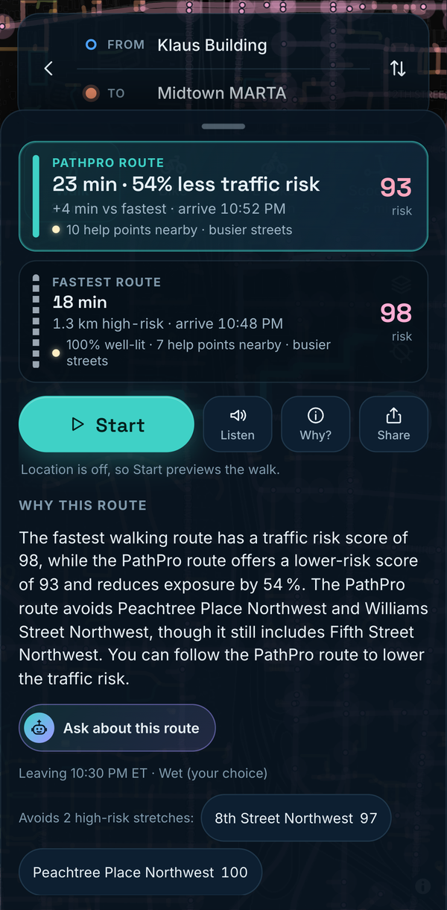

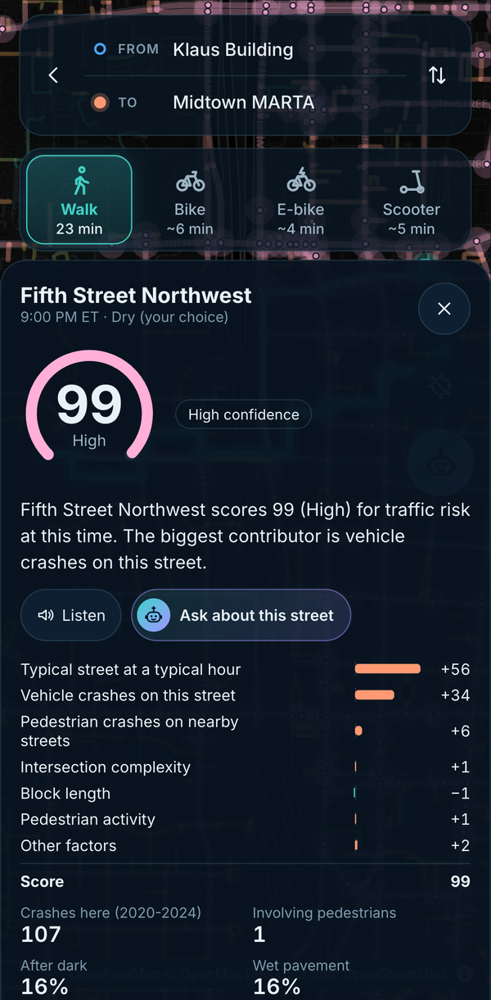

### Listen

**Listen** on the route card or a walking street's sheet reads the explanation aloud in a calm **Grok Voice**. If Grok Voice doesn't answer, PathPro tries **ElevenLabs**, and if neither is available it uses your device's own voice. You always hear the same checked text, whichever voice reads it. Listen only plays when you tap it. Nothing starts talking on its own.

Street sheets for ride routes, and the spoken alerts during navigation and previews, use your device's voice so they play right away.

## Ask PathPro

**Ask PathPro** is a chat that answers questions about how PathPro works, and about the street, route, or City Pulse area on your screen. Answers come from PathPro's model card and docs.

### Where to find it

- **The agent button:** the round teal-to-violet button with a robot face on the map. On a phone it sits at the bottom right, above the layers and locate buttons. On a desktop it sits at the bottom right, above the zoom buttons. Tap it for general questions.
- **About this street:** on a street's sheet, tap the **Ask about this street** pill next to **Listen**, under the explanation.
- **About this route:** under **Why this route**, tap the **Ask about this route** pill.
- **About this area:** on a **City Pulse · this area** card, tap the **Ask about this area** pill.
- **Also:** **Ask PathPro** at the bottom of **Map options** on a phone, or at the bottom of the sidebar on a desktop.

The pills carry the same robot mark as the agent button, so you can spot them at a glance.

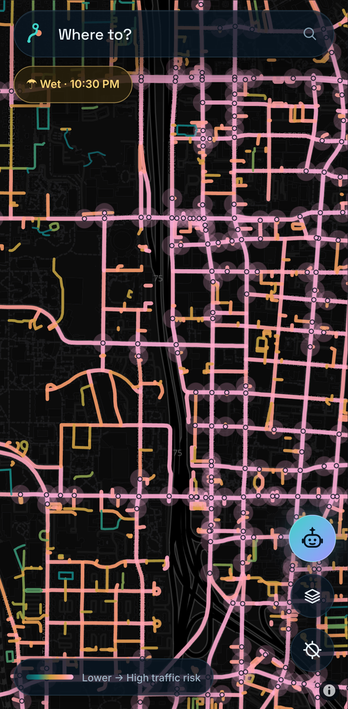

### The chat panel

On a phone, Ask PathPro opens as a tall sheet from the bottom of the screen. On a desktop, it opens as a chat card docked at the bottom right of the map, above the agent button, so the route or street stays in view.

- The **header** shows the agent's avatar, **Ask PathPro**, and *Powered by Backboard*. The **×** closes it.
- When you open Ask from a street, route, or area, a **context pill** under the header shows what you're asking about, for example **About: Fifth Street Northwest · 9 PM** or **About: this route**. Tap its **×** to ask in general instead.
- Your questions appear as **teal bubbles** on the right. PathPro's answers appear as **dark bubbles** on the left, next to its avatar. While it looks, you'll see **typing dots**.
- **Suggestion chips** sit above the message box. Scroll them sideways for more.
- Type your own question (up to 300 characters) in **Ask about PathPro…** and tap the round **Send** button (↑), or press **Enter**.
- The **Remember my preferences** switch sits at the very bottom (see below).

### Asking a question

1. Tap a **suggestion chip**, or type your own question. Suggestions change with the context:
    - In general: *Why isn't crime used for routing?*, *How was the model tested?*, *What does '54% less traffic risk' mean?*
    - For a street: *Why is this street high-risk at this hour?*, *What would lower the risk here?*
    - For a route: *Why is this route longer?*, *Which stretches did it avoid?*
    - For an area: *What drives traffic risk in this area?*
2. The typing dots show while PathPro looks through its docs. The answer then appears in a bubble under your question.
3. Ask follow-ups in the same box. The conversation lasts until you close the tab.

### How answers are checked

PathPro doesn't show whatever the AI writes. Every answer is checked against PathPro's own evidence for that street, route, or area, and against the same wording rules as the rest of the app. PathPro never lets the AI make up a risk score.

- A checked answer is followed by *Answered from PathPro's model card and docs · powered by Backboard*.
- When an answer cites the docs, **Sources** links appear under it. They open in a new tab.
- If an answer doesn't pass the check, or the service is slow, you get a fixed message instead, in a dimmer bubble: *I can't answer that one right now. The model card under About PathPro explains how traffic risk is scored, how the model was tested, and which data it uses.* Try rewording, or open **About PathPro**.
- If the street, route, or area you asked about is no longer available, PathPro says so (for example *That street is no longer available, so I answered in general.*) and answers in general.

Only ids, the hour, and the conditions for the thing on screen go with your question. Your GPS position, saved places, and routines are never sent.

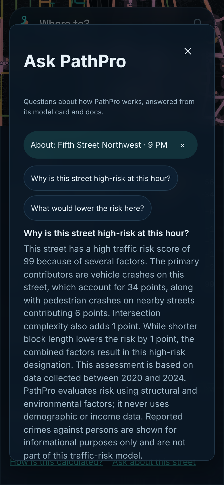

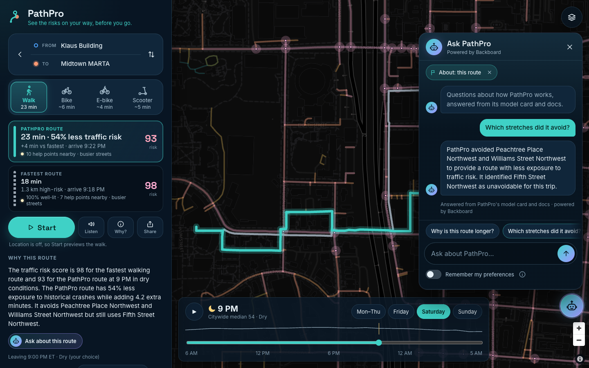

### Remember my preferences (optional)

At the bottom of the chat is a **Remember my preferences** switch. It is **off** by default.

- **Off:** each conversation starts fresh. Nothing is kept after you close the tab.
- **On:** Ask PathPro can remember preferences you tell it, such as when you usually walk, across visits in this browser. Answers that used memory show a **Memory on** tag. Turning the switch off again pauses memory without deleting it.
- Tap the **ⓘ** button next to the switch to read exactly what happens: *When on, what you type here is kept by Backboard for this browser until you tap Forget me. Your location, routes and routines are never sent.*
- **Forget me** (next to the switch, once memory has been turned on) deletes everything Ask PathPro remembered. You'll see *Ask PathPro memory deleted.*
- You can also delete it from **Map options → Privacy → Forget Ask PathPro memory**.

Please don't type your home address or other personal details into Ask PathPro. It doesn't need them to answer.

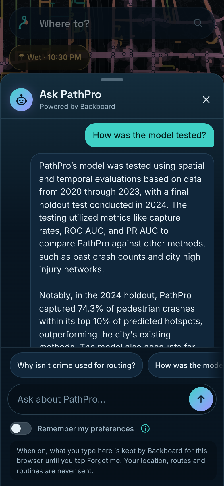

Ask PathPro needs the live service, so the agent button and the Ask pills aren't shown in the offline demo. If you ask a lot in one day, it asks you to try again tomorrow.

## Imagine this street redesigned

Wondering what would make a high-risk street better? On a walking street's sheet, scroll to **Street redesign ideas** and tap **Imagine this street redesigned**.

- The button changes to *Imagining this street…* while the picture is drawn. This can take up to a minute.
- **Grok Imagine** draws the street with evidence-based (Vision Zero) street-design fixes, chosen from that street's own top traffic-risk factors. For example, a street with many vehicle crashes gets a pedestrian refuge island in the median, a street with complex intersections gets high-visibility crosswalks with curb extensions, and a street where many crashes happened after dark gets pedestrian-scale street lighting.
- The picture is always labeled **AI illustration of evidence-based street fixes by Grok Imagine — not a real photo**. Under the label, a line lists the street's top factors and the planned fixes.
- **Gemini then checks the picture.** The line *Checked by Gemini: shows 3 of 3 planned fixes* tells you how many of the planned fixes Gemini could actually see. Gemini also checks that the picture has no readable text, logos, or recognizable faces. A picture that fails is never shown. If the check can't run, the picture shows without that line.
- The picture is an idea for planners and neighbors. It **never changes a score or a route**.
- Once a street has been drawn, the picture is saved, so it loads quickly for everyone after that. New pictures are limited each day. If you hit the limit, PathPro says so.

This section appears on walking streets only, and is hidden in the offline demo.

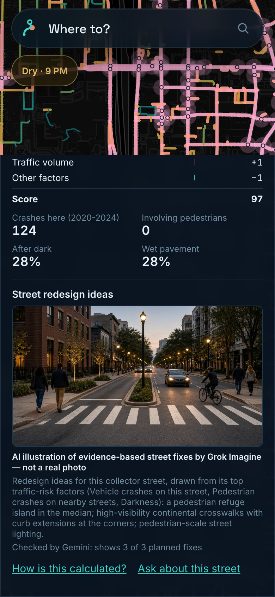

## Walking and riding navigation

1. On the route card, tap **Start**.
2. The map follows you, and a banner at the top tells you what's next:
   - *Continue on …* with the minutes to go
   - **High traffic risk ahead** · *10th St NW in 120 m* before a high-risk stretch
   - **High traffic risk here** · *take extra care crossing* while you're on it
   - **Almost there** near the end
3. Each high-risk stretch is **spoken once**, so you can keep your eyes up and your phone in your pocket.
4. The bottom bar shows minutes left, distance left, and arrival time. **End** stops navigation at any time.
5. When you reach the destination, PathPro shows **You've arrived**. Tap **Done**.

**No GPS? It previews instead.** If location is off, or you're far from the route, **Start** plays a sped-up **Preview walk** (or **Preview ride**) along the route with the same banners. The line under Start explains why, for example *Location is off, so Start previews the walk.* You can also preview any time with **Preview walk** under **Why?**.

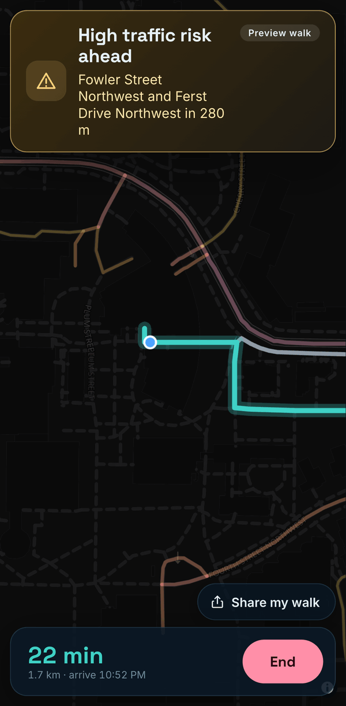

## Learned routines

After you've walked the same trip a couple of times at about the same time of day, PathPro offers it on the home screen, for example *Heading to Midtown MARTA? · ~17 min · lower-risk route one tap away*. Tap **Go** to plan it, or **×** to hide it. Shortly after a trip, it may also offer *Heading back to …?*.

- Routines are learned **on your device only**. Your trip history is never sent to PathPro's servers.
- Saved **Home** and **Work** are suggested at the usual times (Home in the evening, Work on weekday mornings).
- To erase everything, open **Map options → Privacy → Clear history**. The app confirms *History cleared*.

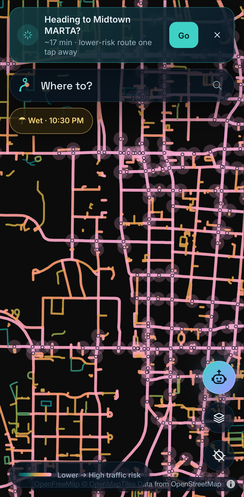

## Share my walk and the late check-in

### Share my walk

While navigating, tap **Share my walk**. PathPro creates a live link and opens your phone's share sheet so you can text it to a friend.

- The bar changes to **Sharing live · Send link · Stop**. **Send link** shares the link again. **Stop** ends sharing.
- Your friend opens the link in any browser, with no app and no login. They see where you're heading, your position on the route, the expected arrival time, and how fresh the position is (*Updated 14 s ago*).
- When you arrive, their page shows **Arrived**. If you tap **End** or **Stop**, it shows **Walk ended**.
- Links **expire 6 hours after the last update**. After that the page reads *Link expired*.
- If you reload the page mid-walk, PathPro asks *You were sharing your walk to … Resume sharing?* Choose **Resume** or **Stop sharing**.

In the offline demo, sharing is simulated on your phone and nothing is sent.

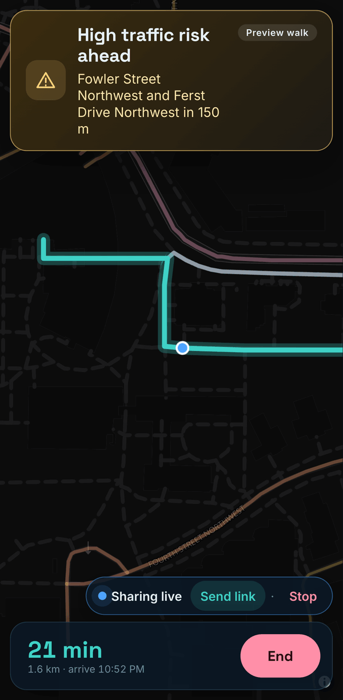

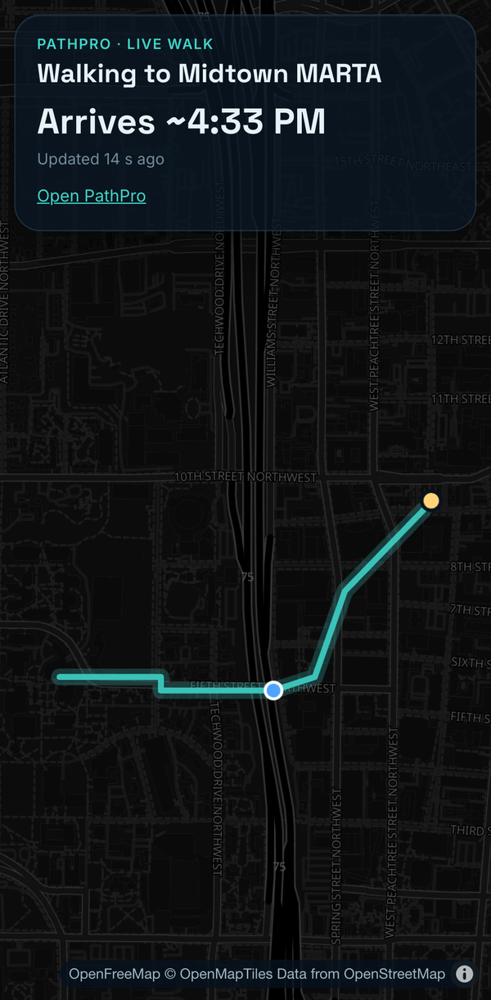

### The late check-in: "Everything OK?"

During GPS navigation, if you haven't arrived **10 minutes after your expected arrival time**, PathPro asks **Everything OK?**

- **I'm fine** hides it and asks again in 10 minutes.
- **Call 911** dials emergency services.
- **Share my location** sends your live link again.

The check-in runs entirely on your phone. It does not alert anyone by itself.

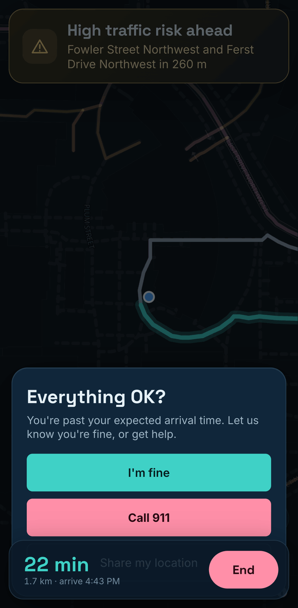

## Personal safety mode

People walking after dark often weigh more than traffic. Personal safety mode shows those signals on the map. Open **Map options → Map → Personal safety**.

**What you can turn on** (each is a switch):

- **Reported crimes against persons** (on by default): Atlanta Police reports of homicide, robbery, aggravated assault, and simple assault from the last 12 months. They are grouped into map hexagons and by time of day (night, morning, afternoon, evening). Shading compares each area with the city: **Fewer reports**, **Typical**, or **More reports**. The colors are calm indigo, never red.
- **Well-lit streets**: streets mapped as lit.
- **Busier streets**: streets with more foot traffic at that time of day.
- **Help points** (on by default): **Blue-light emergency phones** (100 on the Georgia Tech campus), police stations, fire stations, hospitals, and MARTA stations.

The legend opens first, so you read the note beside the layer before the map. It always reads:

> *Reported incidents, grouped by area and time of day. Reports reflect where police record incidents, not how people should feel about a neighborhood. PathPro never routes around neighborhoods based on crime.*

**How the layer is kept fair:**

- Reported crimes are **never** used to choose or rank routes, and never enter the traffic model.
- Areas are compared by **reports per unit of foot traffic**, so an area with no reports is never marked "More reports".
- Incidents at homes, jails, and shelters are left out, and no addresses or victim details are ever loaded.
- Police data is incomplete, and locations are approximate.

Zoom in if you see *Zoom in to see the personal safety layer.*

**Help points.** Tap a help point on the map, or pick one from the list in Map options, to see what it is. A blue-light phone card reads *Press the button on the pole to talk to campus police*, and every card has **Call 911**.

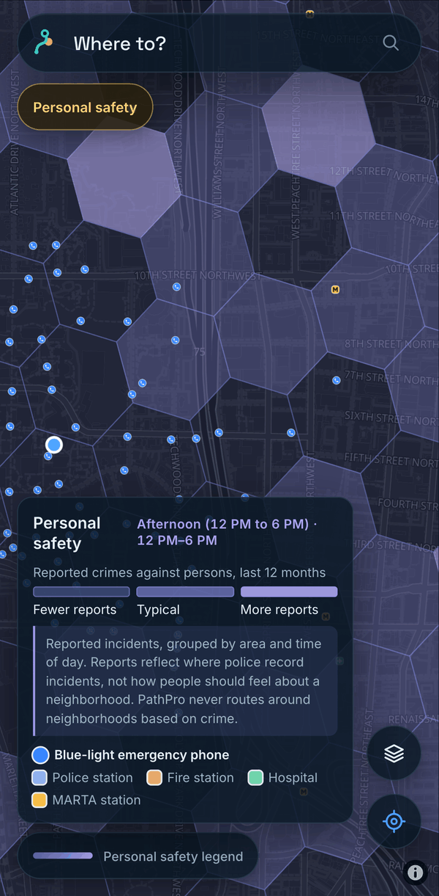

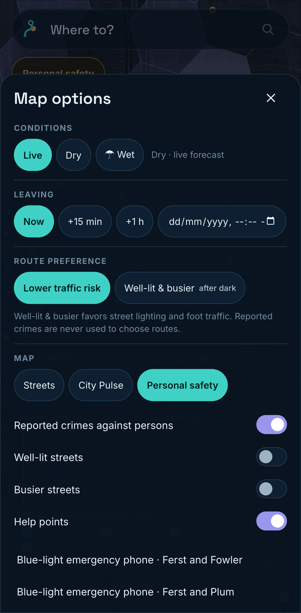

### "Well-lit & busier (after dark)" route preference

Under **Map options → Route preference**, choose **Well-lit & busier** (*after dark*) instead of the default **Lower traffic risk**.

- After sunset, PathPro favors streets known to be lit and streets with more foot traffic. It stays inside the same small detour budget and adds at most 10% traffic exposure.
- By day, and when no route does meaningfully better, you get the usual lower-risk route.
- It uses **lighting and foot traffic only**. Reported crimes never choose routes.
- It applies to walking. Ride modes always use the lower-traffic-risk route.

## Risk Tides and City Pulse

### Risk Tides

Traffic risk rises and falls through the day. **Risk Tides** lets you watch it:

- Drag the **Hour of day** slider (6 AM to 5 AM), or tap **▶** to play all 24 hours.
- Pick the day: **Mon–Thu**, **Friday**, **Saturday**, or **Sunday**.
- The sun or moon icon shows daylight, twilight, or dark. The line above the slider shows the citywide median score for each hour.
- The weather comes from **Conditions** (Live, Dry, or ☂ Wet).

On a phone, Risk Tides is in **Map options**. On a desktop, it sits on the map (see the desktop screenshot in [Getting around the screen](#getting-around-the-screen)).

### City Pulse

**City Pulse** (Map options → Map) scores all **3,537 areas** of the City of Atlanta for traffic risk. It covers the whole city, even outside street-level routing. Click or tap an area to open **City Pulse · this area**, with a score, a confidence badge, the factors behind it, and the area's crash counts. A search result outside routing coverage opens this card automatically.

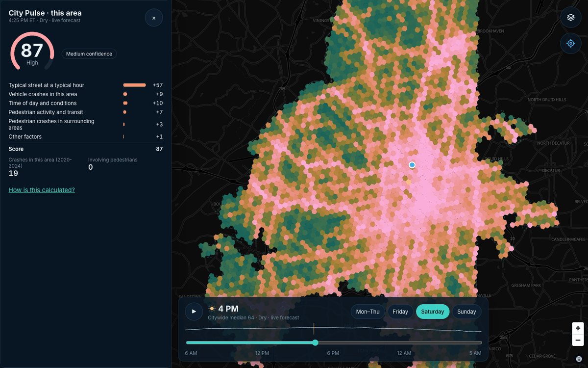

## Community street reports

Anyone can flag a traffic-related problem on a street:

1. Tap the street on the map to open its sheet.
2. Scroll to **Report a street issue**.
3. Tap one of: **Sidewalk blocked**, **Crossing signal out**, **Construction detour**, **Poor street lighting**, **Flooding or standing water**, or **Fast-moving traffic**. PathPro replies *Thanks — other walkers will see this for 14 days.*

What happens next:

- Reports appear as **violet dots** on the map, on the street's sheet (*1 walker*, *3 walkers*), and on route cards (*2 community reports on this route: …*).
- Each report **expires 14 days** after the last confirmation.
- Reports are context only: they **never change a score, a route, or an explanation**.
- There is no free-text box. The location comes from the street, not your phone.

Reports are hidden in the offline demo.

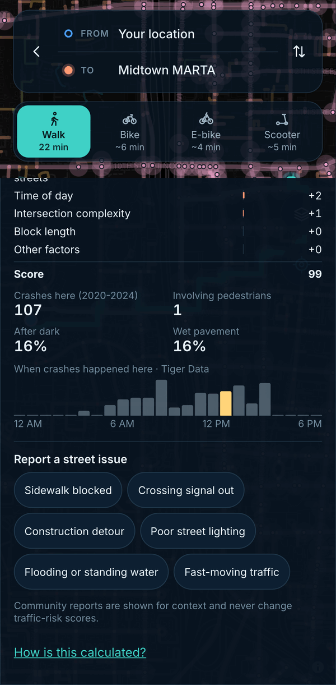

## Map options

Open **Map options** with the layers button on a phone. On a desktop, the same controls are in the sidebar.

- **Conditions**: **Live** (the current forecast), **Dry**, or **☂ Wet**. The line beside it shows what's in use, for example *Dry · live forecast*.
- **Leaving**: **Now**, **+15 min**, **+1 h**, or a custom date and time (Atlanta time). Routes and scores use the hour you'll actually be walking.
- **Route preference**: **Lower traffic risk** or **Well-lit & busier** (*after dark*).
- **Map**: **Streets** (traffic risk by street), **City Pulse** (by area), or **Personal safety**.
- **Risk Tides** (phone only), the **legend** (bands **0 Lower · 25 Moderate · 50 Elevated · 75 High**), and **Privacy**: **Clear history**, plus **Forget Ask PathPro memory** once you've turned Ask memory on.
- **About PathPro**: how the score is made, how well it works, its limits, sources, and emergency numbers.
- **Ask PathPro**: the same chat as the agent button on the map (see [Ask PathPro](#ask-pathpro)).

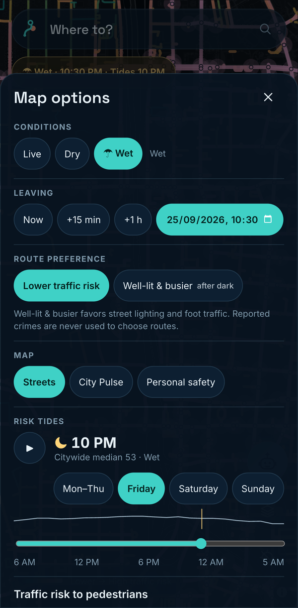

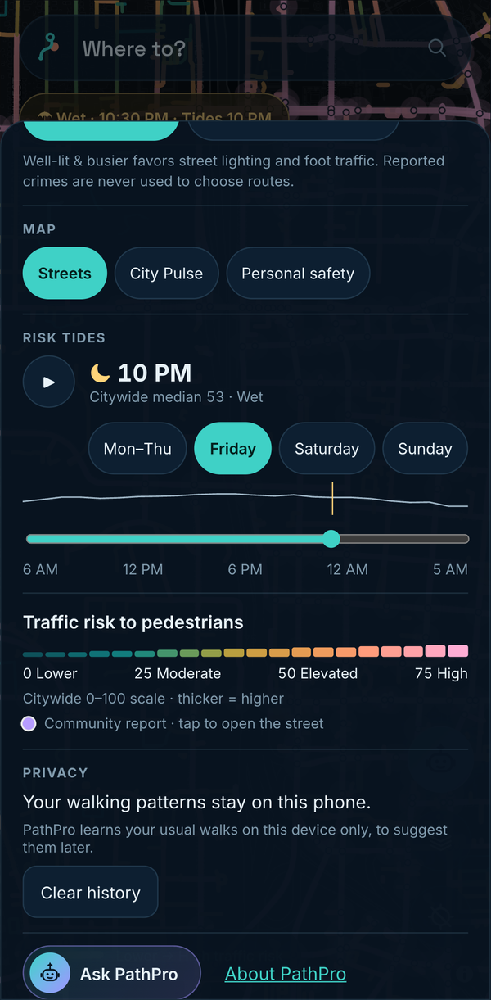

## Privacy

- **No login and no account.** PathPro doesn't know who you are.
- **Routines stay on your device.** Trip history, saved Home and Work, and recents live in your browser's storage on that device. **Clear history** erases them.
- **Your location** is used to plan and navigate trips. Your start point goes to PathPro's server only to plan the route. Your moving position is sent only while you choose to **Share my walk**.
- **Shared walks expire.** A live link is deleted 6 hours after its last update. It holds the destination, the route, your latest position, and the arrival time, and nothing else.
- **No addresses in the reported-crimes layer.** It holds only counts per area and time of day. No addresses, report numbers, or victim details are fetched or stored.
- **Ask PathPro sends only your question and what's on screen.** With a question about a street, route, or area, only its id, hour, and conditions go along. Your GPS position, saved places, and routines are never sent.
- **Ask PathPro memory is opt-in.** **Remember my preferences** is off by default. When you turn it on, what you type into Ask PathPro is kept by Backboard for this browser until you tap **Forget me** (or **Map options → Privacy → Forget Ask PathPro memory**), which deletes it.
- **Street illustrations use no personal data.** The picture is drawn from the street's risk factors only, never from anything you type.

## Accessibility

- **Keyboard.** Every control is a real button, link, or input and can be reached with **Tab**. In the route sheet, the handle opens and closes with **Enter** or **Space**, and **↑**, **↓**, and **Esc** also work. Sheets and dialogs close with **Esc** and return focus to where you were. The check-in dialog keeps focus inside it until you choose. In search, **Enter** picks the first result.
- **Screen readers.** Controls have plain labels, for example *Swap start and destination*, *Show my location*, *Travel mode*, and *Hour of day* (which reads the hour, the weather, and the citywide median). The score dial reads *Traffic risk 93 of 100, High*. Navigation banners and status messages are announced as they change, and help points are listed as buttons so you can reach them without the map.
- **Ask PathPro and street illustrations.** The agent button is labeled *Ask PathPro* and says whether the chat is open. Ask PathPro is a dialog that closes with **Esc**. New answers are read out as they arrive, the Send button is labeled *Send*, **Remember my preferences** is a real switch that announces whether it's on, and the **ⓘ** button (*What memory keeps*) opens the privacy note. When a street illustration finishes drawing, focus moves to the picture, and its description lists the fixes shown.
- **Touch targets** are at least 44 px, with switches for the personal-safety layers.
- **Reduced motion.** If your device asks for less motion, PathPro turns off animated map effects and shows explanations at once instead of typing them out.

## Offline demo mode

Open **[pathpro.tech/?demo=1](https://pathpro.tech/?demo=1)** to replay a fixed scenario: **Klaus Building → Midtown MARTA, Friday 10:30 PM, wet streets**. It uses recorded responses, so after the page loads it works with Wi-Fi off. That makes it good for demos and judging tables.

- Everything on the route card, **Why?**, street sheets, **Preview walk**, and the ride modes works.
- **Share my walk** is simulated on the device, and nothing is sent.
- Community reports, search results for new addresses, **Ask PathPro** (the agent button and the Ask pills), and **Imagine this street redesigned** are hidden, because they need the live service.
- **Listen** uses your device's voice.
- Keyboard shortcuts: **T** jumps to 10 PM, **R** toggles rain, and **D** resets to the demo trip.

## Troubleshooting and FAQ

**PathPro says "Location is off".**
Your browser is blocking location for pathpro.tech. Allow location in your browser's site settings (on iPhone: Settings → Privacy & Security → Location Services → your browser), then reload. Until then, tap **Pick a start** and choose a place.

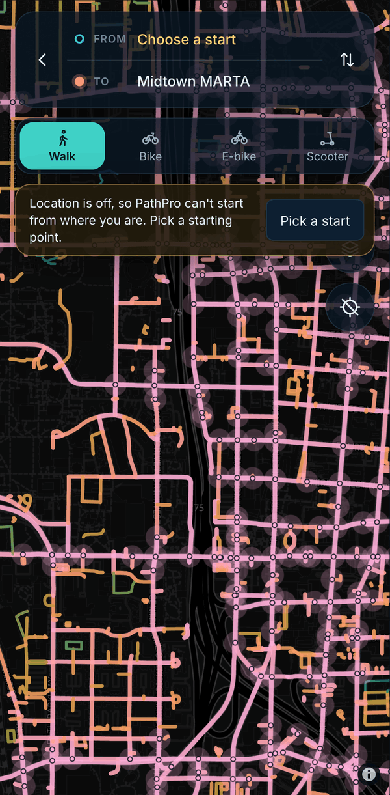

**"You're outside Atlanta."**
PathPro plans routes within the City of Atlanta. Pick a start inside the city. Addresses outside street-level coverage still get an area score from City Pulse.

**Start only previews the walk.**
Start follows your GPS only when you're on or near the route. If you're far away, or location is off, it previews instead. The line under Start tells you which.

**The Bike tab takes a while the first time.**
Ride modes download a separate ride risk map (about 11 MB) once. Give it 15–20 seconds on mobile data. After that it's quick.

**A mode is grayed out: "Coming soon in this area".**
Ride routes aren't available for that area yet. PathPro shows the walk instead.

**My friend's link says "Link expired".**
Shared walks end 6 hours after their last update, or when you stop sharing. Start a new share from navigation.

**The explanation reads like a template.**
When the AI service is slow or down, PathPro builds a short explanation from the numbers instead. The scores are the same.

**Ask PathPro says "I can't answer that one right now."**
Either the answer didn't pass PathPro's check against its evidence, or the service is busy. Try a suggested question or reword yours. **About PathPro** has the full model card.

**I don't see the Ask PathPro agent button or "Imagine this street redesigned".**
Both need the live service, so they're hidden in the offline demo. The street illustration appears on walking streets only.

**"You've reached today's limit for new street illustrations."**
New pictures are limited each day. Streets that someone has already drawn still load.

**Does "lower-risk" mean nothing will happen?**
No. It means less exposure to streets where pedestrian crashes have concentrated at that hour. Always stay alert, especially when crossing.

**Does PathPro avoid neighborhoods?**
No. Routes use traffic risk and, if you choose it, lighting and foot traffic. Reported crimes are shown for information only and are never used to choose routes.

## Limits

- **Coverage.** Street-level routing covers the City of Atlanta. The model learned from 2020–2023 crashes and was tested on 2024 crashes. The crash data runs through September 2026.
- **Traffic risk ranks streets.** It's a strong ranking: the 10% of street length it ranks highest held about 74% of 2024 pedestrian crashes. It is not a prediction of what will happen on one trip. Busy streets look riskier partly because more people walk there.
- **The ride model ranks streets, not counts.** Its scores aren't calibrated counts of cyclist crashes, and its exposure data is a proxy.
- **Lighting data is sparse.** Lighting is known for only about **4% of walkable street length**, mostly Downtown and in well-mapped areas. Unknown lighting is treated as unknown, never as dark.
- **Foot-traffic data is from 2021.** Street activity may have changed since then.
- **Police reports are incomplete** and their locations are approximate. They show where incidents were recorded.
- **Darkness and rain effects are small** in Atlanta's data. The map still shows them, but they are not separately significant on held-out data.

## Emergency note

PathPro is a planning aid, not an emergency service. No map can promise how a walk will go.

- **In an emergency, call 911.**
- **Georgia Tech Police: 404-894-2500.**
- On the Georgia Tech campus, **blue-light emergency phones** connect you to campus police. Press the button on the pole.

*PathPro by Nagur Shareef Shaik (Coding Claws, Georgia State University), HackGT 13 · [pathpro.tech](https://pathpro.tech) · See the risks on your way, before you go.*
