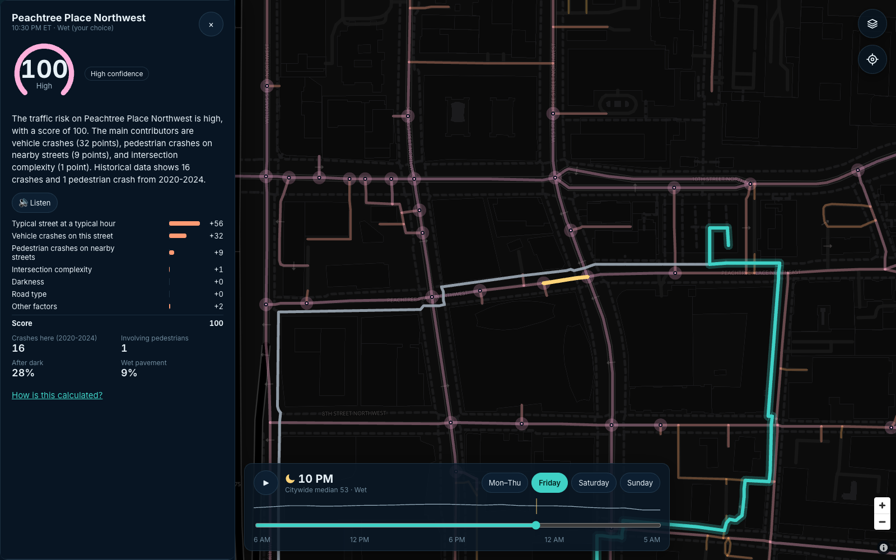
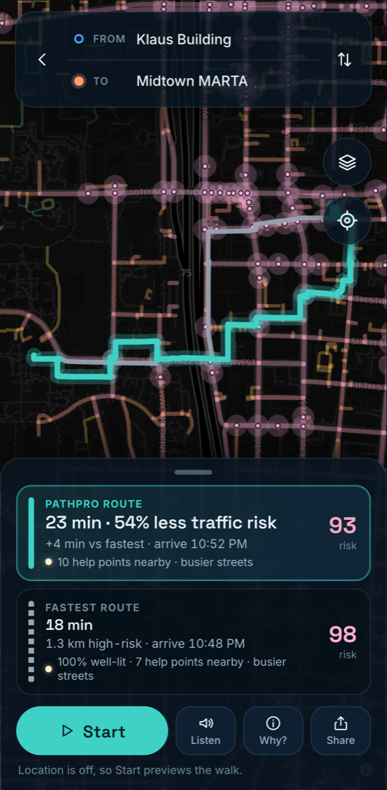
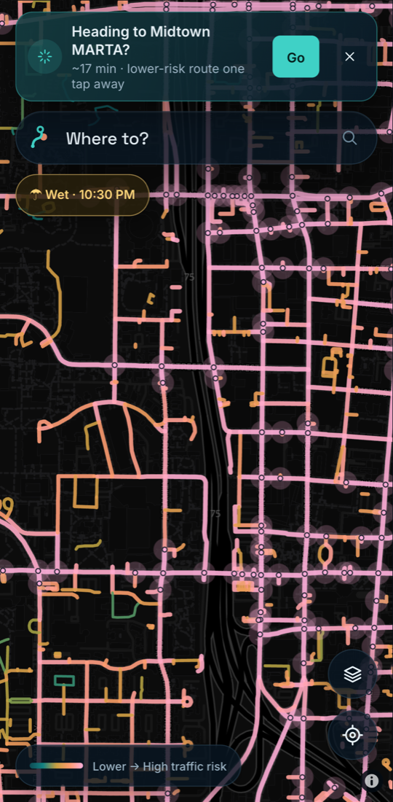
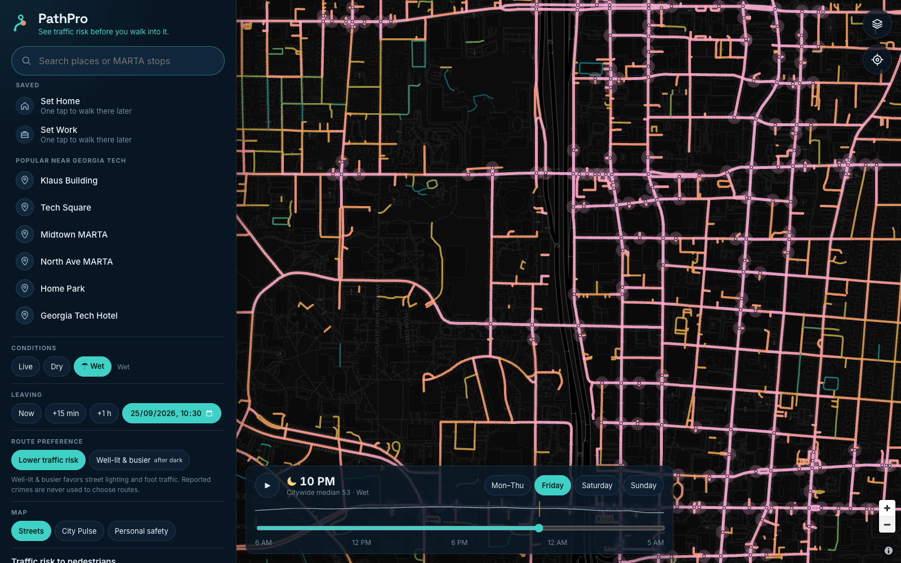
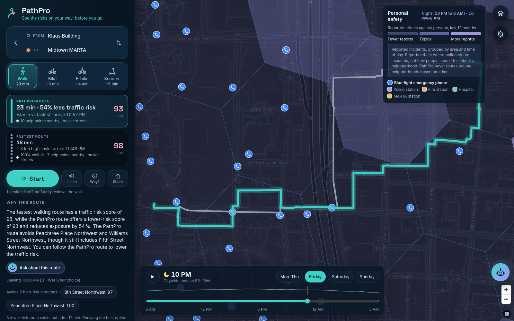

# PathPro: process notes

*How we built a pedestrian traffic-risk forecaster and walking router for Atlanta at HackGT 13, Sep 25–27, 2026.*
Live: [pathpro.tech](https://pathpro.tech) · offline demo: [pathpro.tech/?demo=1](https://pathpro.tech/?demo=1) · code: `ShaikNagurShareef/PathPro`

All times below are Eastern and come from `git log`. All model numbers come from `docs/metrics.json` and `docs/model_card.md`.

## 1. The problem we framed

Map apps optimize one number, travel time. Walking from Klaus to Midtown MARTA at 11 PM, two routes can look the same on a map while one of them runs along streets with a long history of pedestrian crashes. That exposure also changes with darkness, rain, and the day of the week.

We set three constraints before writing code:

- **Traffic risk only, stated plainly.** The score says where and when pedestrian crashes concentrate. It is not a per-person probability, and the copy never promises an outcome. A list of banned framings (words that promise an outcome or label a place) is enforced by tests and by the LLM output validator.
- **A forecast, not a heat map of the past.** The model has to predict *next year's* crashes better than the City's own High Injury Network (HIN) on a held-out year.
- **No demographic, income, or crime features anywhere in the model.** Everything shown on screen must trace back to the model's evidence, and the LLM never produces a number.

## 2. The plan

The build plan in `docs/architecture.md` was written at kickoff. It split the weekend into ten milestones, with a P0 gate before any "nice to have" work:

| # | Planned window | Exit criteria (abridged) |
| --- | --- | --- |
| M0 | Fri 21–22 | Scaffold, ECC rule packs, `.env.example`, PRD amended |
| M1 | Fri 22–01:30 | Every public layer ingested, deduplicated, snapped; walk graph connected |
| M2 | 01:30–04 | Spatial ensemble + Empirical Bayes + temporal GLM; `metrics.json` against every baseline |
| M3 | Sat 08:30–12 | Backend slice: routes, segments, template explanations |
| M4 | 12–16 | Frontend slice: map, Risk Tides, comparison card, working end to end |
| M5 | 16–19 | LLM chain + validator, live conditions, geocoding, factor bars |
| M6 | 19–22 | Vultr + TLS + domain, offline demo bundle, About/model card |
| M7 | 22–00:30 | Verification loop, reviewer agents, Playwright; **P0 gate** |
| M8 | 00:30–04 | P1 in order: City Pulse, voice, preview walk, sparkline; freeze at 04:00 |
| M9 | Sun 04–08 | Video, Devpost, README, expo kit |

**What actually happened:** the first slices landed much faster than planned. The code for M0 through M7 was committed between Fri 21:28 and Fri 22:51, including the Vultr deploy kit, although the VM itself only went live on Saturday. City Pulse and voice (M8) followed by 23:09. That left Saturday for what the plan could not predict: feedback from people using the app, hosting problems, and a scope change. The timeline in section 6 shows where the time went.

## 3. Data decisions

- **Public ArcGIS layers only, no accounts.** We pulled about 250k crash records from 8 layers (Atlanta Regional Commission, City of Atlanta, Central Atlanta Progress, Georgia Tech; 2013–2026), plus 2023 traffic volumes, speed limits, lanes, sidewalks, bus boardings, and StreetLight pedestrian activity. OpenStreetMap supplied the road and walk networks, and Open-Meteo the hourly weather.
- **Merging sources honestly.** The same crash appears in several layers. We merged 4,754 duplicates by collision id, or when two records fell within 20 m and 30 min. One source stored local wall-clock time as UTC. We caught it because only 60% of its crashes agreed with their reported light condition; after the fix, 94% did.
- **Privacy at ingest.** Names, ages, and narratives that some sources contain are never read into pipeline output.
- **Exposure-aware modeling.** Busy streets have more crashes partly because more people walk there. Pedestrian activity and traffic volume enter as features, and the temporal model uses pedestrian exposure hours as an offset. We disclose the remaining exposure bias in the model card instead of hiding it.
- **Why no demographic features.** ARC's risk-factor layer includes income, race, and environmental-justice flags. We removed them and kept only the structural flags, and we relabeled that baseline "ARC structural flags (demographic flags removed)". A model that learns a neighborhood's demographics can end up scoring people rather than streets.
- **Modeling unit.** Most Midtown roads are missing from OSM's walk network because their sidewalks are mapped as separate ways. We scored road centerlines and let sidewalks inherit risk from the nearest road. 95% of pedestrian crashes snap to a segment.
- **System of record.** Crashes, street geometry, and the versioned score grid live in Tiger Data (TimescaleDB + PostGIS): a `crashes` hypertable (57 chunks of 90 days, 220,594 crash-to-segment rows), a `crashes_hourly` continuous aggregate, and 9,583,680 risk-grid rows. By design, the app never needs the database on its hot path.

## 4. Model iterations and validation

**Model.** An exposure-aware safety performance function: a Poisson GLM and a monotone LightGBM combined in log space, blended with each street's own crash history by Empirical Bayes (the Highway Safety Manual method). A separate multi-task Poisson GLM learns how risk shifts by hour, day, light, and rain. Every score is split exactly into factors, and a property test checks on 200 random cases that the bars sum to the score.

**Protocol.** Train on 2020–2023, test on 2024 pedestrian crashes. A second check trains on 2020–2022 and tests on 2023. The headline metric is the share of held-out pedestrian crashes on the top 10% of *street length* ranked by predicted risk. Ranking by length stops a model from looking good by picking long segments. Cross-validation folds and bootstrap intervals use spatial blocks, so neighboring streets are not treated as independent.

**Iteration 1 (Fri 22:00), dense core only.** The first model covered Downtown and Midtown only. It beat past-crash ranking there, but narrowly.

**Iteration 2 (Fri 22:14), after the ML reviewer.** We ran an independent `ecc:mle-reviewer` pass on the model before building on it. It found problems that made our numbers look better than they were:

- Bootstrap intervals resampled segments, which gave falsely narrow intervals. They now resample spatial blocks.
- CV folds could split a single intersection's crashes across folds. Folds are now H3 res-7 blocks.
- The temporal baseline was too weak. Against a fair smoothed hour × day baseline, light and rain add only a small gain. We report that small gain as it is.
- We had not compared against the HIN at the HIN's own share of street length. We now report both.

With honest intervals, the core-only model's top 10% of length held 45.8% of 2024 crashes against 41.4% for past-crash ranking (model card).

**Iteration 3 (Fri 23:55), the whole City of Atlanta.** We expanded street-level coverage to 49,915 road segments and an 84,758-node walk graph. The results on the 2024 holdout (543 pedestrian crashes):

| Method | Top 10% of length | At HIN's 9.8% of length | ROC-AUC |
| --- | --- | --- | --- |
| **PathPro (Empirical Bayes ensemble)** | **74.3%** [70.5, 78.3] | **73.9%** | **0.889** |
| Past pedestrian crash density | 49.8% | 49.8% | 0.716 |
| City High Injury Network 2025 | 53.8% | 53.7% | 0.694 |
| ARC structural flags (demographic flags removed) | 51.2% | 50.1% | 0.792 |
| Random | 11.9% | 11.6% | 0.494 |

- The 95% interval comes from 400 bootstrap resamples of 614 H3 res-8 spatial blocks.
- The gain over past-crash ranking is +24.5 points (95% CI +20.4 to +28.8).
- The 2023 check agrees: 68.1% for PathPro, 54.2% for the HIN, 45.5% for past-crash ranking (ROC-AUC 0.869).
- City Pulse, the same approach on 3,537 H3 res-9 hexes: the top 10% of hexes held 74.5% of 2024 crashes, against 66.1% for past crashes (ROC-AUC 0.916).
- Temporal model: 24.5% lower Poisson deviance than a flat time profile on 889 held-out crashes. Darkness multiplies risk by about 1.6.

**Caveats we kept in the model card:**

- Ranking a whole city is easier than ranking a dense core, because it includes many quiet residential streets.
- We looked at 2024 during development, so the 2023 check is the cleaner second opinion.
- The HIN comparison is conservative against us: the HIN targets killed and serious crashes of all modes.
- Counts are under-predicted (411 predicted vs 543 observed in 2024). We claim ranking, not calibrated counts.
- The plan called for Optuna tuning. We used a small spatial-block CV over the blend weight and boosting rounds instead, which was enough and easier to review.

## 5. Engineering process

We used Claude Code with the ECC workflow for every milestone:

1. **Plan** the slice against the PRD's requirement ids.
2. **RED:** write failing tests and commit them. 27 of our 100 commits (through Sat 14:11) are test-first `test:` commits.
3. **GREEN:** implement until the tests pass, then commit (36 `feat:`, 18 `fix:`, 2 `perf:`, 2 `refactor:`).
4. **Review:** independent reviewer agents (`ecc:mle-reviewer` for the model, `ecc:security-reviewer`, and code, FastAPI, and React reviewers). Findings became their own `fix:` commits, for example `a2d87d9` (ML), `554600d` (security), `26010e4` (UX review), and `0a046c3` (safety review).
5. **Verify:** ruff, mypy, tsc, eslint, and coverage before moving on.

At the latest run the suites held **157 data tests, 247 backend tests, and 427 frontend tests**, plus Playwright end-to-end flows that include an offline demo run with the network cut and a GPS navigation flow.

Some tests guard product rules rather than code paths:

- factor bars add up exactly to the score
- routes never exceed the detour budget
- LLM text with an unknown number, a promise of safety, or crime framing is rejected
- scaling crime counts by 1,000 leaves every route unchanged
- the page copy never promises safety

## 6. Timeline and pivots

| When (ET) | Commit | What happened |
| --- | --- | --- |
| Fri 21:28 | `3563cac` | Scaffold the monorepo with ECC rules and a CLAUDE.md skill map |
| Fri 21:44 | `aed64a3` | Ingest public crash layers, OSM networks, weather |
| Fri 22:00 | `4ef0825` | First spatial ensemble, Empirical Bayes, temporal GLM, export bundle |
| Fri 22:14 | `a2d87d9` | ML reviewer fixes: spatial-block bootstrap, fair baselines |
| Fri 22:30 | `9ceb09d` | Risk Tides map, route comparison, segment sheet |
| Fri 22:39 | `c51c371` | Grounded explanations (Groq → Gemini → template), offline demo mode |
| Fri 22:48 | `554600d` | Security review fixes (rate limits, budgets, worker thread) |
| Fri 22:58 | `9d56d51` | City Pulse: area scores for all of Atlanta |
| Fri 23:25–23:27 | `71ba995`, `5540dda` | Static GitHub Pages demo; live app through a laptop tunnel |
| Fri 23:55 | `c26068a` | Street-level coverage expanded to the whole city |
| Sat 06:47–07:04 | `84b96da`, `37f26d8` | Repo renamed; GitHub Pages retired in favor of Vultr hosting |
| Sat 07:19 | `6bd8c95` | Domain moves to pathpro.tech ("path protect") |
| Sat 07:44–08:13 | `7508e8b` … `8b4d7c1` | Community street reports on MongoDB Atlas |
| Sat 11:02 | `41dd776` | Secret-masking fix in the key-capture helper |
| Sat 11:14–11:24 | `ca544f7`, `3504d6a` | Live on Vultr (Atlanta); pathpro.tech with HTTPS |
| Sat 11:27 | `bdec4b5` | Rebrand PathPulse → PathPro across UI, API, docs |
| Sat 11:38–12:48 | `5716855` … `26010e4` | Mentor feedback → map-first mobile redesign, GPS, navigation, on-device routines |
| Sat 12:49–12:57 | `98f57df`, `df3492a`, `903be82` | Desktop layout with a persistent sidebar |
| Sat 13:08 | `7170083` | Scope amended for a personal-safety layer |
| Sat 13:12–13:54 | `4b6680c` … `0637711` | Safety signals, Share my walk, route geometry fix, safety review |
| Sat 14:11 | `51a30ef` | Share my walk survives a page reload |

### Pivot 1: PathPulse became PathPro

The project started as PathPulse, with pathpulse.tech planned. On Saturday morning (07:19) we moved to **pathpro.tech**, read as "path protect", after an MLH coach's tip that the .tech prize favors a pun. The user-facing rebrand followed at 11:27. Internal identifiers (Python package names, the systemd unit, database names) kept the old name, so nothing broke.

### Pivot 2: from GitHub Pages to Vultr

Friday night we shipped a static GitHub Pages build for the offline demo and exposed the live API through a laptop tunnel, with a watchdog that republished the tunnel URL. It worked, but it depended on a laptop staying awake. At 07:04 Saturday we retired Pages and made a Vultr VM in Atlanta the only host: Caddy with automatic HTTPS, a hardened systemd unit, and a firewall, all set up by one script. Deploying surfaced two problems we fixed (`47fc47e`):

- `ProtectHome` blocked a Python interpreter installed under `/home`, so the venv now uses the system Python.
- We served an `sslip.io` hostname so HTTPS worked before DNS for the new domain had propagated.

### Pivot 3: "not intuitive", from a mentor

Late Saturday morning a mentor tried the app on his phone. His feedback, paraphrased: **the UI/UX was not intuitive; GPS would be a must-have; and it should suggest walks based on your patterns**, the way a car learns a morning commute. He was right. Our first UI stacked four floating panels over the map, which worked on a laptop and fell apart on a phone.

We rebuilt the phone experience in about 70 minutes of RED/GREEN commits (11:38–12:48):

- **Map-first home.** One "Where to?" pill replaces the panels.
- **GPS by default.** "From" becomes "Your location" inside the coverage area.
- **Google-Maps-style sheets.** A search sheet, plus a route sheet with Start, Listen, Why?, and Share.
- **Walking navigation.** It follows GPS, gives a spoken warning once per high-risk stretch, and detects arrival. Without GPS it previews the walk, so the expo table and offline demo still work.
- **On-device routines.** PathPro learns your usual walks in the browser only and offers the lower-risk route as a one-tap card. Nothing about walk history reaches our server, and one tap clears it.

| Route sheet after the redesign | Learned routine on the home screen |
| --- | --- |
|  |  |

A review pass on the redesign found four issues, fixed in `26010e4`:

- navigation progress should use metres along the route, not straight-line distance
- a planned preview needed its own arrival rule
- GPS starts needed names
- the app needed a proper status screen

Two field-style bugs followed: the GPS watch died on transient signal loss (`cb71ead`), and arrival only triggered at the route's end rather than near the chosen destination (`f20451b`).

### Pivot 4: desktop feedback

Feedback on the desktop view came right after the phone redesign, which had been built for small screens first. At 12:53 we added a desktop layout for screens ≥1024 px. It has a persistent sidebar with inline search, conditions, departure, map mode, and privacy. Risk Tides moved to a timeline docked on the map. The phone and the sidebar share the same search and options components, so the two layouts cannot drift apart.

### Pivot 5: a personal-safety layer, with fairness safeguards

Our original scope said "no crime data anywhere". At 13:08 Saturday the team decided to add a personal-safety layer, so that lighting, foot traffic, and nearby help sit beside traffic risk for night walks. We amended the PRD first and set rules before writing code:

- **Signals may shape routes; crime may not.** Street lighting, foot traffic, and help points (100 Georgia Tech blue-light phones, plus police, fire, hospitals, and MARTA) power an optional "Well-lit & busier (after dark)" preference. The default stays "lower traffic risk".
- **Crime is informational only.** Atlanta Police reports of crimes against persons appear as a map layer and never enter routing cost, the traffic model, or LLM evidence. A test scales crime counts by 1,000 and asserts that routes are unchanged.
- **Narrow and aggregated.** The layer keeps homicide, robbery, aggravated assault, and simple assault only. It excludes residences, jails, and shelters, and fetches no addresses or victim fields. Reports are aggregated to hexes by time of day.
- **No stigma from empty data.** Our first banding used citywide terciles, which marked 563 hexes "higher" even though they had *zero* reports, only because few people walk there. We replaced it with an exposure-normalized Empirical-Bayes posterior, so a hex with no reports is never "higher".
- **A fairness note always sits beside the layer:** "Reports reflect where police record incidents, not how people should feel about a neighborhood. PathPro never routes around neighborhoods based on crime."
- **Honest coverage.** Lighting is known for only 4.4% of walkable length, so unknown lighting stays unknown and is never treated as unlit.

**Share my walk** shipped in the same window. It creates a live link a friend can follow, which expires 6 hours after the last update. The owner token is hashed, and position updates use optimistic concurrency on MongoDB Atlas.

### Bugs worth recording

- **Route lines 1.6× too long (`f99e683`, Sat 13:28).** OSMnx stores most walk-edge geometries in the opposite direction. We reversed a geometry only when an edge was traversed backwards, so every other edge backtracked. Polylines ran 1.6–2.1× the true distance and zigzagged, which is visible in the Friday screenshot above. Route choice and scores were correct all along; only the drawing and the navigation distance were wrong. Orientation now follows the node being left (a 1,290 m route draws as 1,293 m instead of 2,464 m), and a regression test guards it.
- **Rate limits and a shared NAT (`554600d`, `0a046c3`).** A hackathon venue puts many people behind one public IP, so a naive per-IP limit would block the whole expo hall at once. The limiter now keys on the proxy-resolved client, groups IPv6 by /64, and allows a generous general limit, with a tight limit only on endpoints that cost money (LLM, geocoding, voice). Share-my-walk position updates are throttled per walk in memory, before any database read, and stay off the shared paid limit.
- **A leaked key in terminal output (`41dd776`, Sat 11:02).** A helper that saved sponsor keys into `backend/.env` masked secrets in its output with a word-boundary pattern. A key sitting next to an escaped newline in JSON slipped past the pattern and was printed in a local terminal session. We now mask each decoded JSON string value instead, and the affected key was flagged for revocation in the sponsor checklist.
- **An LLM validator that was too strict (`ba32da1`).** Groq sometimes reworded the evidence period ("2020–2024"), and the grounding check rejected it as an invented number. Numbers inside evidence strings now count as grounded. The rule that the LLM never produces a risk number is unchanged.
- **Smaller fixes.** NaN written to Tiger Data where NULL belonged; per-keystroke map redraws (`5c032b0`); help-point icons that buried the campus map (`cc593dc`); and a "lit-and-busy" plan that replaced the default route even when it was no better (`039c5f6`).

## 7. AI-tool disclosure

- **Tools.** Code, tests, and most documentation were written with **Claude Code** following the ECC workflow: plan, failing test, implementation, independent reviewer agents (ML, security, language), and a verification loop.
- **Decisions were ours.** People on the team made the product decisions and reviewed the output: scope, the "traffic risk" framing and copy rules, excluding demographic features, the switch to Vultr, the PathPro name, acting on the mentor's feedback, and whether and how to add the personal-safety layer with its safeguards.
- **Limits on the LLM inside the product.** Groq and Gemini only rephrase server-built evidence. They never see user text and never produce a score.
- **Credits.** Data sources and libraries are credited in the README and `docs/safety_sources.md`.

## 8. What we'd do next

- **A truly forward test.** Freeze the model now and score it on 2025–2026 crashes as they are published, instead of a year we looked at during development.
- **Calibrated counts, not only ranking.** Model the 2024 jump in pedestrian share (likely a coding change) so predicted counts match observed ones.
- **Fresher exposure data.** StreetLight activity is from 2021. Newer counts, or MARTA ridership by hour, would reduce exposure bias.
- **Better lighting data.** 4.4% coverage is too thin to trust. We would partner with the City or Georgia Power for a streetlight inventory, or run a mapping sprint on OSM `lit` tags.
- **Live re-routing** when a walker leaves the route, and background GPS in an installable app.
- **A small user study** of the routine suggestions and the fairness note, to check that people read the crime layer the way we intend.
- **A severity-matched HIN comparison** that targets killed and serious crashes only, which would be fairer to the City's method.
