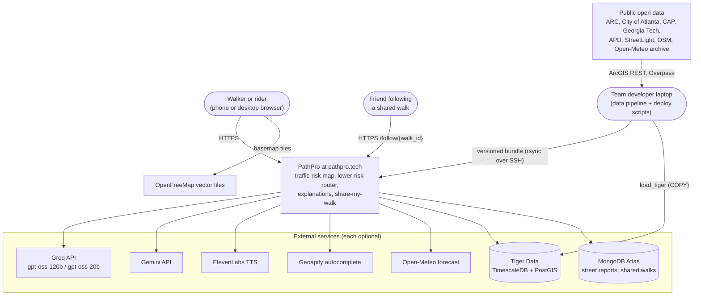
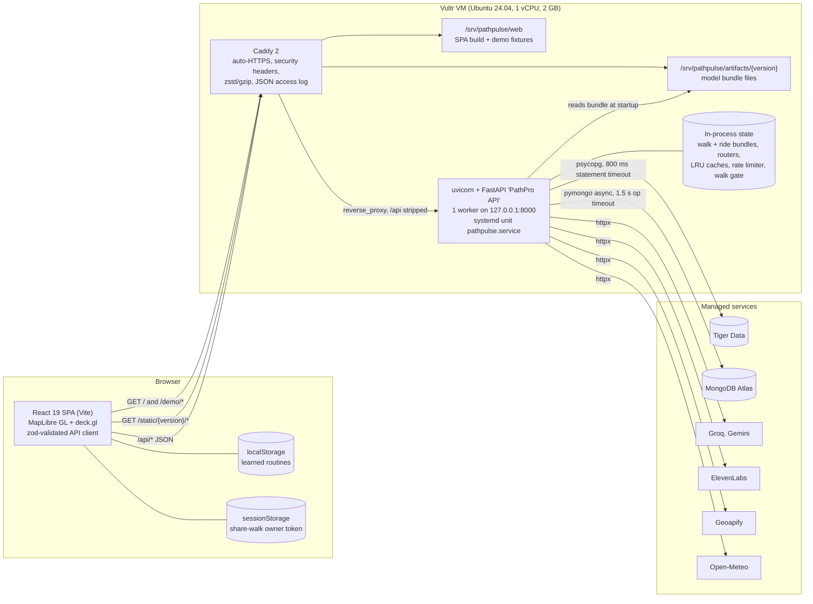
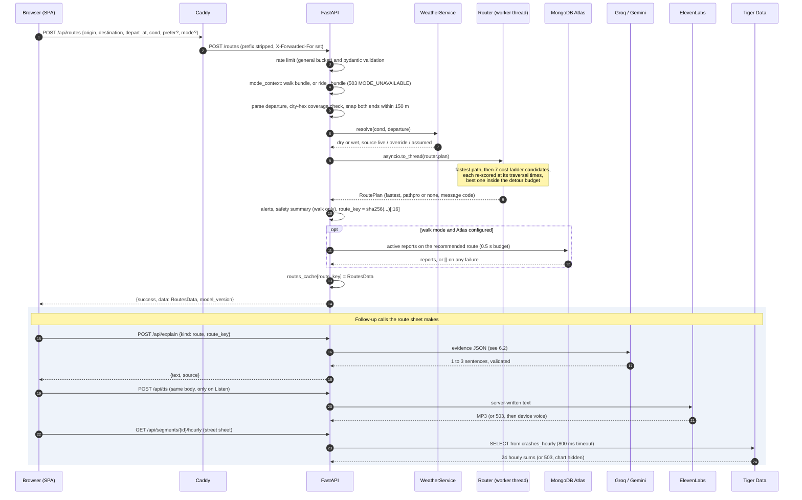
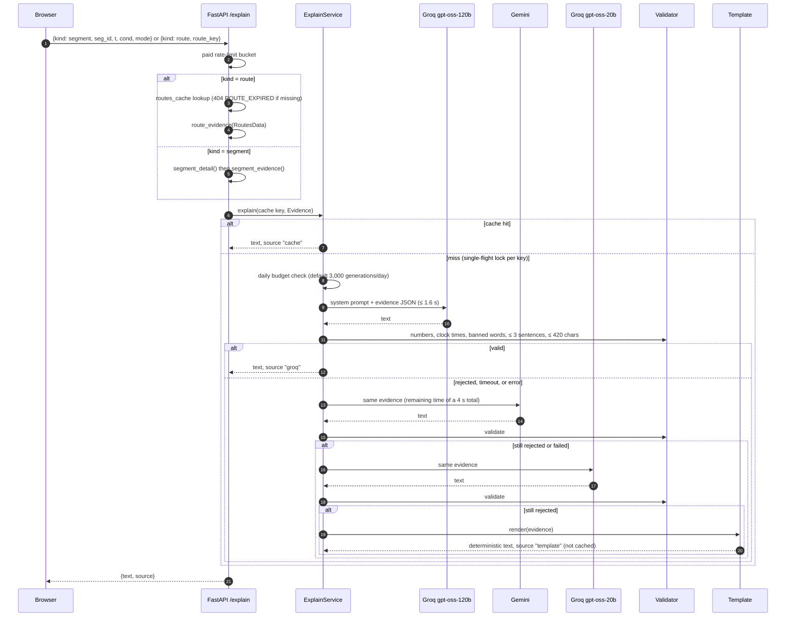
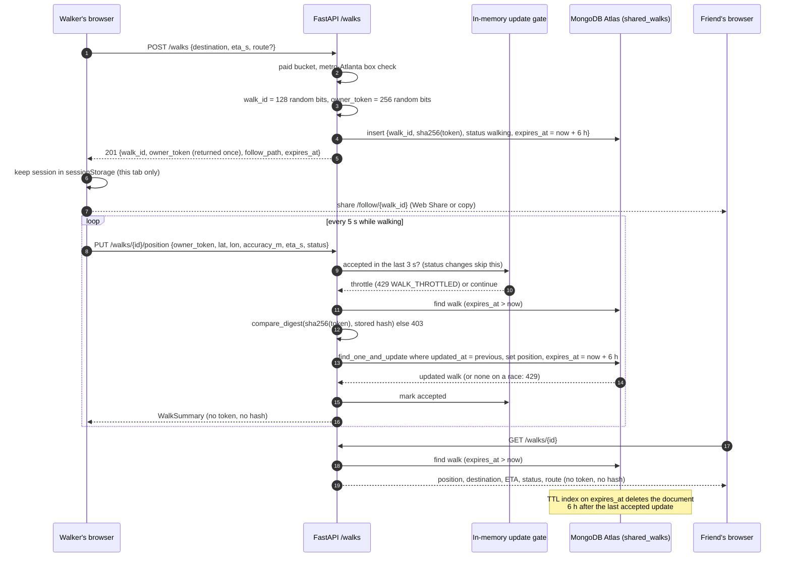
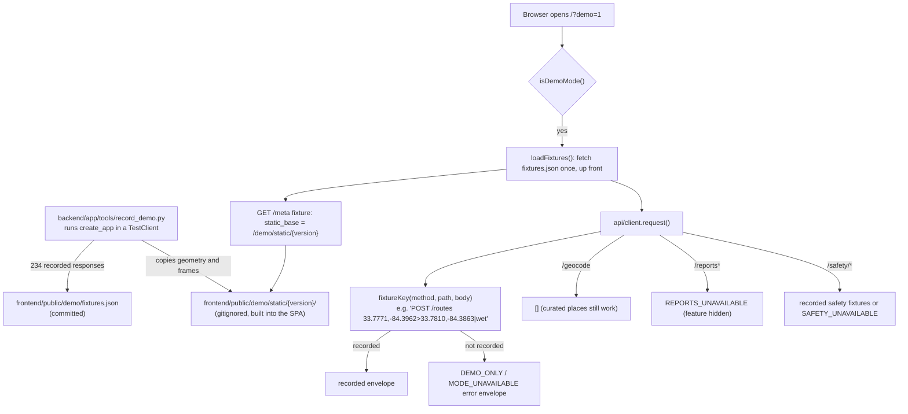
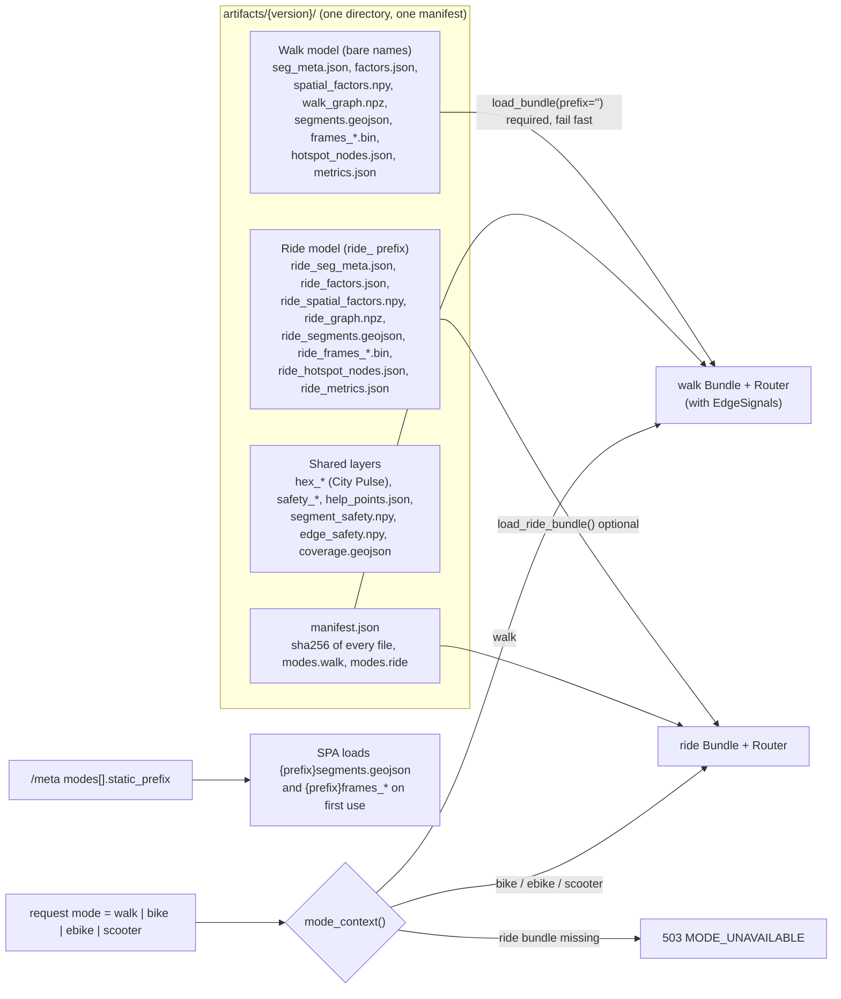
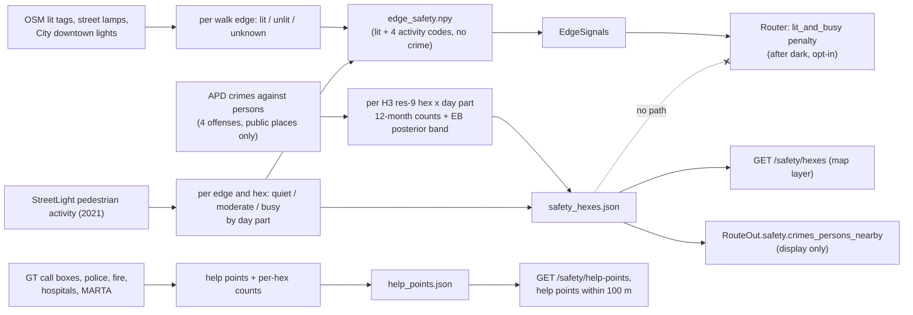

# PathPro system architecture

PathPro forecasts where and when people on foot (and on bikes and scooters) are exposed to traffic crashes in Atlanta. It shows that forecast as an hourly map (Risk Tides) and uses it to plan lower-risk routes. This document describes how the running system is put together. It is written from the code in `backend/app`, `frontend/src`, `data/src/pathpulse_data`, and `deploy/`, as of bundle `pp-20260926-1902-f49c0d2`.

| Fact | Value | Where it comes from |
| --- | --- | --- |
| Live site | https://pathpro.tech (also `www.pathpro.tech` and `155-138-233-35.sslip.io`) | `deploy/go.sh`, `deploy/Caddyfile` |
| Host | One Vultr VM in Atlanta (`atl`, `vc2-1c-2gb`, Ubuntu 24.04), IP 155.138.233.35 | `deploy/provision_vultr.sh` |
| Model bundle served | `pp-20260926-1902-f49c0d2` | `artifacts/current` symlink, `/meta` |
| Street segments (risk units) | 49,915 road segments across the City of Atlanta | `manifest.json` → `n_segments` |
| Walk routing graph | 84,758 nodes, 120,763 edges (99,119 inherit a road segment) | `manifest.json` → `walk_graph` |
| Ride routing graph | 49,824 nodes, 65,997 edges (53,158 inherit a road segment) | `manifest.json` → `ride_graph` |
| City Pulse grid | 3,537 H3 resolution-9 hexes | `manifest.json` → `n_hexes` |
| API process | FastAPI under uvicorn, one worker, bound to 127.0.0.1:8000 | `deploy/pathpulse.service` |

What the system produces (captured with Playwright from the offline demo, except City Pulse, which comes from the live site; see `docs/images/gallery/README.md`):

| Phone and personal-safety views | Desktop and City Pulse views |
| --- | --- |
| **Fastest vs PathPro route (phone)**<br> | **Risk Tides on desktop**<br> |
| **Personal-safety mode with fairness note and help points**<br> | **City Pulse area score with its factors**<br> |

Related documents: [data and models](data_and_models.md), [API reference](api_reference.md), [deployment and operations](deployment_operations.md), [security and privacy](security_privacy.md), [testing and quality](testing_quality.md).

---

## 1. Design principles that shape the architecture

1. **The model bundle is the hot path.** Every score, route, and explanation is computed from files loaded into memory at startup (`repositories/artifacts.py`). No database sits on the request path for routing or scoring (PRD NFR-04).
2. **Every external dependency is optional.** LLMs, voice, geocoding, weather, Tiger Data, and MongoDB Atlas each have a fallback. Missing keys turn a feature off; they never stop the app (section 9).
3. **The LLM never produces a number.** Scores and factor points come from the model; the LLM only rewrites server-built evidence, and a validator rejects anything not grounded in it (section 6.2).
4. **Crime never reaches routing or the traffic model.** The personal-safety layer passes only lighting and foot-traffic codes to the router (section 8).
5. **Versioned, immutable artifacts.** A bundle directory is named by model version, every file is hashed in `manifest.json`, and the browser fetches model files from `/static/<model_version>/` with a one-year immutable cache header.

---

## 2. Context (C4 level 1)



*Figure A1. System context.* PNG: [img/a1_context.png](img/a1_context.png)

- **Users** reach one origin. The browser also loads basemap tiles directly from OpenFreeMap (allowed by the CSP `img-src`/`connect-src`).
- **The model is built offline.** The `data/` pipeline runs on a developer machine, pulls public layers with no accounts, and ships a bundle directory to the VM. The server never trains or fetches training data.
- **Tiger Data** is the system of record for crashes and the versioned score grid. The API reads it for exactly one feature: the "when crashes happened here" hourly chart.
- **MongoDB Atlas** stores user-generated state: community street reports and Share-my-walk sessions. Neither feeds the model.

---

## 3. Containers (C4 level 2)



*Figure A2. Containers.* PNG: [img/a2_containers.png](img/a2_containers.png)

| Container | Technology | Responsibility | State |
| --- | --- | --- | --- |
| SPA | React 19, Vite 8, TypeScript 6, MapLibre GL 5, deck.gl 9, zod 4 | Map, Risk Tides playback, search, route sheets, navigation, share, safety layers | URL query (view state), localStorage (routines), sessionStorage (share session) |
| Caddy | Caddy 2 (apt), config `deploy/Caddyfile` | TLS for three hostnames, security headers, static files, `/api/*` proxy | Certificates, JSON access log `/var/log/caddy/pathpulse.log` |
| API | FastAPI, uvicorn `--workers 1 --proxy-headers --forwarded-allow-ips 127.0.0.1` | Routing, scoring, attribution, explanations, voice, geocoding proxy, reports, shared walks, safety queries | In memory only (see section 4.3) |
| Bundle | Files under `/srv/pathpulse/artifacts/<version>/`, `current` symlink | Model outputs: factors, frames, graphs, geometry, metrics | Immutable per version; old versions kept |
| Tiger Data | TimescaleDB + PostGIS (managed) | `crashes` hypertable, `crashes_hourly` continuous aggregate, `segments`, `risk_grid` | System of record |
| MongoDB Atlas | M0 cluster, collections `street_reports`, `shared_walks` | User-generated context and live sharing | TTL-expiring documents |

---

## 4. Backend internals

### 4.1 Layers

| Package | Role | Examples |
| --- | --- | --- |
| `app/api/` | FastAPI routers, request/response schemas, the response envelope, dependencies | `core.py` (`/healthz`, `/meta`, `/routes`, `/segments/{id}`), `extras.py`, `areas.py`, `reports.py`, `walks.py`, `safety.py`, `transit.py`, `envelope.py` |
| `app/services/` | Use cases that combine domain logic with I/O | `routing.py` (coverage, snapping, copy), `segments.py`, `explain/*`, `weather.py`, `geocode.py`, `tts.py`, `reports.py`, `walks.py`, `safety.py` |
| `app/domain/` | Pure logic, no I/O | `router.py` (Dijkstra ladder), `route_metrics.py`, `scoring.py` (percentile scale, attribution), `alerts.py`, `timeutil.py`, `modes.py`, `safety.py`, `walks.py`, `reports.py`, `transit.py` |
| `app/repositories/` | Data access with tight timeouts | `artifacts.py` (bundle loader), `hexes.py`, `safety.py`, `history.py` (Tiger), `reports.py` and `walks.py` (Atlas) |
| `app/tools/` | Operator CLIs, not served | `check_keys.py` (verifies each sponsor key without printing it), `record_demo.py` (records the offline demo) |

### 4.2 Startup (`create_app` in `app/main.py`)

1. `load_bundle(ARTIFACTS_DIR)` loads the walk model and **fails fast**: a missing file or a SHA-256 mismatch against `manifest.json` raises `BundleError`, and the process does not start.
2. `load_safety(...)` loads the personal-safety layer if all five safety files exist and their shapes match the walk graph; otherwise `None`.
3. `Router(bundle, safety.edges)` builds the walk router (directed edge arrays, a k-d tree for snapping, parallel-edge index).
4. `load_ride_bundle(root)` loads the `ride_`-prefixed model if `ride_graph.npz` exists; any error disables ride modes and logs a warning. A second `Router` is built for it.
5. `load_hexes(root)` loads City Pulse if `hex_meta.json` exists.
6. In-memory objects: a 512-entry LRU of recent `RoutesData` (evidence for `/explain`), the rate limiter, and the Share-my-walk update gate.
7. Repositories for Tiger Data and Atlas are constructed **without I/O**. The lifespan hook creates one shared `httpx.AsyncClient`, the explanation, geocoding, and TTS services, and asks Atlas to ensure indexes (failure only logs a warning).
8. Middleware: `CORSMiddleware` (added last, so outermost) wraps `RateLimitMiddleware`. Exception handlers render every error as the standard envelope.
9. The bundle directory is also mounted at `/static/<model_version>` by FastAPI (Caddy serves the same path from disk in production).

### 4.3 In-process state and the single worker

Several features rely on memory that is local to one process:

| State | Where | Consequence |
| --- | --- | --- |
| `routes_cache` (LRU 512) | `app.state.routes_cache` | `POST /explain {kind: "route"}` finds the route by `route_key`. A different process, or a restart, returns `ROUTE_EXPIRED` (404) and the client re-requests the route. |
| Explanation cache (LRU 4,096) and single-flight locks | `ExplainService` | One LLM call per unique evidence key, per process. |
| Rate-limit windows (TTL cache, 50,000 clients) | `RateLimitMiddleware` | Limits are per process. |
| Share-my-walk update gate (TTL cache, 10,000 walks) | `RecentUpdates` | Floods are rejected before any Atlas read. |
| Daily budgets for LLM, geocoding, TTS | `DailyBudget` | Counters reset at local midnight and on restart. |

The systemd unit runs `--workers 1` so these behave as designed. At about 120 ms of CPU per route (the router runs in `asyncio.to_thread` to keep the event loop free), one worker fits a hackathon load on a 1-vCPU VM. Scaling out would need a shared store for the route cache and limiter.

### 4.4 Frontend structure

| Area | Files | Notes |
| --- | --- | --- |
| Shell | `main.tsx`, `App.tsx`, `app/PathPro.tsx` | `initRuntime()` resolves the API origin before first render (same-origin on the VM). `PathPro` owns view state and wires the data hooks. |
| API client | `api/client.ts`, `api/schemas.ts`, `api/safetySchemas.ts`, `api/walks.ts`, `api/safety.ts` | Every response is parsed with a zod schema wrapped in the envelope schema; an 8 s abort timeout; non-JSON bodies become a friendly `SERVER` error. |
| Demo transport | `api/demo.ts` | With `?demo=1`, `request()` answers from `/demo/fixtures.json` instead of the network (section 6.4). |
| Bundle loading | `hooks/useBundle.ts`, `hooks/bundleFiles.ts`, `hooks/useRideNetwork.ts` | Loads `/meta`, then `segments.geojson`, `hotspot_nodes.json`, `hex_cells.json` from `meta.static_base`. The ride geometry and frames load only when a ride mode is first chosen. |
| Risk Tides frames | `frames/frameStore.ts`, `hooks/useRiskFrames.ts` | One `Uint8Array` per (day group, condition); `hour(h)` is a zero-copy `subarray`, so scrubbing never touches the network after the first fetch (PRD NFR-02). |
| Map | `map/MapView.tsx`, `map/layers.ts`, `map/hexLayer.ts`, `map/safetyLayers.ts`, `map/FollowMap.tsx` | MapLibre basemap with deck.gl `PathLayer`, `ScatterplotLayer`, `SolidPolygonLayer`, and H3 hex layers. |
| On-device features | `lib/routines.ts`, `lib/shareSession.ts`, `hooks/useNavigation.ts`, `hooks/useGeolocation.ts` | Routines are learned in localStorage only; navigation follows the GPS watch and speaks alerts; nothing about walk history is sent to the server. |
| View state | `state/urlState.ts` | Origin, destination, departure, condition, hour, day, segment, preference, and mode live in the URL so a view survives refresh. |

---

## 5. How a score is computed at request time

Every score in the product comes from one identity that the pipeline guarantees (checked to within 1e-6 at export):

```
log density(segment, cell) = base + Σ spatial factor(segment) + Σ temporal factor(cell)
score = percentile of that log density on the bundle's 1,001-point citywide quantile table (0–100)
cell  = (day group, hour, light, wet)   # Atlanta local time; light from solar elevation
```

- `Bundle.log_density()` is one vector addition, so the router can score all 240k directed edges for a departure in a single NumPy pass.
- `domain/scoring.attribute()` splits a displayed score into a baseline, the top five factors, and a remainder, by adding factors from largest to smallest effect and assigning each the score change it causes. The integers always sum to the score (property-tested on 200 random cases in `backend/tests/test_scoring.py`).
- Bands: Lower 0–24, Moderate 25–49, Elevated 50–74, High 75–100.

Details of how the factors are fitted are in [data_and_models.md](data_and_models.md).

---

## 6. Request flows

### 6.1 Plan a route



*Figure A3. Plan-a-route sequence.* PNG: [img/a3_route_sequence.png](img/a3_route_sequence.png)

What the router does (`domain/router.py`, `domain/route_metrics.py`):

| Step | Rule |
| --- | --- |
| Too close | Origin and destination on the same node or under 60 m apart → `TOO_CLOSE` |
| Search area | Directed edges inside a box around the trip padded by max(1,200 m, 0.6 × trip distance); if the box cuts the only connection, the whole graph is searched |
| Fastest path | Dijkstra (SciPy `csgraph`) on travel time at the mode's speed (walk 1.3 m/s; bike 15, e-bike 22, scooter 18 km/h) |
| Candidates | Dijkstra with cost = time × (1 + λ × density / density at score 75) for λ ∈ {0.05, 0.1, 0.25, 0.5, 1, 2, 4} |
| Re-scoring | Each candidate is re-scored edge by edge at the minute the walker would reach that edge (light and hour can change mid-trip) |
| Detour budget | min(1.25 × fastest duration, fastest + 6 min) |
| Pick | Lowest expected-crash exposure inside the budget; shown only if it is ≥10 score points lower or has ≥15% less exposure, else "The fastest route is already the lower-risk option." |
| Trade-off note | If a candidate outside the budget cuts exposure a further ≥15%, the message says how many minutes it would add |
| Long trips | Walk: > 5 km or > 1 h; ride: > 15 km or > 1 h → `long_trip` message suggesting MARTA |
| Lit and busy | Walk only, after dark only, opt-in: see section 8 |

### 6.2 "Why?" explanations



*Figure A4. Explanation chain.* PNG: [img/a4_explain_sequence.png](img/a4_explain_sequence.png)

- **Evidence is the only LLM input.** `services/explain/evidence.py` builds a JSON payload from server data (street name, score, band, time label, conditions, confidence, up to three factors that raise risk and one that lowers it, crash history; or, for routes, minutes, scores, extra minutes, exposure reduction, and avoided streets). No user text is included.
- **Cache keys** include the model version: `seg:{id}:{day|hour|light|wet}:{version}[:{mode}]` and `route:{route_key}:{version}`.
- **Validator** (`services/explain/validator.py`) rejects text that is empty, longer than 420 characters, longer than three sentences, contains a banned framing, contains a clock time other than the evidence time, or contains any number not present in the evidence (numbers inside evidence strings such as street names or "2020-2024" count as grounded).
- **Provider order** is built in `main.build_providers`: Groq (`GROQ_MODEL`, default `openai/gpt-oss-120b`), Gemini (`GEMINI_MODEL`, default `gemini-3.8-flash`), then Groq (`GROQ_FALLBACK_MODEL`, default `openai/gpt-oss-20b`). A missing key drops that provider. With no keys, every answer is the template.
- **Truncation is a failure.** Groq answers must finish with `finish_reason == "stop"` and Gemini with `finishReason == "STOP"`; otherwise the next provider is tried.
- **Voice.** `POST /tts` takes the same request body, regenerates (usually from cache) the server's own explanation, and sends that text to ElevenLabs. Clients cannot supply text to speak.

### 6.3 Share my walk



*Figure A5. Share-my-walk sequence.* PNG: [img/a5_share_sequence.png](img/a5_share_sequence.png)

- `PUT /walks/{id}/position` stays on the **general** rate limit on purpose (many walkers share one venue NAT address); the in-memory gate absorbs floods before Atlas is touched. Only authenticated, saved updates mark the gate, so a stranger holding the follow link cannot throttle the walker.
- A walk with status `ended` stays ended; later updates return the summary unchanged.
- In `?demo=1`, sharing is simulated on the device and nothing is sent.

### 6.4 Offline demo (`?demo=1`)



*Figure A6. Offline demo transport.* PNG: [img/a6_demo_flow.png](img/a6_demo_flow.png)

- The scripted scenario is Klaus Building → Midtown MARTA and Tech Square → North Ave MARTA, Friday 22:30, with wet, dry, and live conditions, for walk, bike, e-bike, and scooter.
- Recorded: `/meta`, `/conditions/live`, 24 route responses, 52 explanations, segment details for every top segment, three City Pulse lookups, safety meta, help points, 24 hourly safety hex sets, and MARTA stations (234 keys).
- `frontend/e2e/demo.spec.ts` loads the page, then calls `context.setOffline(true)` and runs the full route, preview-walk, and copy checks with the network off.

---

## 7. Multi-mode design (walk vs ride)



*Figure A7. One bundle, two travel networks.* PNG: [img/a7_multimode.png](img/a7_multimode.png)

- **Same code path, different prefix.** `load_bundle(root, prefix)` reads `{prefix}seg_meta.json`, `{prefix}factors.json`, `{prefix}spatial_factors.npy`, and `walk_graph.npz` or `ride_graph.npz`. The walk loader verifies every non-`ride_` file; the ride loader verifies only `ride_` files, so a broken ride file can never block walking.
- **Same risk units.** Both models score the same 49,915 road segments and share segment ids. Only the routing graph (OSMnx `walk` vs `bike` network), the training label, the ride-only features, and the frames differ.
- **Mode-specific behaviour.** Ride modes plan at the mode's speed, use the ride long-trip threshold (15 km), skip community reports and the personal-safety summary, ignore the `lit_and_busy` preference, and report `bike_crashes` in segment history. Route cache keys and explanation cache keys add `|mode=...` only for ride modes, so walk keys are unchanged.
- **Frontend.** `/meta` lists four modes with `available`, `speed_kmh`, `network`, and `static_prefix`. `useRideNetwork` downloads `ride_segments.geojson` and `ride_frames_*` only the first time a ride tab is chosen, so walkers never download them.

---

## 8. Personal-safety layer



*Figure A8. Personal-safety data flow: crime is display-only.* PNG: [img/a8_safety_flow.png](img/a8_safety_flow.png)

- **What reaches the router.** `EdgeSignals` holds only a lighting code per walk edge and an activity band per day part (`repositories/safety.py`). There is no crime field in it, and a test (`test_crime_counts_never_change_the_route`) builds bundles with crime counts scaled by 0, 1, and 1,000 and asserts that every plan is identical for both preferences.
- **The `lit_and_busy` preference** (walk only, after dark by the same solar-elevation rule as the model): each edge's cost is multiplied by 1 + 1.0 × [known unlit] + 0.5 × [known quiet in the departure's day part]. Unknown values are neutral. The ladder is re-run with λ = 0 plus the usual seven values; candidates must fit the detour budget and add at most 10% traffic exposure over the fastest route; the winner must cut penalty-weighted unlit-or-quiet length by at least 15% against the route the default plan would show, otherwise the default plan is returned unchanged.
- **Route summary.** For walks, `RouteOut.safety` reports `lit_share` and `busy_share` (by length, `null` when under half the route is known), help points within 100 m (polyline densified every 20 m), and `crimes_persons_nearby` (12-month count for the day part over the hexes crossed). The summary is informational.
- **Copy.** Every crime surface carries the fairness note: "Reported incidents, grouped by area and time of day. Reports reflect where police record incidents, not how people should feel about a neighborhood. PathPro never routes around neighborhoods based on crime."

---

## 9. Graceful degradation

| Dependency | How it fails | What the user sees | Code |
| --- | --- | --- | --- |
| Walk model bundle | Missing file or SHA-256 mismatch | API does not start (fail fast); systemd restarts it every 2 s; Caddy returns 502 for `/api` while the SPA still loads | `repositories/artifacts.py`, `deploy/pathpulse.service` |
| Ride model files | Absent or unreadable | Bike, E-bike, and Scooter tabs show as unavailable; `/routes` with a ride mode returns 503 `MODE_UNAVAILABLE`; walking unaffected | `load_ride_bundle`, `api/deps.mode_context` |
| City Pulse files | Absent | `/areas*` return 503 `CITY_PULSE_UNAVAILABLE`; coverage checks fall back to the bounding box | `repositories/hexes.py`, `services/routing.in_coverage` |
| Safety files | Absent or shape mismatch | `/safety/*` return 503 `SAFETY_UNAVAILABLE`; routes have `safety: null`; `lit_and_busy` behaves like the default | `repositories/safety.load_safety` |
| Groq | No key, timeout, HTTP error, truncated or ungrounded text | Next provider; the user still gets a sentence | `services/explain/service.py` |
| Gemini | Same | Next provider, then the template | same |
| All LLMs / daily budget spent | No providers or budget exhausted | Deterministic template text (`source: "template"`), never cached | `template.py`, `DailyBudget` |
| ElevenLabs | No key or voice, over 420 chars, budget spent, HTTP error | `/tts` returns 503 `TTS_UNAVAILABLE`; the browser speaks with its own voice | `services/tts.py` |
| Geoapify | No key, fewer than 3 characters, budget spent, timeout (2.5 s) | `/geocode` returns `[]`; the curated place list (`lib/places.ts`) still works | `services/geocode.py` |
| Open-Meteo | Timeout (4 s) or error | Cached forecast used for up to 1 h; after that "Live weather unavailable — using dry conditions." (`source: "assumed"`) | `services/weather.py` |
| Tiger Data | Unset, unreachable (3 s connect), slow (800 ms statement) | Hourly chart hidden (503 `HISTORY_UNAVAILABLE`); `/healthz` reports `database` and `status: degraded` | `repositories/history.py` |
| MongoDB Atlas (reports) | Unset | Report UI hidden; `/reports*` 503 `REPORTS_UNAVAILABLE`; routes carry `reports: []` | `repositories/reports.py` |
| MongoDB Atlas (reports) | Unreachable or slow | Same, plus a 30 s cooldown after any failure; routes wait at most 0.5 s | same |
| MongoDB Atlas (walks) | Unset, unreachable, cooling down | 503 `WALKS_UNAVAILABLE` "Live sharing is unavailable right now. Navigation still works." | `repositories/walks.py`, `services/walks.py` |
| Network (client) | Offline or timeout (8 s) | "You're offline. Map still works; routing needs a connection." Frames already fetched keep playing | `api/client.ts`, `frames/frameStore.ts` |
| Browser storage | Blocked or corrupt | Routines and share resume silently disabled; zod-validated reads drop bad data | `lib/routines.ts`, `lib/shareSession.ts` |

---

## 10. Performance

| Measure | Value | Source |
| --- | --- | --- |
| `POST /routes`, walk, in-process on a developer Mac (40 trips 0.8–3 km, Friday 22:30, dry, real bundle, no external calls) | See [testing_quality.md §6](testing_quality.md#6-latency-sample) | Measured for this document |
| Route planning p95 before and after the citywide router refactor | 1.95 s → 0.26 s | Commit `c8d5e8f` message |
| Default and lit-and-busy plans computed together, 40 random night trips 0.8–2.5 km | p50 154 ms, p95 283 ms | `docs/safety_sources.md` |
| Risk Tides frame | 24 × 49,915 bytes = 1,197,960 bytes per (day group, condition); City Pulse 24 × 3,537 = 84,888 bytes | Bundle files |
| Frame swap after first fetch | No network: `subarray` view per hour | `frames/frameStore.ts` |

PRD targets for reference: `POST /routes` p95 < 1.5 s (NFR-03); frame swap < 100 ms (NFR-02).
