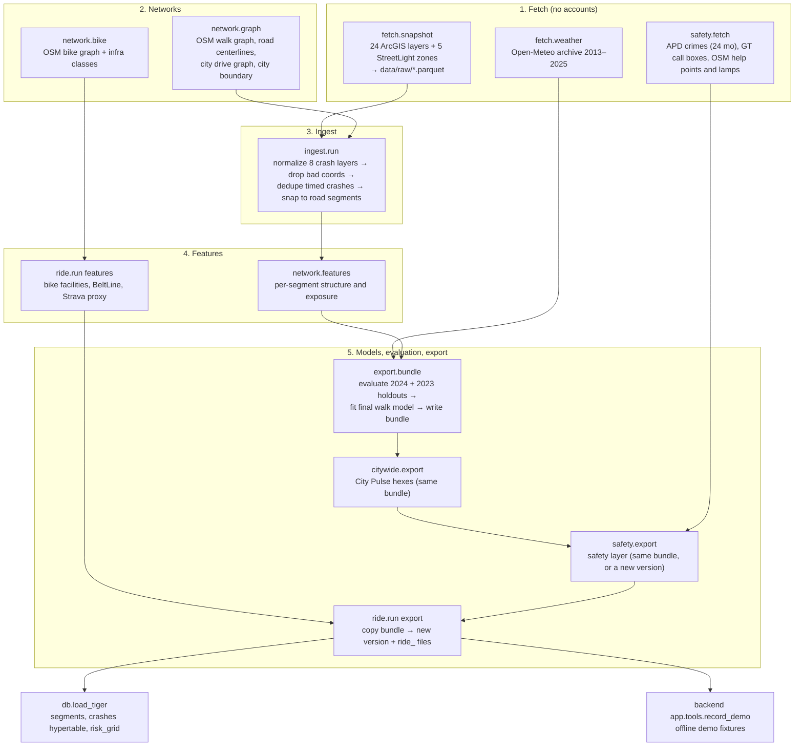
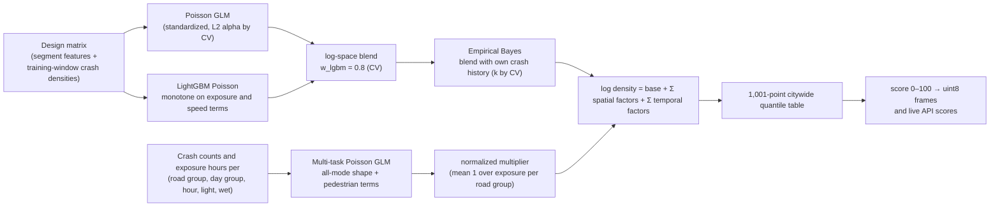
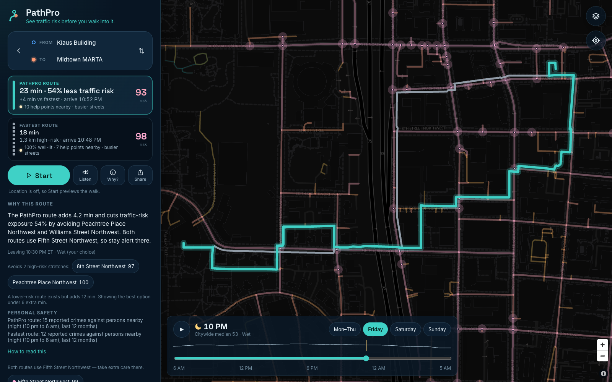
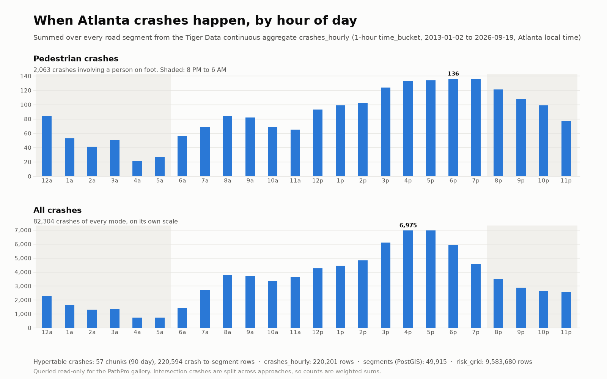
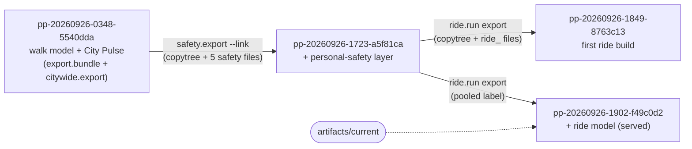

# Data and models

This document covers the offline pipeline in `data/src/pathpulse_data` (uv package `pathpulse-data`): which public data it pulls, how crashes are cleaned and attached to streets, how the walk and ride models are fitted and evaluated, and what ends up in the artifact bundle the API serves. Every number here is copied from `docs/metrics.json`, `artifacts/<version>/manifest.json`, `ride_metrics.json`, `hex_meta.json`, or `safety_meta.json` for bundle `pp-20260926-1902-f49c0d2`.

Scope reminder: the model predicts **traffic crashes involving pedestrians** (walk) and **cyclists** (ride). It uses no demographic, income, or crime features (PRD NFR-14). The separate personal-safety layer (section 9) never feeds either model.

---

## 1. Pipeline overview



*Figure D1. Data pipeline.* PNG: [img/d1_pipeline.png](img/d1_pipeline.png)

All paths are set in `config.py`: `data/raw/` (re-fetchable, gitignored), `data/interim/` (gitignored intermediates), `artifacts/<model_version>/` (bundles; only `artifacts/.gitkeep` is tracked).

---

## 2. Data sources

ArcGIS services (from `config.py`):

- `ARC` = `https://services1.arcgis.com/Ug5xGQbHsD8zuZzM/arcgis/rest/services`
- `COA` = `https://services2.arcgis.com/zLeajbicrDRLQcny/arcgis/rest/services`
- `CAP` = `https://services3.arcgis.com/FWC2S7IFSuSHD4PZ/arcgis/rest/services`
- `GTMAPS` = `https://services2.arcgis.com/I9cUOJUZvdGAJncI/arcgis/rest/services`

| Key | Layer URL (relative to service) | Role |
| --- | --- | --- |
| `arc_crashes_2020_2024` | `ARC/Crashes2020_2024/FeatureServer/0` | Year-only crashes citywide: spatial model labels (pedestrian flag = pedestrians per crash > 0; cyclist flag = `Bicycle_Related`) and non-pedestrian crash density |
| `arc_crashes_2019_2023` | `ARC/Crashes2019to2023/FeatureServer/0` (core bbox) | Fetched but not used by `ingest.run` |
| `coa_all_2022` | `ARC/COA_2022AllCrashes/FeatureServer/0` | Timed crashes, all modes |
| `coa_pedbike_2022` | `ARC/2022_COA_Pedestrian_and_bicycle_crashes/FeatureServer/0` | Timed pedestrian and cyclist crashes |
| `marta_all_2023` | `ARC/MARTACountyCrashes_2023/FeatureServer/0` | Timed crashes with pedestrian and cyclist flags |
| `cap_downtown_2017_2021` | `CAP/Downtown_Transportation/FeatureServer/9` | Timed downtown crashes |
| `coa_midtown_2019_2023` | `COA/Fiveyear_Crashdata_Midtown_WFL1/FeatureServer/0` | Timed Midtown crashes |
| `coa_ka_since_2013` | `COA/KACrashesSince2013/FeatureServer/0` | Timed killed/serious crashes |
| `gt_pedcyc_2021_2025` | `GTMAPS/Atlanta_Collisions_Involving_Ped_or_Cyclist/FeatureServer/3` | Timed pedestrian/cyclist collisions |
| `coa_aadt_2023` | `COA/SummaryStats_Routes_AADT/FeatureServer/17` | Traffic volume |
| `coa_centerline` | `COA/Centerline_ATLDOT/FeatureServer/0` | Speed limit, lanes, ownership |
| `coa_speedlimit` | `COA/Speedlimit_COA/FeatureServer/0` | Speed limit |
| `arc_ped_risk_factors` | `ARC/Atlanta_Region_Safety_Risk_Factors/FeatureServer/1` | Nine **structural** flags only; income, race, and environmental-justice flags are never read |
| `arc_ped_signals` | `ARC/PedestrianSignals/FeatureServer/1` | Fetched context |
| `coa_sidewalks` | `COA/Sidewalks_Inventory/FeatureServer/2` | Sidewalk presence and condition |
| `coa_marta_bus_stops` | `COA/MARTA_Bus_Stops_COA/FeatureServer/0` | Bus stops and boardings |
| `coa_school_zones` | `COA/School_Zones_with_Schedules/FeatureServer/0` | School zones |
| `coa_downtown_lights` | `COA/Downtown_Lights_all_WFL1/FeatureServer/0` | Street lamps (safety layer) |
| `coa_bike_facilities` | `COA/Bike_Facilities_Public_View/FeatureServer/0` | Ride features (status `Existing` only) |
| `coa_beltline` | `COA/Atlanta_BeltLine/FeatureServer/1` | BeltLine adjacency (status not `Planning`) |
| `arc_strava_bike_origins` / `_destinations` | `ARC/Strava_Bike_Hexagons_WFL1/FeatureServer/9` and `/4` | Cycling activity proxy (Strava Metro 2024, H3 res-8) |
| `coa_hin_2025` | `COA/HIN_Tiers_2025/FeatureServer/0` | **Baseline only**, never a feature |
| `arc_hin_severity` | `ARC/ARC_High_Injury_Network_Severity/FeatureServer/0` | Baseline only |
| StreetLight zones ZA11–ZA51 | `COA/Citywide-Pedestrian-Activity--250ftHex--{zone}/FeatureServer/0` | Pedestrian activity by day type and day part (2021) |

Other sources:

| Source | URL | Role |
| --- | --- | --- |
| Open-Meteo archive | `https://archive-api.open-meteo.com/v1/archive` (2013-01-01 to 2025-12-31, hourly precipitation at 33.7756, −84.3963) | Wet/dry exposure hours |
| OpenStreetMap via OSMnx | Overpass | Walk, bike, and drive networks; signals, crossings, restaurants and nightlife, rail stations; `lit` tags; help points |
| APD open data | `https://services3.arcgis.com/Et5Qfajgiyosiw4d/arcgis/rest/services/OpenDataWebsite_Crime_view/FeatureServer/0` | Safety layer only (section 9) |
| GT call boxes | `https://services5.arcgis.com/7WaXTZEsI88qiQGw/arcgis/rest/services/Call_Box_Location_View_Layer/FeatureServer/0` | Safety layer only |

The ArcGIS client (`fetch/arcgis.py`) pages with `resultOffset` / `exceededTransferLimit` (2,000 rows per page), retries four times with exponential back-off, and filters to the city bounding box `(-84.56, 33.64, -84.28, 33.89)` unless a layer overrides it.

---

## 3. Ingest: clean, dedupe, snap

`ingest/run.py` produces `crashes_timed.parquet`, `crashes_yearly.parquet`, `crash_segments.parquet`, and `ingest_report.json`.

**Normalize** (`ingest/clean.py`). Each of the eight crash layers has its own normalizer into one schema: `source, source_id, collision_id, ts, year, time_precision, lat, lon, is_ped, is_bike, severity, light_report, surface_report, road, cross_road`. Columns that carry personal data (`Name`, `Age`, `Details_411`, pedestrian, driver, bicyclist, and scooter-rider ages, `mapUrl`) are dropped or never selected. One source (`coa_pedbike_2022`) stores Atlanta wall-clock time as UTC epoch milliseconds; it is parsed with `wall_clock=True` after its agreement between reported and solar light condition rose from 60% to 94% with that reading.

**Validate coordinates.** Rows with missing, (0,0), or outside-Georgia coordinates are dropped and counted. For this build no rows were dropped:

| Source | Records in | Kept |
| --- | --- | --- |
| arc_crashes_2020_2024 | 251,440 | 251,440 |
| marta_all_2023 | 46,613 | 46,613 |
| coa_all_2022 | 35,769 | 35,769 |
| cap_downtown_2017_2021 | 32,847 | 32,847 |
| coa_ka_since_2013 | 6,004 | 6,004 |
| coa_midtown_2019_2023 | 5,922 | 5,922 |
| coa_pedbike_2022 | 548 | 548 |
| gt_pedcyc_2021_2025 | 483 | 483 |

**Deduplicate timed crashes** (`ingest/dedupe.py`). Two timed records are the same crash if they share a GDOT collision id, or lie within 20 m and 30 minutes of each other. Clusters are formed with a disjoint set; a merged record keeps the most severe KABCO letter and ORs the pedestrian and cyclist flags. Result: 127,011 → 122,257 records (4,754 merges). The ARC year-only stream has no collision id, so only exact `OBJECTID` repeats are removed from it.

**Snap to road segments** (`ingest/snap.py`, in UTM 16N metres). The risk unit is the OSM road centerline segment (interstates excluded), because crashes are geocoded to centerlines and most Midtown sidewalks are separate OSM ways.

1. Within 15 m of an intersection node (degree ≥ 3): split with weight 1/degree across that node's segments.
2. Else the nearest segment within 30 m: weight 1.
3. Else dropped (mostly interstate crashes).

| Stream (inside the buffered city boundary) | Crashes | Pedestrian | Snapped | Snapped pedestrian |
| --- | --- | --- | --- | --- |
| Year-only (ARC 2020–2024) | 174,198 | 2,337 | 130,064 | 2,228 (95.3%) |
| Timed (all timed layers, deduped) | 111,129 | 2,193 | 82,305 | 2,063 (94.1%) |

Pedestrian crashes per year in the year-only stream: 2020 388, 2021 463, 2022 435, 2023 490, 2024 561. Data runs through 2026-09-19 (`data_through`).

---

## 4. Networks

| Network | Builder | Size in this bundle | Use |
| --- | --- | --- | --- |
| Road centerlines | `network.graph.build_core_road_graph` (OSM custom filter: trunk to service roads, no private access, no parking aisles or driveways, no motorways) | 49,915 segments | Risk unit for both models |
| Walk graph | OSMnx `network_type="walk"` over the city boundary buffered 200 m, largest weakly connected component | 84,758 nodes, 120,763 edges | Walk routing |
| Bike graph | OSMnx `network_type="bike"`, same polygon, largest component | 49,824 nodes, 65,997 edges | Ride routing |
| City drive graph | OSMnx `graph_from_place("Atlanta, Georgia, USA", network_type="drive")` | n/a | City Pulse hex features only |

**Risk inheritance** (`network/inherit.py`). Each routing edge takes the `seg_id` of the road it is exposed to, matched by midpoint distance and heading: road edges within 15 m and 30°, footpaths within 25 m and 30°, crossings within 20 m at any angle. Edges with no nearby road (park paths, campus quads, the BeltLine) get `-1` and are scored at the citywide median density. 99,119 of 120,763 walk edges and 53,158 of 65,997 bike edges inherit a road.

**Edge geometry orientation.** OSMnx stores many edge geometries in the opposite direction; the API orients each edge's vertices from the node being left (`route_metrics.oriented_coords`), a fix from commit `f99e683` that made drawn routes match their true length.

---

## 5. Features (per road segment)

`network/features.py` conflates agency lines onto segments by midpoint distance (≤ 20 m) and heading (≤ 30°) so a cross street never donates its attributes.

| Factor shown to users | Model columns |
| --- | --- |
| Traffic volume | `log_aadt`, `aadt_missing`, `arc_aadt_risk` |
| Speed limit | `speed` (City speed-limit layer, then centerline, then OSM `maxspeed`), `arc_psl_risk` |
| Number of lanes | `lanes` (OSM, then centerline), `arc_lanes_risk` |
| Road type | `group_arterial/collector/local`, `is_service`, `oneway`, `state_owned`, `arc_gdot_risk`, `arc_min_art_risk`, `arc_urban_risk`, `arc_high_dev_risk`, `arc_structural_count` (+ the temporal model's road-group level) |
| Pedestrian activity | `log_ped_volume` (StreetLight all-day volume within 60 m), `ped_volume_missing` |
| Restaurants and nightlife nearby | `log_food_n`, `log_nightlife_n` (OSM amenities within 150 m) |
| Transit stops | `bus_stops_n` (40 m), `log_bus_boardings`, `arc_bus_risk`, `arc_high_bus_risk`, `log_rail_dist` |
| Intersection complexity | `node_degree_max`, `signals_n` (15 m), `crossings_n` (10 m) |
| Sidewalk condition | `sidewalk_n`, `sidewalk_cond` (25 m) |
| School zone | `school_zone` (60 m) |
| Mapped street lighting | `osm_lit` |
| Vehicle crashes on this street | `log_nonped_density`, `log_nbr_nonped_density` (training years only) |
| Pedestrian crashes on nearby streets | `log_nbr_ped_density` (other segments within 200 m, training years only) |
| Block length | `log_len` (length clipped at 30 m) |
| Pedestrian crash history here | Empirical Bayes adjustment (section 6.2) |

Missing numeric values are filled with the road-group median. Crash-derived features are recomputed for each training window from that window's years only, so a holdout year never leaks into its own features.

---

## 6. Walk model

The expected annual pedestrian crash density of a segment in a time cell is the product of a **spatial** model (where) and a **temporal** multiplier (when), with an exact additive split in log space.



*Figure D2. Model composition.* PNG: [img/d2_model.png](img/d2_model.png)

### 6.1 Spatial model (safety performance function)

- **Target:** annual pedestrian crash rate per segment (`window_counts / n_years`), sample weight `n_years`, from the snapped ARC year-only stream.
- **GLM member:** scikit-learn `PoissonRegressor` on standardized columns; L2 `alpha` chosen from {0.003, 0.01, 0.03, 0.1, 0.3, 1.0} by grouped 5-fold CV deviance.
- **LightGBM member:** Poisson objective, learning rate 0.03, 7 leaves, 60 minimum rows per leaf, 0.8 feature and bagging fractions, L2 5.0, seed 13. Monotone-increasing constraints on `log_aadt`, `lanes`, `speed`, `log_nonped_density`, `log_ped_volume`, `log_len`, `log_nbr_ped_density`, `log_nbr_nonped_density` (and `log_bike_activity` for ride). Boosting rounds chosen by `lgb.cv` with early stopping (100) up to 1,500.
- **Spatial-block CV:** every fold split is `GroupKFold(5)` over H3 resolution-7 blocks (~5 km²), coarse enough that the split pieces of one intersection crash stay in one fold.
- **Ensemble:** `log μ = w · log μ_lgbm + (1 − w) · log μ_glm`, with `w` on a 0.1 grid chosen on out-of-fold predictions.
- **Selected on the 2020–2023 fit:** `glm_alpha` 0.003, 543 rounds, `w_lgbm` 0.8, CV deviance 0.0358 (validation fit 2020–2022: 521 rounds, same alpha and weight).

### 6.2 Empirical Bayes

Highway Safety Manual form (`model/eb.py`): `EB = w · μ + (1 − w) · y` with `w = 1 / (1 + k · μ)`, where μ and y are totals over the same window. `k` is chosen from {0, 0.1, 0.25, 0.5, 1, 2, 4, 8, 16, 32} by predicting the last training year from the earlier ones (method-of-moments `k` is biased toward 0 here because intersection crashes are split into fractional counts). Selected: `k = 0.25` (test fit), `0.5` (validation fit).

### 6.3 Temporal model

`model/temporal.py` fits one `PoissonRegressor` (alpha 1e-3) on stacked cells: (road group × day group × hour × light × wet) × {all-mode, pedestrian}, with rates per 10,000 exposure hours weighted by hours, plus year indicators (and pedestrian × year) that absorb changes in which layers exist in which year.

- **Shared terms:** road group, day group (weekday / Friday / Saturday / Sunday), 24 hours, light (day / twilight / dark), wet.
- **Pedestrian terms:** light, five hour bins (0–5, 6–9, 10–14, 15–18, 19–23), day group, road group, wet.
- **Same definitions for crashes and exposure** (`timeseries/exposure.py`): light from solar elevation at 33.7756, −84.3963 at mid-hour (day > −0.833°, twilight > −6°, else dark); wet when precipitation ≥ 0.1 mm in the current or previous hour; DST-exact hour starts.
- **Output:** a multiplier normalized so its exposure-weighted mean is 1 within each road group, so the spatial model keeps its annual scale.
- **Windows:** evaluated by training on 2017–2021 and testing on 2022–2023; the shipped model is fit on 2017–2023 (2024–25 timed data comes from only two narrow layers).

### 6.4 Exact factor attribution

`export/factors.py` groups per-feature log contributions into the 15 spatial and 4 temporal factors users see:

- LightGBM contributions come from `predict(pred_contrib=True)` (TreeSHAP); GLM contributions are `z · coef`; both are blended with the same `w`, so the sum is exact.
- The Empirical Bayes adjustment `log(EB / SPF)` is added to **Pedestrian crash history here**; `−log(length / 100 m)` to **Block length** (scores are per 100 m); the temporal model's road-group level to **Road type**.
- Every factor is centered on its mean, so `base` means "a typical street at a typical hour".
- `export/assemble._check_identity` asserts that the decomposed log density equals `log(EB × multiplier / length)` within 1e-6 for Friday 22:00 wet, or the export fails.

At request time, `domain/scoring.attribute` turns log contributions into integer score points by adding factors from largest to smallest |effect| and assigning each the change in percentile score it causes; the top five are shown and the rest become `remainder_points`, so **baseline + bars + remainder = score** exactly.

### 6.5 Score scale and Risk Tides frames

- **Quantiles:** 1,001 quantiles of log density over every segment × 24 hours × 8 frames (4 day groups × dry/wet). The score is the piecewise-linear percentile on that table, so "High" (75+) always means the top quarter of the city's street-hours for this model version.
- **Reference dates:** each day group uses its next date on or after the build day (Friday 2026-09-25, Saturday 09-26, Sunday 09-27, weekday 09-28); light for hour *h* is computed at *h*:30 on that date and recorded in `manifest.frame_light`. The API scores live requests with the exact light at the requested time.
- **Format:** `frames_{day}_{cond}.bin` is `uint8`, hour-major `[24][n_segments]`, scores rounded and clipped to 0–100. The browser indexes it by segment id.
- **Confidence:** `high` when a segment has ≥ 15 weighted crashes (all modes, 2020–2024), `medium` ≥ 3, else `limited`.
- **Hotspots:** `hotspot_nodes.json` lists 26,486 road intersections (degree ≥ 3) with their segment ids; the SPA glows the top 5% by maximum incident score, never below 75.

---

## 7. City Pulse (citywide hexes)

`citywide/` repeats the approach on 3,537 H3 resolution-9 cells (~0.1 km²) whose centers fall inside the City of Atlanta boundary.

- **Features per hex:** km of arterial, collector, and local road (city drive graph), intersections, signals, mean `log_aadt`, mean speed limit, bus stops, `log_boardings`, mean `log_ped_volume` (with missing flags), `log_nonped`, and 1-ring neighbour pedestrian and non-pedestrian crash sums (training years only).
- **Labels:** ARC year-only crashes located in each hex (not snapped).
- **Fit:** GLM (alpha 0.01) + monotone LightGBM with rounds chosen by CV grouped on H3 resolution-6 parents; the blend weight is chosen in-sample on the training window; EB `k` by the last-year check.
- **Time and conditions:** a road-length-weighted mixture of the pedestrian temporal multipliers, shown as a single factor "Time of day and conditions".
- **Outputs:** `hex_meta.json` (cells, centroids, road-group shares, crash counts, confidence ≥ 30 / ≥ 5 crashes, base, quantiles, factor labels, multipliers, metrics), `hex_factors.npy` (3,537 × 7), `hex_frames_{day}_{cond}.bin` (24 × 3,537 bytes), and `hex_cells.json`.

---

## 8. Ride model (bike, e-bike, scooter)

`ride/run.py` reuses the walk pipeline on the same 49,915 segments with a different target, extra features, and its own routing graph.

- **Target flag:** `is_bike` (ARC `Bicycle_Related`; 2020–2024: 29, 95, 123, 132, 175 crashes by year; 551 of 554 in coverage snapped). Scooter riders appear only in the killed/serious layer and are not counted as cyclists.
- **Extra features** (`ride/features.py`): strongest bike facility within 20 m and 30° from OSM cycleway tags and the City's `Bike_Facilities_Public_View` (protected / painted / shared, one-hot); BeltLine adjacency within 15 m (OSM names or the ABI layer); `log_bike_activity` from Strava Metro 2024 ride and e-bike trip origins plus destinations in the segment's H3 res-8 hex. Segment counts by facility class: none 46,012, shared 611, painted 1,885, protected 1,407.
- **Exposure is a proxy.** The City publishes no StreetLight bicycle layer. Without the Strava feature the 2024 capture is 69.5% [63.9, 75.8] (model card), so Strava does not drive the result.
- **Training label chosen on validation.** Two candidates were fit and scored on **cyclist crashes only**: cyclist-only labels, and pooled pedestrian + cyclist labels. The pooled label won on the 2023 validation year and is shipped.

| Candidate (scored on cyclist crashes) | 2023 validation, top 10% | 2024 test, top 10% [95% CI] | 2024 gain over reusing the walk model [95% CI] |
| --- | --- | --- | --- |
| Cyclist-only | 59.7% | 57.4% [48.1, 65.6] | −16.4 to −0.6 points |
| **Pedestrian + cyclist (shipped)** | **69.0%** | **69.9% [64.0, 76.1]** | **+1.3 to +6.2 points** |

- **Temporal choice.** Three temporal structures were compared on held-out 2022–2023 cyclist crashes (shape deviance): cyclist-specific 0.516, all-mode shape 0.562, walk structure reused 0.580. The cyclist-specific model (trained on 48 cyclist crashes from 2017–2021 plus the all-mode shape) was chosen and refit on 2017–2023. It matches a smoothed hour × day baseline (−0.06%), so light and rain add essentially nothing for cyclists.
- **Bundle safety.** `ride/bundle.new_ride_version` copies the source bundle byte for byte into a new version directory, writes only `ride_*` files, and `verify_unchanged` fails the export if any walk file's bytes changed.
- **Speeds.** Bike 15 km/h, e-bike 22 km/h, scooter 18 km/h (`backend/app/domain/modes.py`). All three share the ride model.

---

## 9. Personal-safety layer

Built by `safety/export.py` from `safety/fetch.py` pulls. Full method and coverage are in `docs/safety_sources.md`; the essentials:

| Signal | Method | Coverage in this bundle |
| --- | --- | --- |
| Reported crimes against persons | APD NIBRS homicide, robbery, aggravated assault, simple assault; excludes residences, apartments, jails, and shelters; fetches only `OccurredFromDate, NIBRS_Offense, LocationType` + point; converts true UTC to Atlanta time; counts per H3 res-9 hex × day part | 15,096 raw rows; 6,174 kept for 24 months (banding), 3,268 for 12 months (shipped counts), 3,167 inside city hexes |
| Crime band | Exposure-normalized Empirical Bayes: E = expected count if every pedestrian-hour had the city rate (activity × hours in day part; missing activity → city median); Gamma(α, α/m) prior by method of moments (Clayton & Kaldor 1987); posterior Gamma(y + α, E + α/m). "higher" if P(θ > m) ≥ 0.9 **and** y > 0; "lower" if P(θ < m) ≥ 0.9; else "typical" | Night 701 / 2,614 / 222 (lower / typical / higher); morning 439 / 2,960 / 138; afternoon 642 / 2,662 / 233; evening 465 / 2,890 / 182 |
| Lighting | Edge's own OSM `lit` tag, else its road segment's tag, else a mapped lamp within 25 m counts as lit; only `lit=no` or `disused` is unlit; hex `lit_share` is `null` unless ≥ 50% of walkable length is known | Known for 4.4% of walkable length; 56 of 3,537 hexes have a `lit_share`; 2,523 lamps |
| Foot traffic | StreetLight daily volume per period → mean hourly rate per day part; bands are pooled terciles: quiet < 2.56/h, moderate 2.56–9.06/h, busy ≥ 9.06/h; segments blend weekday and weekend 5:2 | 3,498 hexes; 43,621 segments |
| Help points | GT call boxes (active, outdoor), OSM police, fire, hospitals, MARTA rail; same-kind points within 30 m merged | 189 points: 100 blue-light, 35 fire, 24 MARTA, 21 police, 9 hospital |

Day parts (Atlanta time): night 22–05, morning 06–11, afternoon 12–17, evening 18–21.

---

## 10. Evaluation

### 10.1 Protocol

- **Temporal holdout.** Train on 2020–2023, test on 2024 pedestrian crashes. Second check: train 2020–2022, test 2023. Features that use crash history are rebuilt from the training window only.
- **Headline metric:** share of held-out crashes on the top X% of **street length** when segments are ranked by predicted density per 100 m. The segment straddling the budget counts pro-rata. Ranking by length stops a model from winning by picking long segments.
- **Uncertainty:** 95% percentile intervals from 400 bootstrap resamples of 614 H3 resolution-8 spatial blocks (whole blocks are resampled, because nearby streets are not independent). The gain over the past-crash baseline has its own paired block-bootstrap interval.
- **Baselines** (`model/benchmark.py`): past pedestrian crash density in the training window; the City's 2025 High Injury Network tier; ARC structural risk flags (demographic flags removed); random. Tied baseline scores get a seeded 1e-9 jitter so ties are not broken by row order. The HIN is also compared at its own share of street length (9.8%).
- **Other metrics:** ROC-AUC and PR-AUC for "segment has ≥ 1 crash in the holdout", mean Poisson deviance, and calibration by decile.

### 10.2 Walk model, 2024 holdout (543 pedestrian crashes)

| Method | Top 10% length | Top 5% length | At HIN's 9.8% | ROC-AUC | PR-AUC |
| --- | --- | --- | --- | --- | --- |
| **PathPro (EB ensemble)** | **74.3%** [70.5, 78.3] | **61.1%** | **73.9%** | **0.889** | **0.277** |
| Model only (SPF, no EB) | 74.3% | 61.2% | 73.8% | 0.889 | 0.276 |
| Past pedestrian crash density | 49.8% | 44.4% | 49.8% | 0.716 | 0.160 |
| City High Injury Network 2025 | 53.8% | 39.3% | 53.7% | 0.694 | 0.088 |
| ARC structural flags (demographic flags removed) | 51.2% | 26.2% | 50.1% | 0.792 | 0.085 |
| Random | 11.9% | 6.1% | 11.6% | 0.494 | 0.027 |

- Gain over past-crash ranking: +24.5 points, 95% CI [+20.4, +28.8].
- Poisson deviance: EB 0.0515, SPF 0.0516, count-only 0.1523.
- Predicted 411.0 vs observed 543 crashes: counts are under-predicted, so the claim is **ranking**, not calibrated counts.

### 10.3 Walk model, 2023 check (train 2020–2022; 475 pedestrian crashes)

| Method | Top 10% length | Top 5% | At HIN share | ROC-AUC | PR-AUC |
| --- | --- | --- | --- | --- | --- |
| **PathPro (EB ensemble)** | **68.1%** [63.9, 72.4] | **58.0%** | **67.5%** | **0.869** | **0.248** |
| Model only (SPF) | 68.0% | 57.3% | 67.8% | 0.869 | 0.248 |
| Past pedestrian crash density | 45.5% | 41.4% | 45.2% | 0.682 | 0.127 |
| City High Injury Network 2025 | 54.2% | 38.2% | 53.9% | 0.703 | 0.082 |
| ARC structural flags | 50.8% | 27.1% | 50.3% | 0.793 | 0.079 |
| Random | 12.4% | 6.3% | 12.3% | 0.508 | 0.026 |

Gain over past-crash ranking: +22.6 points, 95% CI [+18.1, +26.9]. Deviance: EB 0.0486, SPF 0.0487, count-only 0.1490. Predicted 393.4 vs observed 475.

### 10.4 Calibration by decile of predicted value (observed / predicted)

| Decile | 2024: predicted | 2024: observed | Ratio | 2023: predicted | 2023: observed | Ratio |
| --- | --- | --- | --- | --- | --- | --- |
| 0 (lowest) | 1.1 | 0.7 | 0.60 | 1.1 | 1.2 | 1.09 |
| 1 | 1.9 | 2.3 | 1.23 | 1.9 | 2.8 | 1.47 |
| 2 | 3.2 | 4.3 | 1.35 | 3.1 | 6.5 | 2.12 |
| 3 | 4.4 | 1.2 | 0.28 | 4.6 | 4.0 | 0.87 |
| 4 | 5.8 | 6.2 | 1.06 | 6.0 | 5.9 | 0.98 |
| 5 | 8.3 | 16.3 | 1.97 | 8.3 | 10.8 | 1.29 |
| 6 | 13.4 | 24.8 | 1.85 | 12.9 | 21.2 | 1.64 |
| 7 | 25.4 | 42.7 | 1.68 | 23.4 | 50.4 | 2.15 |
| 8 | 54.4 | 67.1 | 1.23 | 51.4 | 55.6 | 1.08 |
| 9 (highest) | 293.0 | 377.3 | 1.29 | 280.7 | 316.7 | 1.13 |

### 10.5 Temporal model (held-out 2022–2023, 889 pedestrian crashes)

Shape deviance (each prediction rescaled to the test total, so only the time profile is compared):

| Model | Deviance | Reduction |
| --- | --- | --- |
| Flat (rate constant within road group) | 1.0334 | baseline |
| Smoothed hour × day GLM (no light, no rain) | 0.7902 | 23.5% vs flat |
| **PathPro temporal GLM** | **0.7801** | **24.5% vs flat; 1.3% vs hour × day** |

Pedestrian multipliers from the evaluation fit (2017–2021): dark ×1.62, twilight ×1.44, wet ×1.12, pedestrian-specific darkness term ×1.11. From the shipped fit (2017–2023, `temporal_effects`): dark ×1.63, twilight ×1.35, wet ×1.04, pedestrian × dark ×1.28.

### 10.6 Ride model (scored on cyclist crashes)

| Method | 2024 top 10% (174 crashes) | 2024 ROC-AUC | 2023 top 10% (132 crashes) | 2023 ROC-AUC |
| --- | --- | --- | --- | --- |
| **Ride model (EB ensemble, pooled label)** | **69.9%** [64.0, 76.1] | **0.866** | **69.0%** [62.3, 76.6] | **0.867** |
| Model only (SPF) | 69.7% | 0.866 | 69.4% | 0.867 |
| Walk model reused | 66.4% | 0.855 | 62.5% | 0.851 |
| City High Injury Network 2025 | 43.6% | 0.642 | 48.9% | 0.691 |
| ARC structural flags | 42.4% | 0.769 | 43.9% | 0.789 |
| Past cyclist crash density | 30.4% | 0.611 | 22.1% | 0.569 |
| Random | 12.0% | 0.501 | 11.8% | 0.480 |

- 2024 gains: over past cyclist crashes +30.9 to +46.3 points; over the reused walk model +1.3 to +6.2 points (95% CIs).
- Pre-registered targets (`ride/evaluate.targets`): CI lower bound above the count-only point estimate, and above twice the random capture. Both met.
- Temporal: 25.1% lower deviance than flat on 252 held-out cyclist crashes (0.516 vs 0.689). Shipped multipliers: dark ×1.00, twilight ×1.08, wet ×0.86 (exposure is clock hours, not riders).

### 10.7 City Pulse (top 10% of hexes, equal weight per hex; no bootstrap interval computed)

| Method | 2024 (548 crashes) | ROC-AUC | 2023 (468 crashes) | ROC-AUC |
| --- | --- | --- | --- | --- |
| **City Pulse (EB ensemble)** | **74.5%** | **0.916** | **69.2%** | **0.908** |
| Past crash count only | 66.1% | 0.829 | 58.8% | 0.765 |
| Random | 13.1% | 0.470 | 13.0% | 0.465 |

### 10.8 Caveats carried from the model card

- Ranking a whole city (with many quiet residential streets) is easier than ranking a dense core; the earlier core-only model reached 45.8% vs 41.4% for past crashes.
- 2024 was looked at during development; the 2023 check is the cleaner second opinion.
- The HIN targets killed and serious crashes of all modes, so the comparison is conservative against PathPro.
- Street features (OSM signals and crossings, 2023 AADT, current speed limits, current bike facilities) are snapshots taken during or after the test period.
- Exposure bias: busy streets score higher partly because more people walk there. StreetLight activity is from 2021.

---

Scores are split into factors as in section 6.4 and put into words as in [architecture §6.2](architecture.md#62-why-explanations); the hourly crash chart comes from Tiger Data (section 12):

| Explanation | Tiger Data |
| --- | --- |
| **Grounded route explanation (desktop)**<br> | **Crashes by hour from the `crashes_hourly` continuous aggregate**<br> |

## 11. Bundle layout

A bundle is one directory, `artifacts/<model_version>/`, where `model_version = pp-<UTC yyyymmdd-HHMM>-<git short sha>`. `artifacts/current` is a relative symlink to the served version. `manifest.json` records the SHA-256 of every other file; the API refuses to start on a mismatch in any walk file.

| File | Format | Purpose | Read by |
| --- | --- | --- | --- |
| `manifest.json` | JSON | Version, `data_through`, `n_segments`, day groups, conditions, reference dates, `frame_light`, coverage bbox, walk/ride graph stats, `n_hexes`, lineage (`derived_from`, `safety_added_at`, `ride_added_at`), `modes`, and `files` → sha256 | API |
| `metrics.json` | JSON | Walk evaluation (`spatial_test`, `spatial_validation`, `temporal_test`), `headline`, `temporal_effects`, `ingest` report | API (`/meta.headline`) |
| `seg_meta.json` | JSON columns | Per segment: `name`, `road_group`, `length_m`, `eb`, `spf`, `crashes`, `ped_crashes`, `dark_share`, `wet_share`, `confidence` | API |
| `factors.json` | JSON | `base`, spatial and temporal factor keys and labels, 576 `temporal_rows` (4 day groups × 24 h × 3 light × 2 wet → 4 values), 1,001 `quantiles` | API |
| `spatial_factors.npy` | float32 [49,915 × 15] | Centered spatial log contributions per segment | API |
| `walk_graph.npz` | NumPy archive | `node_lon/lat` [84,758], `edge_u/v/len/seg/kind` [120,763], `coords` [429,275 × 2], `coord_offsets` | API router |
| `frames_{weekday,friday,saturday,sunday}_{dry,wet}.bin` | uint8 [24 × 49,915] | Risk Tides scores | Browser |
| `segments.geojson` | GeoJSON | Segment lines (5-decimal coordinates) with `n` name, `g` road-group letter, `c` confidence letter; feature id = seg id | Browser |
| `hotspot_nodes.json` | JSON | `[lon, lat, [seg ids]]` for 26,486 intersections | Browser |
| `coverage.geojson` | GeoJSON | Simplified City of Atlanta boundary (~50 m tolerance) | Browser |
| `hex_meta.json`, `hex_factors.npy`, `hex_cells.json`, `hex_frames_*.bin` | JSON, float32 [3,537 × 7], JSON, uint8 [24 × 3,537] | City Pulse model, factors, cell list, frames | API, browser |
| `safety_meta.json` | JSON | Sources, crime categories, excluded locations, day parts, columns, method, stats | API |
| `safety_hexes.json` | JSON columns | Per hex: 12-month crime counts and bands per day part, `lit_share`, activity band per day part, help-point count | API |
| `help_points.json` | JSON | 189 points: `kind`, `name`, `lat`, `lon` | API |
| `segment_safety.npy` | int16 [49,915 × 6] | `lit`, activity per day part ×4, `help_dist_m` | API (loaded; not used by an endpoint yet) |
| `edge_safety.npy` | int8 [120,763 × 5] | `lit`, activity per day part ×4 (no crime) | API router |
| `ride_seg_meta.json` | JSON columns | As `seg_meta.json` plus `bike_crashes`, `bike_infra` | API |
| `ride_factors.json`, `ride_spatial_factors.npy` | JSON, float32 [49,915 × 17] | Ride factors (adds bike facility and cycling activity) | API |
| `ride_graph.npz` | NumPy archive | Bike routing graph (49,824 nodes, 65,997 edges), same layout as the walk graph | API router |
| `ride_frames_*.bin`, `ride_segments.geojson` (adds `b` facility code), `ride_hotspot_nodes.json` | as walk | Ride Risk Tides | Browser |
| `ride_metrics.json` | JSON | Ride evaluation, label and temporal choices, sources, facility counts | API (`/meta.ride_model`) |

Bundle lineage on disk:



*Figure D3. Bundle lineage.* PNG: [img/d3_lineage.png](img/d3_lineage.png)

Each extension copies its parent and adds files, so older bundle directories stay valid and can be re-pointed to for rollback.

---

## 12. Tiger Data (system of record)

`data/sql/schema.sql` (idempotent) and `db/load_tiger.py`:

| Object | Definition | Loaded rows (per sponsor checklist) |
| --- | --- | --- |
| `segments` | `seg_id` PK, name, road group, length, `geometry(LineString, 4326)` with a GiST index | 49,915 |
| `crashes` | Hypertable on `ts`, 90-day chunks; one row per crash–segment assignment (weight, pedestrian flag, severity, light, surface, point geometry); index `(seg_id, ts DESC)` | 220,594 rows, 57 chunks |
| `crashes_hourly` | Continuous aggregate: `time_bucket('1 hour')`, `seg_id`, `sum(weight)`, pedestrian and dark sums; refreshed after load | n/a |
| `citywide_hour_profile` | View: hour-of-day profile in Atlanta time | n/a |
| `risk_grid` | Scores per (`model_version`, day group, condition, hour, segment) | 9,583,680 |

The API reads only `crashes_hourly` (`GET /segments/{id}/hourly`). The load is manual (`LOAD_TIGER=1 deploy/go.sh …` or the module directly).

---

## 13. Rebuilding

Prerequisites: Python 3.12 with uv, Node 22; network access to the public layers.

```bash
uv sync --all-packages

# Walk model + City Pulse + (if safety raw pulls exist) safety layer, in one bundle
uv run --package pathpulse-data python -m pathpulse_data.fetch.snapshot     # data/raw/*.parquet
uv run --package pathpulse-data python -m pathpulse_data.fetch.weather
uv run --package pathpulse-data python -m pathpulse_data.network.graph      # OSM graphs, boundary
uv run --package pathpulse-data python -m pathpulse_data.ingest.run         # clean, dedupe, snap
uv run --package pathpulse-data python -m pathpulse_data.network.features
uv run --package pathpulse-data python -m pathpulse_data.safety.fetch       # optional layer inputs
uv run --package pathpulse-data python -m pathpulse_data.export.bundle      # evaluate, fit, export, link current

# Add the safety layer to an existing bundle as a new version instead
uv run --package pathpulse-data python -m pathpulse_data.safety.export --link

# Ride model as a new version derived from current
uv run --package pathpulse-data python -m pathpulse_data.network.bike
uv run --package pathpulse-data python -m pathpulse_data.ride.run features
uv run --package pathpulse-data python -m pathpulse_data.ride.run export
uv run --package pathpulse-data python -m pathpulse_data.ride.run link <new-version>

# Optional: system of record and offline demo
DATABASE_URL=... uv run --package pathpulse-data python -m pathpulse_data.db.load_tiger
cd backend && uv run python -m app.tools.record_demo    # fixtures.json + demo static files
```

Notes:

- `ingest.run` must run after `network.graph` (it snaps to `road_segments.parquet`); `network.features` after both.
- OSMnx graphs are cached as `data/interim/*.graphml`; delete them to force a fresh OSM pull.
- A build produces a new version directory; nothing is overwritten except the `current` symlink.
- The model card figures (CIs, deviances) are regenerated by `export.bundle` (walk), `citywide.export` (City Pulse), and `ride.run export` (ride); `docs/metrics.json` is a copy of the walk `metrics.json` plus a `ride` summary.
