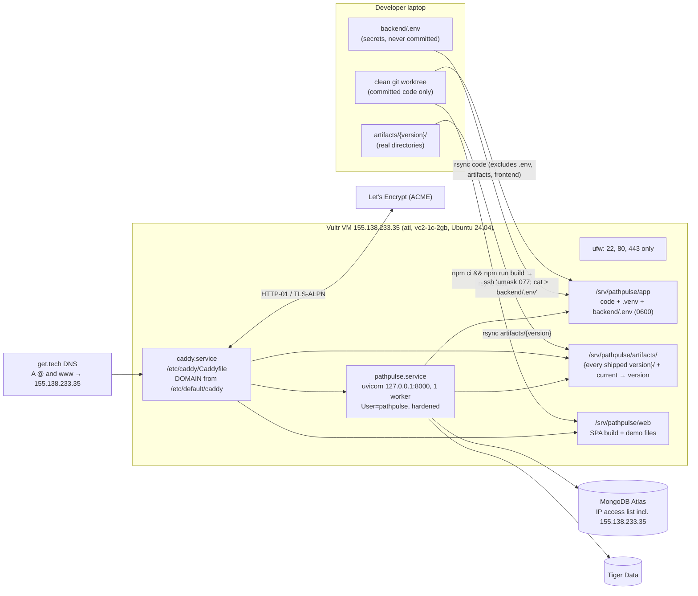

# Deployment and operations

How PathPro is hosted, configured, deployed, observed, and rolled back. Sources: `deploy/*.sh`, `deploy/Caddyfile`, `deploy/Caddyfile.local`, `deploy/pathpulse.service`, `backend/app/config.py`, `.env.example`, `docs/sponsor_checklist.md`. Internal identifiers (`pathpulse.service`, `/srv/pathpulse`, the `pathpulse` system user, database names, `~/.ssh/pathpulse_ed25519`) keep the project's original name on purpose; the user-facing brand is PathPro.

## 1. Environments

| Environment | How it runs | Used for |
| --- | --- | --- |
| Local development | `cd backend && uv run uvicorn app.main:create_app --factory --reload` (port 8000) and `cd frontend && npm run dev` (Vite on 5173, proxies `/api` and `/static` to 8000) | Day-to-day work; Playwright starts both via `playwright.config.ts` |
| Local production-like + tunnel (fallback, retired) | `deploy/run_live.sh`: builds the SPA, starts uvicorn, Caddy with `deploy/Caddyfile.local` on :8080, and a Cloudflare quick tunnel; `deploy/tunnel_watchdog.sh` restarts the tunnel every 60 s if `/api/healthz` fails twice | Friday-night hosting before the VM; kept as a runbook fallback (section 10) |
| Production | One Vultr VM, Caddy + systemd, `deploy/go.sh pathpro.tech` | https://pathpro.tech |
| Offline demo | Any build, URL `?demo=1` | Expo table; works with the network off |



*Figure O1. Production deployment topology.* PNG: [img/o1_deploy.png](img/o1_deploy.png)

## 2. Configuration

### 2.1 Backend environment variables

Read by pydantic-settings from the process environment or `backend/.env` (`app/config.py`). Secrets are typed `SecretStr` and never logged. Names only; values live in `backend/.env` on the laptop and on the VM.

| Name | Default | Purpose |
| --- | --- | --- |
| `APP_ENV` | `development` | Set to `production` by the unit and `deploy.sh`; informational |
| `ARTIFACTS_DIR` | `<repo>/artifacts/current` | Bundle directory; production `/srv/pathpulse/artifacts/current` |
| `ALLOWED_ORIGINS` | `http://localhost:5173` | CORS origins, comma-separated; `deploy.sh` rewrites it |
| `RATE_LIMIT_PER_MINUTE` | 300 | General per-client limit |
| `PAID_RATE_LIMIT_PER_MINUTE` | 30 | Paid/write per-client limit |
| `LLM_DAILY_BUDGET` | 3000 | LLM generations per day (process) |
| `GEOCODE_DAILY_BUDGET` | 2500 | Geoapify calls per day |
| `TTS_DAILY_BUDGET` | 500 | ElevenLabs calls per day |
| `EXPLAIN_BUDGET_S` | 4.0 | Total explanation time budget |
| `GROQ_BUDGET_S` | 1.6 | First provider's share of that budget |
| `GROQ_API_KEY` | none | Groq (secret) |
| `GROQ_MODEL` / `GROQ_FALLBACK_MODEL` | `openai/gpt-oss-120b` / `openai/gpt-oss-20b` | Groq models |
| `GEMINI_API_KEY` | none | Gemini (secret) |
| `GEMINI_MODEL` | `gemini-3.8-flash` | Gemini model |
| `ELEVENLABS_API_KEY` | none | ElevenLabs (secret) |
| `ELEVENLABS_VOICE_ID` | none | Voice to use |
| `ELEVENLABS_MODEL` | `eleven_flash_v2_5` | TTS model |
| `GEOAPIFY_API_KEY` | none | Geoapify (secret) |
| `DATABASE_URL` | none | Tiger Data Postgres URL (secret) |
| `MONGODB_URI` | none | Atlas connection string (secret) |
| `MONGODB_DB` | `pathpulse` | Atlas database name |
| `VULTR_API_KEY` | none | Read only by `deploy/provision_vultr.sh` on the laptop; not used by the app |

Every secret is optional: without it the matching feature degrades (see [architecture §9](architecture.md#9-graceful-degradation)).

### 2.2 Frontend build variables

| Name | Effect |
| --- | --- |
| `VITE_BASE` | Base path (default `/`) |
| `VITE_FORCE_DEMO=1` | Fixtures only, no backend (used by the retired static build) |
| `VITE_LIVE_CONFIG=1` | Reads `live.json` for a remote API origin and health-checks it, else falls back to the demo (retired static build) |
| `PATHPULSE_API` | Dev-server proxy target (default `http://127.0.0.1:8000`) |

The production build uses none of these: the SPA and API share one origin.

## 3. Provisioning (`deploy/go.sh`)

`deploy/go.sh <domain>` runs six steps and can be re-run: each step reuses what already exists.

| Step | Script | What it does |
| --- | --- | --- |
| 1 | `app.tools.check_keys` | One minimal live call per configured key (Groq models list, Gemini model, Geoapify search, ElevenLabs voice, Tiger extensions, Atlas ping and indexes). Prints `OK`/`MISSING`/`FAIL` and never the key. Any `FAIL` stops the deploy. |
| 2 | `deploy/provision_vultr.sh` | Skipped if `deploy/.host` exists. Otherwise, with `VULTR_API_KEY`: reuse a VM labelled `pathpulse` or create one (`region atl`, `plan vc2-1c-2gb`, Ubuntu 24.04 x64, backups disabled) with a new ed25519 key `~/.ssh/pathpulse_ed25519`; wait for `ok` and write the IP to `deploy/.host` (gitignored). |
| 3 | `deploy/bootstrap.sh` (over SSH as root) | Installs Caddy from the Cloudsmith apt repo, rsync, ufw, python3.12; creates the `pathpulse` system user and `/srv/pathpulse/{app,artifacts,web}`; installs uv for that user; writes `DOMAIN=<site list>` to `/etc/default/caddy` with a drop-in so Caddy reads it; ufw allows OpenSSH, 80, 443 and is enabled. |
| 4 | `deploy/deploy.sh` | Build and ship (section 4). |
| 5 | `db.load_tiger` | Only when `LOAD_TIGER=1` and `DATABASE_URL` is set: loads schema, segments, crashes, and the risk grid (multi-minute, one-time). |
| 6 | Smoke test | Prints the DNS answer for the domain and `curl`s `https://<domain>/api/healthz`; the sslip.io name is always reachable. |

The Caddy site list is `"<domain>, www.<domain>, <ip-with-dashes>.sslip.io"`. The sslip.io name gives real HTTPS before DNS for the domain propagates.

## 4. Deploying a new version (`deploy/deploy.sh`)

```bash
RSYNC_RSH="ssh -i ~/.ssh/pathpulse_ed25519" \
  bash deploy/deploy.sh root@155.138.233.35 "pathpro.tech, www.pathpro.tech, 155-138-233-35.sslip.io"
```

What it does, in order:

1. `VERSION` = the target of the local `artifacts/current` symlink.
2. `npm ci && npm run build` in `frontend/` (type-check, then Vite build into `frontend/dist/`).
3. `rsync -az --delete` the repository to `/srv/pathpulse/app/`, excluding `.git`, `node_modules`, `.venv`, `cache`, `data/raw`, `data/interim`, `artifacts`, `frontend`, `backend/.env`, `__pycache__`.
4. `rsync -az` `artifacts/$VERSION` to `/srv/pathpulse/artifacts/` (**no** `--delete`, so earlier versions stay on the server).
5. `rsync -az --delete` `frontend/dist/` to `/srv/pathpulse/web/`.
6. Stream `backend/.env` over SSH with `umask 077` (macOS rsync has no `--chmod`).
7. On the VM: point `/srv/pathpulse/artifacts/current` at the new version; remove and re-append `ALLOWED_ORIGINS`, `ARTIFACTS_DIR`, `APP_ENV` so production values always win; `chmod 600 backend/.env`; `chown -R pathpulse`; `uv sync --package pathpulse-backend --frozen --no-dev --python /usr/bin/python3.12 --python-preference only-system`; install the unit and Caddyfile; `systemctl enable --now`, `restart pathpulse`, `reload caddy`; poll `http://127.0.0.1:8000/healthz` for up to 30 s.
8. From the laptop, `curl https://<each origin>/api/healthz`.

### 4.1 Clean-worktree procedure (used since the ride release)

Deploying from the working copy risks shipping uncommitted edits made by other people or agents. Deploys therefore run from a clean git worktree of the commit being released:

```bash
git worktree add <scratch>/wt-deploy <commit>            # committed code only
cp -R artifacts/pp-20260926-1902-f49c0d2 <scratch>/wt-deploy/artifacts/   # the REAL directory
ln -sfn pp-20260926-1902-f49c0d2 <scratch>/wt-deploy/artifacts/current
cp -R frontend/public/demo/static <scratch>/wt-deploy/frontend/public/demo/  # gitignored demo files
cd <scratch>/wt-deploy && RSYNC_RSH="ssh -i ~/.ssh/pathpulse_ed25519" \
  bash deploy/deploy.sh root@155.138.233.35 "pathpro.tech, www.pathpro.tech, 155-138-233-35.sslip.io"
```

- **Copy the bundle directory, do not symlink it.** `artifacts/` is gitignored, so a fresh worktree has none. `deploy.sh` ships it with `rsync -a`, which copies a symlink as a symlink; a symlinked bundle would arrive on the VM as a dangling link and the API would fail its startup bundle check.
- `backend/.env` is read from the worktree path; copy it in (it is never committed) or the deploy leaves the server's existing file in place except for the three production lines.
- The demo geometry under `frontend/public/demo/static/` is gitignored and regenerated by `record_demo`; copy it so `?demo=1` keeps its map on the live site.

## 5. Caddy and systemd hardening

**Caddy** (`deploy/Caddyfile`):

| Route | Behaviour |
| --- | --- |
| `/api/*` | `handle_path` strips `/api`, `reverse_proxy 127.0.0.1:8000`; Caddy sets `X-Forwarded-For` to the real client |
| `/static/*` | Files from `/srv/pathpulse/artifacts`, `Cache-Control: public, max-age=31536000, immutable` |
| `/demo/*` | Files from `/srv/pathpulse/web`, `max-age=3600` |
| everything else | SPA with `try_files {path} /index.html` |

Headers on every response: `Strict-Transport-Security: max-age=31536000; includeSubDomains`, `X-Content-Type-Options: nosniff`, `X-Frame-Options: DENY`, `Referrer-Policy: strict-origin-when-cross-origin`, `Permissions-Policy: camera=(), microphone=(), geolocation=(self)`, a `Content-Security-Policy` allowing only self plus Google Fonts and OpenFreeMap tiles (full text in [security_privacy.md](security_privacy.md#6-transport-and-browser-hardening)), and `Server` removed. Responses are compressed with zstd or gzip. TLS certificates are issued and renewed automatically.

**systemd** (`deploy/pathpulse.service`):

| Setting | Why |
| --- | --- |
| `User=pathpulse`, `Group=pathpulse` | Unprivileged system user |
| `ExecStart=.venv/bin/uvicorn app.main:create_app --factory --host 127.0.0.1 --port 8000 --workers 1 --proxy-headers --forwarded-allow-ips 127.0.0.1` | Loopback only; trust forwarded headers only from local Caddy; one worker because caches, limits, and the walk gate are in memory |
| `EnvironmentFile=/srv/pathpulse/app/backend/.env`, `Environment=APP_ENV=production`, `ARTIFACTS_DIR=/srv/pathpulse/artifacts/current` | Config |
| `Environment=HOME=/srv/pathpulse` | libpq probes `~/.postgresql` for client certificates. With `ProtectHome=true`, `/home` is unreadable and that probe fails the Tiger Data connection. A HOME outside `/home` keeps the hardening and lets Tiger connect. |
| `NoNewPrivileges`, `PrivateTmp`, `ProtectSystem=strict`, `ProtectHome=true`, `ReadOnlyPaths=/srv/pathpulse`, empty `CapabilityBoundingSet`, `LockPersonality`, `RestrictSUIDSGID` | The API only reads its code and artifacts |
| `Restart=always`, `RestartSec=2` | Self-healing |

Because of `ProtectHome=true`, the venv must use the system Python (`/usr/bin/python3.12`), not a uv-managed interpreter under `/home` (fix `47fc47e`).

## 6. DNS, external services, and secrets

| Item | Setting |
| --- | --- |
| Domain | `pathpro.tech`, registered at get.tech with the MLH .tech code (valid to 2027-09-26) |
| DNS | A records `@` and `www` → 155.138.233.35 |
| TLS | Let's Encrypt via Caddy for `pathpro.tech`, `www.pathpro.tech`, `155-138-233-35.sslip.io` |
| MongoDB Atlas | Free M0 cluster (AWS us-east-1). **Network Access list must include 155.138.233.35**, or `/healthz` shows `reports: unavailable` and reports and sharing turn off. TLS verified with certifi's CA bundle. Indexes are created at API startup. |
| Tiger Data | Free shared service (AWS us-east-1). Connection string in `DATABASE_URL`. Needs the `timescaledb` and `postgis` extensions (checked by `check_keys`). |
| Secrets | Only in `backend/.env` (laptop and VM, mode 0600 on the VM). `.gitignore` excludes `.env` and `.env.*` except `.env.example`, which holds names only. Keys never reach the browser: the SPA calls the API, which calls the providers. |
| Key capture helpers | `deploy/capture_keys.py` (clipboard watcher) and `deploy/chrome_keys.py` (browser helper) write keys straight into `backend/.env`, recognize them by format, and mask any key-like string in their own output. |

## 7. Health checks and logs

| Check | Command | Healthy result |
| --- | --- | --- |
| Public health | `curl -s https://pathpro.tech/api/healthz` | `status: ok`, `database: ok`, `reports: ok`, `safety: ok`, `modes.ride: ok`, expected `model_version` |
| Local health on the VM | `curl -s http://127.0.0.1:8000/healthz` | same |
| Keys | `cd backend && uv run python -m app.tools.check_keys` | all `OK` |
| Model served | `curl -s https://pathpro.tech/api/meta` | `model_version`, `n_segments: 49915`, four modes available |
| Headers | `curl -sI https://pathpro.tech/` | HSTS, CSP, `X-Frame-Options: DENY` |

Logs:

- API: `journalctl -u pathpulse -f`. Startup logs `PathPro API ready: model <version>, <n> walk segments, ride <n|unavailable>`. Provider, database, and Atlas failures log the exception **type** only, because exception text can echo a connection string. `httpx` is set to WARNING so the Geoapify key (a query parameter) never lands in logs.
- Caddy: JSON access log at `/var/log/caddy/pathpulse.log`, written through a `format filter` that deletes the `lat`, `lon`, `bbox`, `q`, and `t` query parameters and the `Cookie` header; service log in `journalctl -u caddy`.

## 8. Rollback

Every shipped bundle stays in `/srv/pathpulse/artifacts/` (step 4 has no `--delete`), and bundle versions are immutable. Each version also has distinct `/static/<version>/` URLs, so browsers never mix frames from two versions.

Model rollback (no code change):

```bash
ssh -i ~/.ssh/pathpulse_ed25519 root@155.138.233.35 \
  'ls /srv/pathpulse/artifacts && ln -sfn /srv/pathpulse/artifacts/<older-version> /srv/pathpulse/artifacts/current && systemctl restart pathpulse'
curl -s https://pathpro.tech/api/healthz   # model_version should now be <older-version>
```

A bundle without ride or safety files is still valid: ride modes and the safety layer switch off; walking keeps working. Code rollback: create a worktree at the previous commit and run the procedure in section 4.1 (the API and a bundle must be compatible; the loader treats ride, City Pulse, and safety files as optional).

## 9. Cost

| Item | Cost |
| --- | --- |
| Vultr `vc2-1c-2gb` in Atlanta | about $10 per month, paid from a $100 MLH Vultr credit (expires 2026-10-27) |
| pathpro.tech | Free for the first year with the MLH .tech code |
| MongoDB Atlas M0, Tiger Data free shared service | Free tiers |
| Groq, Gemini, ElevenLabs, Geoapify | Free tiers, bounded by the daily budgets in section 2.1 |
| OpenFreeMap tiles, Open-Meteo | Free, no key |

## 10. Runbook

| Symptom | Likely cause | Action |
| --- | --- | --- |
| `/api/*` returns 502 | API not running (bad bundle, crash loop) | `journalctl -u pathpulse -n 100`; a `BundleError` means a missing file or checksum mismatch: re-ship the bundle directory or roll back (section 8) |
| `/healthz` `reports: unavailable` | Atlas unreachable or VM IP not in the access list | Check Atlas Network Access; the API retries after a 30 s cooldown |
| `/healthz` `database: unavailable` | Tiger Data down or slow; `HOME` missing from the unit | Confirm `Environment=HOME=/srv/pathpulse`; run `check_keys` |
| Explanations always `source: "template"` | No LLM keys, provider errors, or daily budget spent | `check_keys`; look for `explain provider ... failed` or `output rejected` in the journal |
| "Listen" uses the device voice | ElevenLabs key, voice id, or budget | `check_keys`; 503 `TTS_UNAVAILABLE` is expected fallback behaviour |
| Many 429s from one venue | Shared NAT address | Raise `RATE_LIMIT_PER_MINUTE` in `backend/.env` and restart (paid limits stay tight) |
| Certificate errors on the domain | DNS not pointing at the VM yet | Use `https://155-138-233-35.sslip.io`; check `dig +short pathpro.tech` |
| VM unreachable | Provider outage | Fallback: `deploy/run_live.sh` on a laptop serves the same build through a Cloudflare quick tunnel (URL printed and saved to `deploy/.tunnel_url`); `deploy/tunnel_watchdog.sh` keeps it alive. For the expo table, `?demo=1` needs no backend at all. |
| Need to rotate a key | Exposure or provider revocation | Replace it in `backend/.env`, re-run `deploy.sh` (it re-streams the file) or edit on the VM and `systemctl restart pathpulse`; revoke the old key at the provider |
